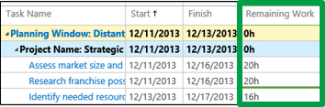
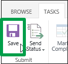

# Update how much work you have left to do

 * [Project help](afac1e38-1219-4a88-bd22-81534778d528.md)* 
  
    
    

 **This topic is for organizations that track time and task progress using separate views.** [Report your task progress](4e338fec-6e78-4b0e-b059-11422057df31.md)
Sometimes the number of hours that the schedule has left for a task doesn't match up with the amount of time you think you'll be spending to finish that task. For example, after completing 20 of the 40 scheduled hours for a task, you may feel like you have more than 20 hours of work left to do before the task is finished. By submitting your estimated remaining work to your project manager, you are communicating **task progress**.
  
    
    

1. Click **Tasks** on the Quick Launch.
    
    
  
    
    

  
    
    

  
    
    

  
    
    

    
  
2. Update your tasks.
    
    In the grid, fill out the **Remaining Work** column.
    
    
  
    
    

  
    
    

  
    
    

  
    
    

    
    If you don't see the task that you want to update, click **Tasks** > **Add Row**.
    
    
  
    
    

  
    
    

  
    
    

  
    
    

    
    If you're completely done with a task, select the check box for the task, and then click **Task** > **Mark Complete**. Remaining work is set to 0 hours.
    
    
  
    
    

  
    
    

  
    
    

  
    
    

    
  
3. Send your updates to the project managers for your tasks.
    
    If you're ready to send all of your updates, click **Tasks** > **Send Status** > **All Tasks**.
    
    
  
    
    

  
    
    

  
    
    

  
    
    

    
    If you only want to submit some of your updates, select the check box for each task, and then click **Tasks** > **Send Status** > **Selected Tasks**.
    
    
  
    
    

  
    
    

  
    
    

  
    
    

    
|||
|:-----|:-----|
|
> [!TIP]
> **Not ready to submit?** If you aren't ready to send your remaining work to the project manager, click **Tasks** > **Save** to save your updates and submit them later.
  
    
    

|
  
    
    

  
    
    

  
    
    

  
    
    
   |
   
