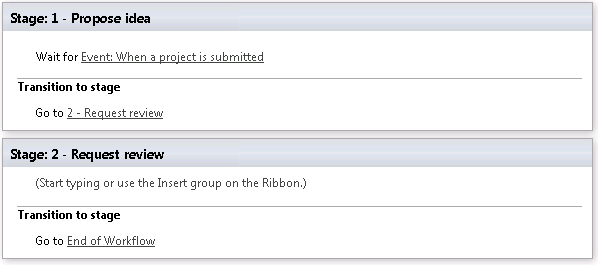

# Have a workflow wait for a Project Web App event
 
 **Summary:** Learn how to have a workflow wait for a Project Web App event. 
**Applies to:** Project Server 2016, Project Server 2013
  
You can set a Project Web App workflow to pause and wait for a Project event before proceeding. The workflow can be set to wait for when the project is checked in, committed, or submitted.
  
In this article we'll take a look at configuring a workflow to pause until the associated project is submitted. This is useful if you want to gather project information and then have the project sent for approval after the information gathering is complete.
  
## Before you begin

Before starting, make sure:
  
- If you are using an on-premises deployment of Project Server, you have set up the [SharePoint 2013 workflow platform](/SharePoint/governance/workflow-in-sharepoint-server).
    
- You have created the sample workflow, stages, and enterprise project type as described in [Create a sample Project Web App workflow](create-a-sample-project-web-app-workflow.md).
    
## Configure a workflow to wait for a Project event

First, we'll create a simple workflow with two stages and have it wait for the project to be submitted before moving from the first stage to the second.
  
We'll be using the Sample Workflow that you created in [Create a sample Project Web App workflow](create-a-sample-project-web-app-workflow.md) to build a workflow that looks like this:
  

  
If you've completed the procedures in other articles in this series, you may already have part of this workflow in place. The complete steps for creating this workflow are in the following procedure.
  
### To have a workflow wait for a Project event

1. Start SharePoint Designer.
    
2. Connect to your Project Web App site.
    
3. On the left, click **Workflows**.
    
4. Click **Sample Workflow**.
    
5. Click **Edit workflow**.
    
6. On the ribbon, click **Stage**, and then click **1 - Propose idea**.
    
7. Place the orange cursor in the top section of **Stage 1** and, on the ribbon, click **Action**, and then, under **Project Web App Actions**, click **Wait for Project Event**.
    
8. Click **this project event**, and choose **Event: When a project is submitted** from the dropdown menu.
    
9. Place the orange cursor below Stage 1, click **Stage**, and then click **2 - Request review**.
    
10. Place the orange cursor in the **Transition to stage** area of Stage 1, and then, on the ribbon, click **Action**, and then click **Go to a stage**.
    
11. Click **a stage**, and then choose **2 - Request review** from the dropdown menu.
    
12. Place the orange cursor in the **Transition to stage** area of Stage 2, and then, on the ribbon, click **Action**, and then click **Go to a stage**.
    
13. Click **a stage**, and then choose **End of Workflow** from the dropdown menu.
    
14. On the ribbon, click **Publish**.
    
## Test it out

With the workflow published, the next thing to do is to create a test project to see if the workflow is being properly paused in the first stage.
  
### To create a project

1. In Project Web App, in the left navigation, click **Projects**.
    
2. On the ribbon, click the **Projects** tab.
    
3. Click **New**, and then click **Sample Project Type**.
    
4. Name the project **Wait for an event**, and then click **Save**.
    
The Workflow Status page should show the workflow stages as **1 - Propose idea**. (You may need to wait a minute or two and refresh the page if you don't see this right away.)
  
The workflow is waiting for a Submit event, so the next step is to submit this project.
  
### To submit a project

1. On the Workflow Status page, on the ribbon, click **Submit**.
    
2. Click **OK** to confirm.
    
The Workflow Status page should show the workflow stage as **2 - Request review**, confirming that the workflow has moved forward after seeing the submit event.
  
In the next article, we'll look at [how to use the workflow status information to leave messages for your users](set-the-stage-status-in-a-project-web-app-workflow.md).
  
## See also

#### 

[Create a sample Project Web App workflow](create-a-sample-project-web-app-workflow.md)
  
[Set the stage status in a Project Web App workflow](set-the-stage-status-in-a-project-web-app-workflow.md)
  
[Add a custom field to a project detail page](add-a-custom-field-to-a-project-detail-page.md)
  
[Assign an approval task in a workflow](assign-an-approval-task-in-a-workflow.md)
  
[Customize approval options for Project Web App workflows](customize-approval-options-for-project-web-app-workflows.md)