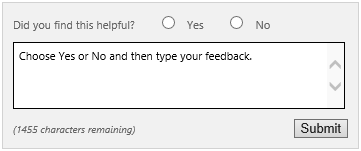

# Installation and deployment overview for Project Server 2016
 
 **Summary:** Learn about the steps involved in installing Project Server 2016.
  
This series of articles describes the steps necessary to install Project Server 2016. These steps include the following:
  
- Install SharePoint Server 2016
    
- Create a Project Web App site
    
## Install SharePoint Server 2016

Project Server 2016 is part of SharePoint Server 2016 Enterprise Edition. Before you can configure Project Web App, you must [install SharePoint Server 2016](install-sharepoint-server-2016-project-server-2016.md). 
  
## Install and configure Project Server 2016

Unlike prior versions of Project Server, Project Server 2016 does not require a separate install from SharePoint Server 2016. Once you have installed SharePoint Server 2016, you can [configure the Project Server service application ](install-and-configure-project-server-2016.md)and create a Project Web App site.
  
## Create a Project Web App site

Once the initial Project Server 2016 configuration within SharePoint Server 2016 is completed, you can [create a Project Web App site](deploy-project-web-app.md).
  
## Project Server forums and documentation feedback

If you have additional questions, try the [Project forums](https://social.technet.microsoft.com/Forums/en-US/category/project). The Project forums give you the chance to have your question discussed by other participants, Project MVPs, and Project community experts.
  
If you would like to provide feedback on this article, choose the **Yes** or **No** option for **Did you find this article helpful?** located at the end of this page, and then type your feedback in the box that appears.
  

  

