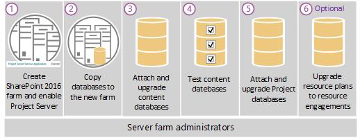

# Overview of the Project Server 2016 upgrade process
 
 **Summary:** View a high-level overview of the steps required to upgrade to Project Server 2016 from Project Server 2013. 
**Applies to:** Project Server 2016
  
> [!NOTE]
> For information about planning consideration when upgrading to Project Server 2016, see [Plan for upgrade to Project Server 2016](plan-for-upgrade-to-project-server-2016.md). 
  
## Overview of the Project Server 2016 upgrade steps

  
Upgrading to Project Server 2016 can be broken up into six steps. These include:
  
1. Create the SharePoint Server 2016 farm installation and enable Project Server 2016. Project Server 2016 installs with SharePoint Server 2016 and the Project Server service application needs to be started.
    
    > [!IMPORTANT]
    > Project Server 2016 can only be enabled on the Enterprise version of SharePoint Server 2016. Project Server 2016 cannot be enabled on SharePoint Server 2016 with a Standard license. 
  
2. Copy and move your databases from your Project Server 2013 database server to the database server that hosts your Project Server 2016 installation. These databases are:
    
   - Project Server 2013 databases
    
   - SharePoint 2013 content database that contains your project site collections
    
3. Use the **Mount-SPContentDatabase** PowerShell cmdlet to attach and upgrade the SharePoint 2013 content database containing your Project site data to the Project Server 2016.
    
4. Use the **Test-SPContentDatabase** PowerShell cmdlet to check your upgraded SharePoint content databases.
    
5. Use the **Migrate-SPProjectDatabase** PowerShell cmdlet to attach and upgrade the Project Server 2013 database to the Project Server 2016 farm.
    
6. Use the **Migrate-SPProjectResourcePlans** to migrate your Project Server 2013 resource plans to resource engagements. If you don't plan to use your Project Server 2013 resource plans in Project Server 2016, this step is not required.
    
> [!NOTE]
> For detailed information about the steps required to upgrade to Project Server 2016 from Project Server 2013, see [Upgrading to Project Server 2016](upgrading-to-project-server-2016.md). 
  

