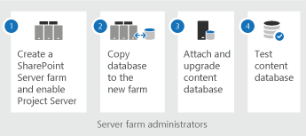

# Overview of the Project Server 2019 upgrade process
 
 **Summary:** View a high-level overview of the steps required to upgrade to Project Server 2019 from Project Server 2016. 
 **Applies to:** Project Server 2019
  
> [!NOTE]
> For information about planning consideration when upgrading to Project Server 2016, see [Plan for upgrade to Project Server 2019](plan-for-upgrade-to-project-server-2019.md). 
  
## Overview of the Project Server 2019 upgrade steps

  
Upgrading to Project Server 2019 can be broken up into four steps. These include:
  
1. Create the SharePoint Server 2019 farm installation and enable Project Server 2019. Project Server 2019 installs with SharePoint Server 2019 and the Project Server service application needs to be started.
    
    > [!IMPORTANT]
    > Project Server 2019 can only be enabled on the Enterprise version of SharePoint Server 2019. Project Server 2019 cannot be enabled on SharePoint Server 2019 with a Standard license. 
  
2. Copy and move your databases from your Project Server 2016 database server to the database server that hosts your Project Server 2019 installation. These databases are:
    
   - Project Server 2016 databases
    
   - SharePoint 2016 content database that contains your project site collections
    
3. Use the [Mount-SPContentDatabase](https://docs.microsoft.com/powershell/module/sharepoint-server/mount-spcontentdatabase?view=sharepoint-ps) PowerShell cmdlet to attach and upgrade the SharePoint 2016 content database containing your Project site data to the Project Server 2019.
    
4. Use the [Test-SPContentDatabase](https://docs.microsoft.com/powershell/module/sharepoint-server/test-spcontentdatabase?view=sharepoint-ps) PowerShell cmdlet to check your upgraded SharePoint content databases.
    
   
