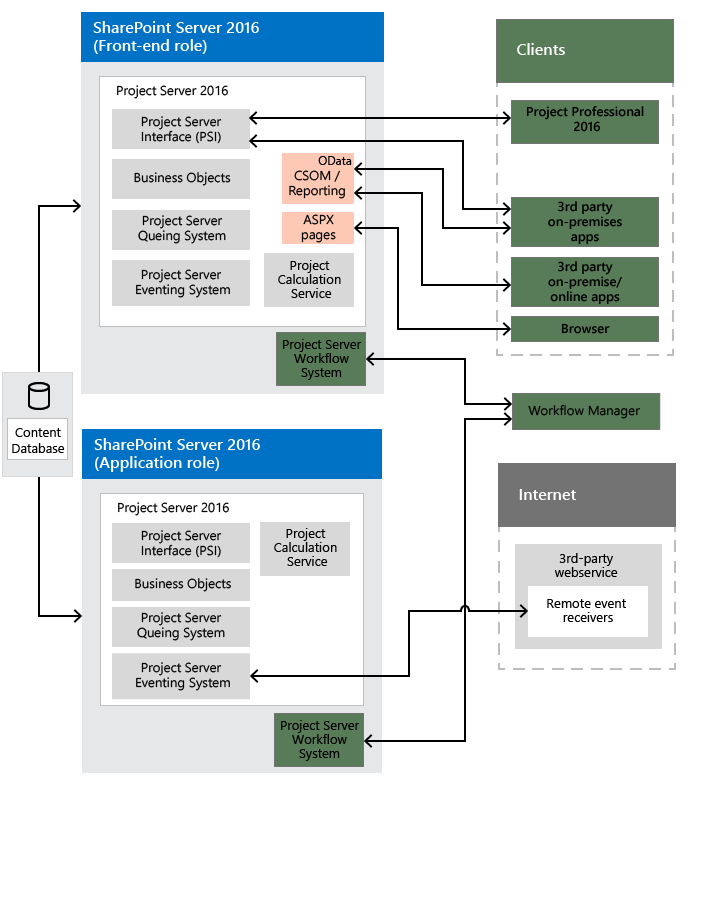

# Project Server 2016 architecture
 
 **Summary:** Learn about the general architecture of Project Server 2016. 
**Applies to:** Project Server 2016
  
Project Server 2016 architecture includes association of the Project Application Service with SharePoint site collections, the client-side object model (CSOM) for remote access, an OData interface for reporting, and remote event receivers that are accessible by multiple Project Server installations. In addition to on-premises custom solutions, you can create apps that include remote event receivers and components that access the CSOM and OData interfaces.
  
The front-end tier includes Project Professional 2016, Project Web App, and third-party apps. Client applications communicate with the middle tier through the Project Server Interface (PSI) or through the CSOM endpoints, which in turn communicate with the PSI and the business object layer. Database access is integrated in the business objects. The Project Server Eventing System can access both local event handlers and remote event receivers. The Project Calculation Service implements the Project scheduling engine within Project Server.
  
## General architecture

Below is a generalized view of the Project Server 2016 architecture, including the Project Service Application and several client applications including Project Professional 2016.
  

  
The following general comments apply to the illustration above:
  
- **Project Online:** You can create apps that use the CSOM, REST, and OData interfaces. An app package can also install remote event receivers in a custom web service on a local server, on an Azure server, or on Microsoft Azure. Project Online does not support third-party on-premises solutions, the WCF interface, the ASMX interface, or local event handlers.
    
- **Event receivers:** Event receivers can also be called event handlers. Project Online supports registration of remote Project Server event receivers, which can be used by a Project Web App instance in the cloud or by an on-premises Project Server installation. An on-premises Project Server installation supports remote event receivers and local full-trust event handlers.
    
- **Programmatic interfaces:** For third-party apps, Project Online exposes the HTTP/HTTPS interface (including REST), the CSOM interface, an OData service for the CSOM, and an OData service for reporting. For third-party client applications that are on-premises (on the Intranet), you can use the WCF interface for the PSI, or you can use the CSOM, OData, and REST interfaces through HTTP. The Project Web App and Project Professional 2016 clients both use the WCF interface. In a single-server installation, the front-end ASMX web services, CSOM, and REST internally call the back-end WCF services.
    
    The OData service for reporting is implemented by the internal OData.svc WCF service. You can get the Service Metadata Document for the reporting data by using  `https://ServerName/ProjectServerName/_api/ProjectData/$metadata`. 
    
    The OData service for the CSOM is intended for platforms such as Windows RT, iOS, and Android, where you can use the REST interface with UNRESOLVED_TOKEN_VAL(ecmascriptshort) in HTML pages. 
    
- **Workflows:** Declarative workflows are offloaded to Workflow Manager for processing. Workflow Manager can run on a separate server in the SharePoint farm, on Microsoft Azure in the cloud, or on a single Project Server computer for testing or demonstrations. Coded workflows that are developed with Visual Studio are processed in the workflow runtime within SharePoint.
    
- **Perimeter network (DMZ):** The illustration above does not show that an on-premises front end server can be isolated by an additional firewall in a perimeter network (also known as a "demilitarized zone" or DMZ). A perimeter network can allow Internet clients to access SharePoint and Project Server across a firewall.
    
- **SharePoint Web Services:** The illustration above does not show the SharePoint infrastructure, such as the back-end SharePoint Web Services application, which is part of SharePoint Server 2016. When you install Project Server, the Project Service Application is added to the SharePoint Web Services.
    
The front-end tier includes third-party applications, Project Professional, and Project Web App. A browser displays ASP.NET 4.0 pages (.aspx pages) in Project Web App. The Project Web App pages use Project Server Web Parts that communicate with the PSI and also use standard SharePoint Web Parts. 
  
The Project Web App components of Project Server use the SharePoint Server 2016 configuration database for project site setup and the content database for all other information. There is no longer a separate Project Server database.
  
