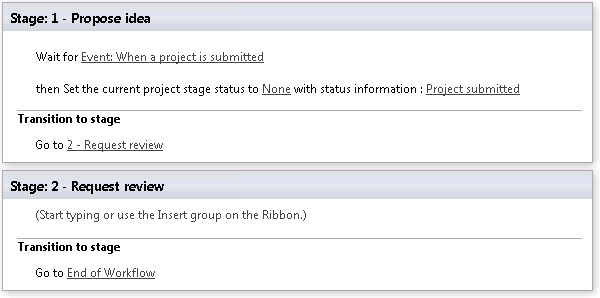

# Set the stage status in a Project Web App workflow
 
 **Summary:** Learn how to set the stage status in a Project Web App workflow to leave a message for your users. 
**Applies to:** Project Server 2016, Project Server 2013
  
You can use the Project Stage Status feature in a Project Web App workflow to leave a message for your Project Web App users while the workflow is running. This can be useful if you want to tell your users about actions that they must complete in order to advance the workflow.
  
## Before you begin

Before starting, make sure:
  
- If you are using an on-premises deployment of Project Server, you have set up the [SharePoint 2013 workflow platform](http://technet.microsoft.com/library/145fc383-d584-487a-8738-8de15512ae26%28Office.14%29.aspx).
    
- You have created the sample workflow, stages, and enterprise project type as described in [Create a sample Project Web App workflow](create-a-sample-project-web-app-workflow.md).
    
## Set a status update in a workflow

We'll be using the Sample Workflow that you created in [Create a sample Project Web App workflow](create-a-sample-project-web-app-workflow.md) to build a workflow that looks like this:
  

  
If you've completed the procedures in other articles in this series, you may already have part of this workflow in place. The complete steps for creating this workflow are in the following procedure.
  
### To set the stage status in a Project Web App workflow

1. Start SharePoint Designer.
    
2. Connect to your Project Web App site.
    
3. On the left, click **Workflows**.
    
4. Click **Sample Workflow**.
    
5. Click **Edit workflow**.
    
6. On the ribbon, click **Stage**, and then click **1 - Propose idea**.
    
7. Place the orange cursor in the top section of **Stage 1** and, on the ribbon, click **Action**, and then, under **Project Web App Actions**, click **Wait for Project Event**.
    
8. Click **this project event**, and choose **Event: When a project is submitted** from the dropdown menu.
    
9. Place the orange cursor under **Wait for Event: When a project is submitted**.
    
10. On the ribbon, click **Action**, and then under **Project Web App Actions**, click **Set Project Stage Status**.
    
11. Click the first **this value** link and choose **None** from the dropdown list.
    
12. Click the second **this value** link, and in the text box, typeProject submitted.
    
13. Place the orange cursor below Stage 1, click **Stage**, and then click **2 - Request review**.
    
14. Place the orange cursor in the **Transition to stage** area of Stage 1, and then, on the ribbon, click **Action**, and then click **Go to a stage**.
    
15. Click **a stage**, and then choose **2 - Request review** from the dropdown menu.
    
16. Place the orange cursor in the **Transition to stage** area of Stage 2, and then, on the ribbon, click **Action**, and then click **Go to a stage**.
    
17. Click **a stage**, and then choose **End of Workflow** from the dropdown menu.
    
18. On the ribbon, click **Publish**.
    
## Test it out

With the workflow published, the next thing to do is to create a test project to see if the status is being set correctly.
  
### To create a project

1. In Project Web App, in the left navigation, click **Projects**.
    
2. On the ribbon, click the **Projects** tab.
    
3. Click **New**, and then click **Sample Project Type**.
    
4. Name the project **Set the stage status**, and then click **Save**.
    
The Workflow Status page should show the workflow stages as **1 - Propose idea**. (You may need to wait a minute or two and refresh the page if you don't see this right away.)
  
Expand All Workflow Stages at the bottom of the page. The **Status Info** should be empty for the **1 - Propose idea** stage.
  
Next, we'll submit the project to trigger the status update that we included in SharePoint Designer.
  
### To submit a project

1. On the Workflow Status page, on the ribbon, click **Submit**.
    
2. Click **OK** to confirm.
    
The Workflow Status page should show the workflow stages as **2 - Request review**.
  
Expand All Workflow Stages at the bottom of the page. The **Status Info** should be **Project submitted** for the **1 - Propose idea** stage. This is the custom text that we included in the workflow.
  
In the next article, we'll look at [how to add a custom field to a project detail page](add-a-custom-field-to-a-project-detail-page.md).
  
## See also

#### 

[Create a sample Project Web App workflow](create-a-sample-project-web-app-workflow.md)
  
[Have a workflow wait for a Project Web App event](have-a-workflow-wait-for-a-project-web-app-event.md)
  
[Add a custom field to a project detail page](add-a-custom-field-to-a-project-detail-page.md)
  
[Assign an approval task in a workflow](assign-an-approval-task-in-a-workflow.md)
  
[Customize approval options for Project Web App workflows](customize-approval-options-for-project-web-app-workflows.md)

