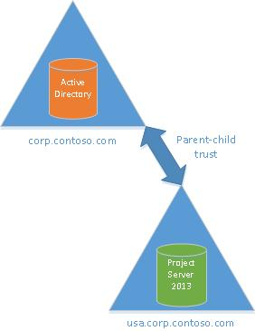
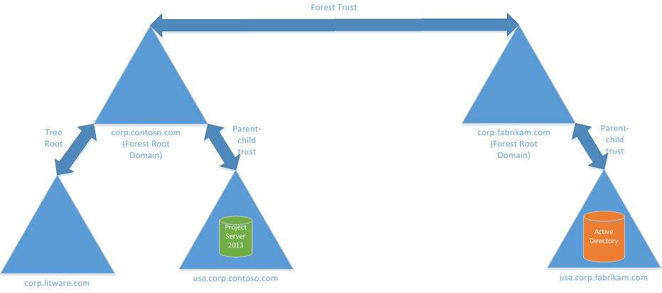

# Supported Active Directory topologies for Project Server 2013 Enterprise Resource Pool synchronization
 
 **Summary:** This article describes the Active Directory topologies that are supported for synchronization with the Enterprise Resource Pool in Project Server 2013. 
**Applies to:** Project Server 2013
  
When planning to synchronize your users from Active Directory groups to resources in your Project Web App Enterprise Resource Pool in Project Server 2013, it is important to understand that only certain Active Directory topologies are supported. This article describes the following topologies:
  
- **Supported topologies** - Topologies that are supported with the Project Server 2013 RTM build.
    
- **Additional topologies** - Topologies that are supported with the Project Server 2013 March 12 2013 Cumulative Update.
    
- **Unsupported topologies** - Topologies that will not be supported.
    
## Supported topologies

The following topologies are supported when synchronizing your users and groups from Active Directory to your Enterprise Resource Pool for your Project Web App instance in Project Server 2013. Note that some topologies will require you to install the Project Server 2013 March 12 2013 Cumulative Update to your Project Server 2013 environment in order to be supported. 
  
### Single Domain topology

In the single domain topology, Active Directory and Project Server 2013 servers all reside in the same domain. This is the simplest of topologies for Active Directory synchronization to your Enterprise Resource Pool or security groups, since this topology does not require the configuration of trusts between domains.
  

  
## Additional topologies

The following topologies are also supported, but require the installation of the Project Server 2013 March 12 2013 Cumulative Update. These topologies include:
  
- Single Forest Parent-Child Trust topology
    
- Single Forest Tree-Root Trust topology
    
- Forest Trust topology
    
- External Trust topology
    
> [!NOTE]
> Unless this update is installed, your Project Server 2013 environment will only support the single domain topology. For more information about the Project Server 2013 March 12, 2013 Cumulative Update, see [Description of the Project Server 2013 update: March 12, 2013](https://support.microsoft.com/kb/2768001). 
  
### Single Forest Parent-Child Trust topology

> [!IMPORTANT]
> This topology is not supported for Active Directory synchronization with the RTM build of Project Server 2013. It is only supported by installing the Project Server 2013 March 12, 2013 Cumulative Update to your Project Server 2013 environment. 
  
In this single forest topology, a child domain is created off of the parent domain. By default, the relationship between the child and parent domain is automatically two-way and transitive. This relationship ensures that users in the corp.contoso.com domain can be synchronized with the Project Server 2013 Enterprise Resource Pool in usa.corp.contoso.com. Additionally, if you created another child domain off of the usa.corp.contoso.com domain and host an Active Directory there, its users and groups would be able to be resolved by Project Server 2013 hosted in any other domain in the same tree.
  

  
### Single Forest Tree-Root Trust topology

> [!IMPORTANT]
> This topology is not supported for Active Directory synchronization with the RTM build of Project Server 2013. It is only supported by installing the Project Server 2013 March 12, 2013 Cumulative Update to your Project Server 2013 environment. 
  
In this single forest topology, when you create a new domain within an existing forest, you create a tree root trust between the new domain and the rest of the forest. By default, this relationship ensures that users in a domain in the tree (for example, usa.corp.contoso.com) can be synchronized to the Project Server 2013 Enterprise Resource Pool if it resided in the new domain (for example, corp.litware.com). Tree-root trusts are always two-way and transitive, so the synchronization could also occur successfully if the Project Server 2013 Enterprise Resource Pool resided in usa.corp.contoso.com, and the Active Directory users resided in the corp.litware.com domain.
  

  
In this topology above, Project Server 2013 trusts the Active Directory domain through its own root trust with the forest root domain, and then through the parent—child trust between the forest root domain and the domain that contains the Active Directory.
  
### Forest Trust topology

> [!IMPORTANT]
> This topology is not supported for Active Directory synchronization with the RTM build of Project Server 2013. It is only supported by installing the Project Server 2013 March 12, 2013 Cumulative Update to your Project Server 2013 environment. 
  
In this multi-forest topology, two forests exist in which Project Server 2013 resides in one forest, and the Active Directory users reside in another. A forest trust needs to be created between forest root domains for each forest in order for the Project Server 2013 Enterprise Resource Pool to successfully synchronize with Active Directory groups and user in the other forest. Forest trusts are transitive, so any domain within one forest will trust any domain within the other forest. You are not required to setup individual trusts, although if your topology is complex you may need to set up some shortcut trusts. For more information about creating a shortcut trust, see [Create a shortcut trust](https://technet.microsoft.com/en-us/library/cc725721.aspx). 
  

  
In the topology graphic above, a forest trust is established between the Contoso and Fabrikam forests. The domain in which Project Server 2013 resides (corp.litware.com) and the domain containing the Active Directory users (usa.corp.fabrikam.com) trust each other because of the transitivity of the forest trust. This trust can be configured to be either one-way or two-way.
  
### External Trust topology

> [!IMPORTANT]
> This topology is not supported for Active Directory synchronization with the RTM build of Project Server 2013. It is only supported by installing the Project Server 2013 March 12, 2013 Cumulative Update to your Project Server 2013 environment. 
  
In this multi-forest topology, you allow synchronization with users in a different forest by creating an external trust between the domain hosting Project Server 2013 and the domain hosting the Active Directory. This is useful if you need to synchronize users who reside in only a single domain, but not the whole forest. 
  

  
In the topology graphic above, Project Server 2013 can synchronize with groups and users in the usa.corp.fabrikam.com domain. Since an external trust is non-transitive, Project Server 2013 will not be able to synchronize with groups or users from any other domain in the Fabrikam forest.
  
## Unsupported topologies

All topologies not mentioned in this article as supported topologies are not supported. This includes (but not limited to):
  
- Topologies using Realm trusts
    
- Topologies without properly configured trusts
    
## See also

#### 

[Best practices to configure Active Directory groups for Enterprise Resource Pool synchronization in Project Server 2013](best-practices-to-configure-active-directory-groups-for-enterprise-resource-pool.md)
  
[Manage Active Directory Resource Pool synchronization in Project Server 2013](manage-active-directory-resource-pool-synchronization-in-project-server-2013.md)
  
[Manage security group synchronization with Active Directory in Project Server](manage-security-group-synchronization-with-active-directory-in-project-server.md)

