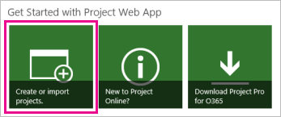

# What's new for IT pros in Project Server 2016
  **Summary:** Learn about Project Server 2016. Find information on the latest features and capabilities and get an overview of its new and updated functionality. 
**Applies to:** Project Server 2016
  
This article provides a brief overview of new and significantly updated functionality in Project Server 2016, with a particular emphasis on the areas of interest to IT professionals. These include the following:
  
- [Resource Engagements](what-s-new-for-it-pros-in-project-server-2016.md#RE)
    
- [One installation - Project Server and SharePoint Server](what-s-new-for-it-pros-in-project-server-2016.md#OneInstall)
    
- [Base installation languages and language packs](what-s-new-for-it-pros-in-project-server-2016.md#Lang)
    
- [Hardware and software requirements](what-s-new-for-it-pros-in-project-server-2016.md#Req)
    
- [Upgrading to Project Server 2016 ](what-s-new-for-it-pros-in-project-server-2016.md#Upgra)
    
- [A single database for multiple instances](what-s-new-for-it-pros-in-project-server-2016.md#SingleDB)
    
- [Custom field limits](what-s-new-for-it-pros-in-project-server-2016.md#Cust)
    
- [Project Web App changes](what-s-new-for-it-pros-in-project-server-2016.md#PWAChanges)
    
## Resource Engagements

The new Resource Engagements capabilities in Project Server 2016 helps project managers and resource managers to align with each other on the specific amount of work and time periods for specific resources associated with a project. Resource Engagements are an evolution of the old Resource Plan feature in Project Web App and all of your existing Resource Plan data can be converted to Resource Engagements as an optional part of the upgrade process. 
  
Resource Engagements provides you with the following:
  
- Project Managers can use the new Resource Plan view in Project Professional 2016 to create requests for resources.
    
- Resource Managers can view all requests for resource through the new Resource Requests page and can use the capacity planning heat map to provide them with availability information on their resources.
    
IT-Pros will need to know how to migrate their Project Server 2013 Resource Plans to use as Resource Engagements in Project Server 2016. This will be done as part of the upgrade process by running a SharePoint PowerShell cmdlet. 
  
> [!NOTE]
> For more information about migrating your Project Server 2013 Resource Plans to Resource Engagements, see [Upgrading to Project Server 2016](upgrading-to-project-server-2016.md). 
  
> [!NOTE]
> For more information about Resource Engagements, see [Overview: Resource Engagements](https://go.microsoft.com/fwlink/p/?linkid=832111) .
  
## One installation - Project Server and SharePoint Server

One of the biggest changes in Project Server 2016 is the installation process. The new Project Server 2016 runs as a service application in SharePoint Server 2016 Enterprise. The SharePoint Server 2016 Enterprise MSI file will contain the installation files for Project Server 2016 as well, so a separate installation is no longer required as it was in previous versions of Project Server. Activating Project Server 2016 will require an activation key.
  
> [!IMPORTANT]
> The Enterprise version of SharePoint Server 2016 is required to enable Project Server 2016. Project Server 2016 cannot be enabled on SharePoint Server 2016 with a Standard license. 
  
For more detailed information about deploying Project Server 2016, see [Deploy Project Server 2016](deploy-project-server-2016.md).
  
> [!NOTE]
> Project Server 2016 runs as a service application in SharePoint Server 2016, so Project Server administrators should read about its new features and functionality. For information about new features and functionality in SharePoint Server 2016, see [New and improved features in SharePoint Server 2016](/SharePoint/what-s-new/new-and-improved-features-in-sharepoint-server-2016). 
  
## Base installation languages and language packs

Since Project Server 2013 and SharePoint Server 2013 were installed separately, it was sometimes necessary to consider languages for the base installation and languages packs to provide multi-language support for your users. For example, you might install both Project Server 2013 (English -US) and SharePoint Server 2013 (English - US), and then add the Project Server 2013 (French) language pack in a scenario in which you want to provide either a English-US and French Project Web App interface for your users. Now that both the new Project Server 2016 and the new SharePoint Server 2016 are installed through a single installation, the base language is automatically matched for both. For example, when you install SharePoint Server 2016 (English - US), the base installation language for both Project Server 2016 and SharePoint Server 2016 will be English - US. 
  
There is a special case in which the base installation language for SharePoint Server 2016 and Project Server 2016 do not match:
  
|&nbsp;|&nbsp;|
|:-----|:-----|
|**SharePoint Server 2016**   |**Project Server 2016**   |
|Thai    |English    |
   
 **Language packs**
  
SharePoint Server 2016 language packs will also match languages for both Project Server 2016 and SharePoint Server 2016. Individual language packs for Project Server 2016 are not available. 
  
Since Project Server 2016 does not provide a matching language for all available SharePoint Server 2016 language packs, an alternate language is provided. The following table lists SharePoint Server 2016 language packs in which an alternate Project Server 2016 language is provided.
  
|&nbsp;|&nbsp;|
|:-----|:-----|
|**SharePoint Server 2016 language pack**   |**Project Server 2016 language**   |
|Azerbaijani    |English    |
|Basque    |Spanish    |
|Bosnian    |English    |
|Bulgarian    |English    |
|Catalan    |Spanish    |
|Croatian    |English    |
|Dari    |English    |
|Estonian    |English    |
|Irish    |English    |
|Galician    |Spanish    |
|Hindi    |English    |
|Indonesian    |English    |
|Kazakh    |Russian    |
|Latvian    |English    |
|Lithuanian    |English    |
|Macedonian    |English    |
|Malay    |English    |
|Serbian (Latin)    |English    |
|Thai    |English    |
|Vietnamese    |English    |
|Welsh    |English    |
   
> [!NOTE]
> For more information about Project Online supported languages, see [Supported languages for Project Online](/ProjectOnline/supported-languages-for-project-online). 
  
## Hardware and software requirements

Since Project Server 2016 is now a service application in SharePoint Server 2016, the hardware, software, and browser requirements for Project Server 2016 will be the ones specified for SharePoint Server 2016. Some notable requirements for this version are:
  
|&nbsp;|&nbsp;|
|:-----|:-----|
|**Supported Server Operating Systems** **:**   | Windows Server 2016 Standard or Datacenter    Windows Server 2012 R2   |
|**Supported Database Server** **:**   | Microsoft SQL Server 2016 RTM    The 64-bit edition of Microsoft SQL Server 2014 with Service Pack 1(SP1)    SQL Analysis Services must also be installed if you are using the Cube Building Service in Project Server 2016.   |
|**Supported browser** **s:**   | Microsoft Edge    Microsoft Internet Explorer 11    Microsoft Internet Explorer 10    Google Chrome (latest released version)    Mozilla Firefox (latest released version plus immediate previous version)    Apple Safari (latest released version)   |
   
 **Project client compatibility**
  
You can connect to Project Server 2016 with not only Project Professional 2016 and the Project Online Desktop Client, but also with Project Professional 2013.
  
|&nbsp;|&nbsp;|
|:-----|:-----|
|**Version**   |**Compatible with**   |
|Project Server 2016    | Project Professional 2016    Project Online Desktop Client    Project Professional 2013   |
|Project Server 2013    | Project Professional 2016    Project Professional 2013   |
|Project Server 2010    | Project Server 2010    Project Professional 2007 with Service Pack 2    Project Professional 2007 with Service Pack 2 can only connect if Backwards Compatibility is enabled on Project Server 2010   |
   
> [!NOTE]
> Project Online Desktop Client connectivity to Project Server 2013 will expire and no longer be supported after January 13, 2020. 

> [!NOTE]
> If you are using Resource Engagements in Project Server 2016, the new Resource Plan view for Resource Engagements is not available in Project Professional 2013. You must use Project Professional 2016 or the Project Online Desktop Client to use the Resource Plan view. 
  
> [!NOTE]
> For more information about the hardware and software requirements for SharePoint Server 2016, see [Hardware and software requirements for SharePoint Server 2016 Beta 2](/SharePoint/install/hardware-and-software-requirements). > For more information about supported browsers for SharePoint Server 2016, see [Plan browser support in SharePoint Server 2016 Beta 2](/sharepoint/install/browser-support-planning-2016-2019). 
  
## Upgrading to Project Server 2016

When planning to upgrade to Project Server 2016 take note of the following: 
  
- **Upgrade only through Project Server 2013** - If you are upgrading from earlier versions of Project Server, you must upgrade your databases to Project Server 2013 first in order to upgrade to Project Server 2016. There is no direct upgrade path from Project Server 2010 to Project Server 2016.
    
- **Project Web App site collection upgrade** - The SharePoint 2013 content database that contains your PWA site collection needs to be upgraded as well during the upgrade process.
    
- **No in-place upgrade** - You must first create a Project Server 2016, and then attach and upgrade your Project Server 2013 databases to the new farm. In-place upgrade is not supported.
    
- **Upgrade through SharePoint PowerShell** - Similar to the Project Server 2013 upgrade experience, upgrading to Project Server 2016 will be through the use of SharePoint PowerShell cmdlets.
    
- **Migrate your Project Server 2013 Resource Plans** - You can migrate your Project Server 2013 Resource Plans to use as Resource Engagements in Project Server 2016 as an optional part of the upgrade process. Resource Plans are not supported in Project Server 2016.
    
For more detailed information about the upgrade process, see [Upgrading to Project Server 2016](upgrading-to-project-server-2016.md).
  
## A single database for multiple instances

In Project Server 2013, a separate Project database is created for each Project Web App instance. In Project Server 2016, a single database (the SharePoint content database) will be used for all instances of PWA. Even though all data is saved to the single database, data from each individual instance is still isolated from other instances. 
  
Having your Project data contained within a single database makes for easier database operations, such as backup and restore, migration, etc..
  
> [!NOTE]
> Direct access to the reporting schema is supported only if there is a single instance of Project Web App that uses the database. 
  
## Custom field limits

To help provide the best performance in Project Server 2016 reporting, there are limits to how many single-value custom fields, or each type, that get stored in the reporting schema:
  
|&nbsp;|&nbsp;|&nbsp;|
|:-----|:-----|:-----|
|**Project custom fields**   |**Timesheet custom fields**   |**Task and Resource custom fields, combined**   |
|450 text fields    |450 text fields    |450 text fields    |
|450 lookup tables    |450 lookup tables    |450 lookup tables    |
|450 of all other custom field types (cost, date, duration, number, flag)    |450 of all other custom field types (cost, date, duration, number, flag)    |450 of all other custom field types (cost, date, duration, number, flag)    |
   
## Project Web App changes

Administrators should know of a couple of big changes in Project Web App that affects your users:
  
 **New Timeline options**
  
In Project Server 2016, note that there are several changes to the way timelines are used in Project Web App. These include:
  
|**What's new**|**How do I do this?**|
|:-----|:-----|
|**Multiple timelines** - You have the ability to have multiple timelines. You can add an additional timeline through the Project Center or Schedule page.   | Project Center -[Add projects and tasks to the Project Center timeline](https://go.microsoft.com/fwlink/p/?LinkId=746887)    Schedule page -[Add tasks to a project timeline](https://go.microsoft.com/fwlink/p/?LinkId=746889)   |
|**Adjust the timeline date range** - You are now able to adjust the start and end date of a timeline.   |[Change the appearance of a timeline in Project Web App](https://go.microsoft.com/fwlink/p/?LinkID=746892&amp;clcid=0x409)   |
   
 **Easier way to create a project**
  
In Project Server 2016, you can easily create a new project through the Get Started with Project Web App window that displays on the Project Web App home page. Selecting **Create or Import project** will start the Create a new project wizard that will help guide your user through the required steps.
  

  
> [!NOTE]
> For more information, see [Create a project in Project Web App](https://go.microsoft.com/fwlink/p/?LinkId=746895). 
  
## See also

[New and improved features in SharePoint Server 2016](/SharePoint/what-s-new/new-and-improved-features-in-sharepoint-server-2016)