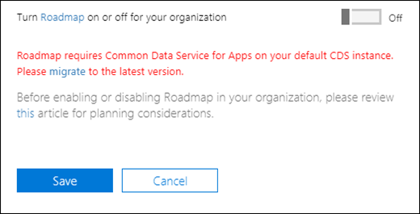
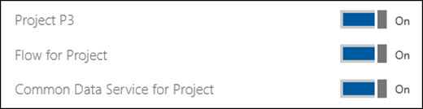

# Turn Roadmap on or off for your organization

Office 365 admins can turn the Project Online Roadmap feature on or off for their organization through their Microsoft 365 Admin settings.

> [!VIDEO https://www.microsoft.com/videoplayer/embed/RE2Mfg9]

## Considerations about Roadmap data deletion

Before using the Roadmap feature, admins should understand more about deleting Roadmap data, should they need to do this in the future.
  
You can turn Roadmap off in the Microsoft 365 admin center. This will prevent your users from using Roadmap, but will not remove any user data that currently exists. 

If your Project Online subscription ends, most of the associated data is deleted in conformance with the [Data Retention, Deletion, and Destruction in Office 365](https://docs.microsoft.com/office365/securitycompliance/office-365-data-retention-deletion-and-destruction-overview). Unlike other Project Online data, Roadmap data isn’t automatically deleted after your Project Online subscription ends.

For more information details about deleting Roadmap data, see 
[Remove Roadmap from Office 365](remove-roadmap-from-office-365.md).

## Turn Roadmap on or off

An Office 365 admin can do the following to turn Roadmap on or off for their organization:
> [!NOTE]
> Roadmap is currently turned off by default. After March 15, Roadmap will be turned on for all licensed users. If you want to ensure that Roadmap is off for your organization after that date, follow these steps after February 14, 2019 and turn it off. You need to do this even if you previously turned Roadmap off, and even if you’ve never used Roadmap. 
 
1. In the Microsoft 365 admin center, under **Settings**, click **Services & add-ins**.
2. Click **Project Online**.
3. Set **Turn Roadmap on or off for your entire organization** to On or Off.
4. Click **Save**.
5. After saving the settings, go to project.microsoft.com and verify that you can [create a roadmap](https://support.office.com/article/video-create-a-roadmap-6c1828da-203e-4c5b-9739-fdd837021feb?ui=en-US&rs=en-US&ad=US).

    
## If you aren't able to turn on Roadmap

In the following conditions, you will not be able to turn on Roadmap:

### Roadmap is not yet available to your organization

The Roadmap feature is being gradually rolled out to organizations over a period of time, similar to how other [Office 365 features are made available](https://support.office.com/article/when-do-i-get-the-newest-features-in-for-office-365-da36192c-58b9-4bc9-8d51-bb6eed468516).

If you see this message, it simply means that Roadmap hasn't been made available yet to your tenant, but should be shortly.

  
 
### Roadmap is not yet available in your region

Per the Online Services Terms, specific countries have requirements for data storage within that country or region for Project Online. If you see this message, it means that Roadmap is not currently available in your region.

Roadmap requires Business Application Platform support in your specific country.  For the current list of countries and regions supported by the Business Application Platform, please go to [here](https://www.microsoft.com/TrustCenter/CloudServices/business-application-platform/data-location).

> [!NOTE]
> For more information about the Online Services Terms, see the [Licensing Terms page](https://www.microsoft.com/licensing/product-licensing/products).

### You need to migrate to Common Data Service for Apps

Roadmap requires [Common Data Service for Apps](https://powerapps.microsoft.com/blog/cds-for-apps-march/).  If Roadmap is available to your organization, and you need to upgrade to CDS for Apps, you will see a message in your Project Online Roadmap settings stating that **Roadmap requires Common Data Service for Apps on your default CDS instance**.  The message will also provide you a link to documentation about [how to upgrade to CDS for Apps](https://go.microsoft.com/fwlink/?linkid=2030786).

### Your Office 365 tenant does not have the correct license

Your Office 365 tenant needs to have a **Project Online Professional** or **Project Online Premium** license in order to use the Roadmap feature.  The Project Online settings in the Microsoft 365 Admin Center will not be available if your Office 365 tenant does not have at least one of these licenses.

The **Project Online Professional** or **Project Online Premium** license assigned to a user will provide three service plans that will allow the user to use the Roadmap feature. The **Project P3**, **Data integration for Project with Flow**, and **Common Data Service for Project** service plans directly support the infrastructure of running Roadmap.  All three must be turned on for Roadmap to work for the user. 

## Related Topics

[Roadmap training](https://support.office.com/article/video-welcome-to-roadmap-57764149-51b8-468f-a50d-9ea6a4fd835a)

  

