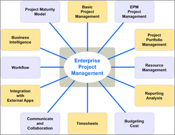
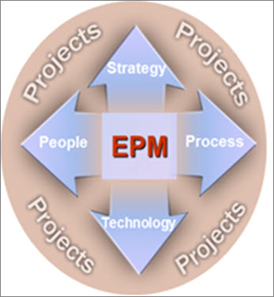
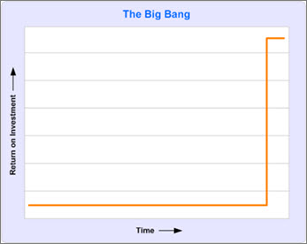
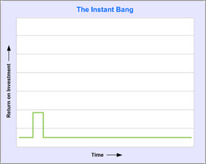
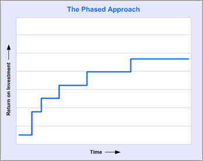

# A phased approach to deploying enterprise project management: white paper

This white paper is part of our "From the trenches" collection. It describes various challenges you can face when planning to deploy the Enterprise Project Management solution in your environment. It also describes several different deployment scenarios that can be used, as well as important prerequisites that need to be considered. 
  
To download the Word version of this white paper, see [A Phased Approach to Deploying Enterprise Project Management: white paper](https://go.microsoft.com/fwlink/?LinkId=120877).
  
To see more white papers, see ["From the Trenches" white papers](https://support.office.com/article/faec6b1a-c217-4c79-b8c4-0514f402106b).
  
## A Phased Approach to Deploying Enterprise Project Management

This white paper provides business decision makers, network administrators, and Project Server administrators guidance about various challenges you can face when planning to deploy the Enterprise Project Management solution in your environment. It also describes several different deployment scenarios that can be used, as well as important prerequisites that need to be considered.
  
### Introduction

I own a company that does deployments of Microsoft's Enterprise Project Management (EPM) Solution. To be fair, HMS Software does more than that. We're also an ISV, but I spend a fair amount of my time working with medium- to large-sized organizations on how they can deploy EPM. Some of the challenges are specific to Microsoft's technology but many of them are similar to what I've seen companies face since I started in the project management software business in 1983. We'll look at how you can plan your own EPM deployment here.
  
 One of the biggest challenges we face when we start an EPM deployment is establishing a credible roadmap for producing the intended result. While we have deployed enterprise project management systems here for over 24 years, one thing that hasn't changed is the desire of senior management to have all the results yesterday. 
  
The challenge is compounded by a couple of factors that are almost always present:
  
1. The Sales team has shown the client the end-result without explaining the effort that would be required to reproduce the effects in a production environment or even how much effort went into creating the virtual image and data involved in the sales demonstration (typically several man-months). 
    
2. Microsoft carries an ease-of-deployment legacy. People have gotten used to stuffing a DVD into their PC, waiting until it pops out and then getting the benefits of the software they've purchased immediately. Oh, there may be some notion of optional training but there is rarely an expectation that what is being undertaken is an organization-changing exercise.
    
### What is Enterprise Project Management?

That would be challenge enough but there are other aspects that are often overlooked by the client during a purchase, starting with 'What exactly is EPM?' That's a short question with a potentially long answer. In the early stages of an EPM deployment we do an envisioning workshop with the client's senior management. One slide that I always use looks like this: 
  

  
"What is EPM from your perspective?" I'll ask. The responses are often found in one of the circles on the slide. The responses might be: 
  
- **Basic Project Management**. "For us, enterprise project management would mean that everyone would be doing project management the same way and using the same tools."
    
- **Enterprise Project Management**. "That wouldn't be enough for us," someone might say. "For us, enterprise project management would mean that our project management data would be integrated. We would be able to get reports that would show our schedules in an integrated, summarized report and we would be able to manage the impact from one project to another."
    
- **Project Portfolio Management (PPM)**. "It's about project portfolio management for us," someone might say. "For us, enterprise project management would mean managing one level higher at the project level. We would need to group projects into portfolios or groups of projects, and analyze and report on them together. We'd need to be able to track progress at this summarized level as well as implement stage-gating." 
    
- **Resource Management**. "For us, enterprise project management would mean resource capacity planning. We need to know not only if we can take on a new project and what the impact might be on existing commitments, we also need to know what the status is of managing the work we've already committed to based on project progress and resource availability." 
    
- **Reporting Analysis**. "For us, enterprise project management would occur in the reports," someone might say. "We need a report that pulls from project management, finance, HR and other internal systems to make roll-up reports for management and decision making. While we're talking about reports, we'll also need dynamic dashboards, scorecarding and other visible systems."
    
- **Budgeting and Cost management**. "For us, enterprise project management is all about the money. We budget at the beginning of the year. We then budget for each project and the only thing that matters for us is tracking the money against the plan, month after month." 
    
- **Timesheets**. "Never mind the planning. If you could just tell me what my people actually spend their time on, we'd be so far ahead of where we are now, we'd call that an EPM success," someone often says. 
    
- **Communication and Collaboration**. "It's not about the fancy algorithms. We need to facilitate talking to our people. Can you help us connect our project teams that now include not just planners but also senior management, clients, users, sub-contractors, outsourcers and team members?"
    
- **Integration with External Applications**. "We've got a big ERP/Finance system which is great except that we don't have any of the forward looking projections for deliverables and costs that come with project management. If you could connect a project management tool with our ERP/Finance system then that would be plenty of enterprise project management for us!"
    
- **Workflow**. "We envisage a system that tracks not just tasks but procedures in an automated fashion. We'd like project managers to fill in an online form to request project funding which would then go to the person responsible who would then, in an automated fashion, accept or reject the request. If approved, the project would instantly be included in the EPM system. We'd like to do the same with all our project documents. In fact, we'd like to automate all our project management procedures in this way through workflow management. That would really be enterprise project management."
    
- **Business Intelligence**. "What we need is scorecarding, dashboarding and data mining of our project data," some people will tell us. That would be the ultimate Enterprise Project Management environment." 
    
- **The Project Management Maturity Model**. "We're working on improving our maturity level as measured by the 'Project Management Maturity Model'." 
    
So, what's the right answer? They're all right. In fact, it's probably not an exhaustive list. EPM can mean so many things to so many people and is highly dependent on the perspective you are looking at the problem from.
  
When we do this with senior management, what often happens is that there is no one of these aspects that is not desired. Yes, people want all of them. And, when they ask if all of this is possible in a Microsoft EPM Solution deployment, the honest answer is, "Yes". The problem is that each of these aspects of EPM can be considered as a vector or a direction in which you can push the EPM environment. If we decide to push on all of these vectors on the first day, the size of the project we'll end up designing will be so large, so potentially disruptive, so complex, and involve so many other corporate systems that it will have little chance of success.
  

  
Remember, an Enterprise Project Management deployment isn't just technology. If it were, the implementation would be over in a few days. No, an EPM deployment involves Strategy, People, Process and Technology. Successful Microsoft EPM Solution deployments virtually always consider the project a 'Change Management' project rather than a technology project. What we're looking to accomplish is to change the way the business works. How? Well, depending on which direction an envisioning exercise goes, the direction could be very different.
  
 If we try to implement every aspect and every direction at the same time, we could end up creating a huge project that is complex and very difficult to understand and that just makes the deployment much riskier. 
  
### EPM Deployment Approaches

Let's talk for a moment about how many people approach an EPM deployment. There are a couple of possible scenarios: the Big Bang, Instant Bang, and Phase Approach.
  
#### Big Bang

The Big Bang theory says "Let's do it all!" The idea is that we'll spend an inordinate amount of time designing, building, rewriting and programming the ultimate enterprise project management environment. It will take a phalanx of programmers and, one day, sometime in the future, on a given weekend, we'll flip a switch and everyone will have enterprise project management. If we were to graph this as Return on Investment over time, it would look like the picture at right.
  

  
There are pluses and minuses to using the Big Bang theory. On the plus side, there's a better chance than with other types of approaches that the end result will be closer to the original intent. After all, the team doesn't rest until they've checked off all the desires created at the beginning of the project. 
  
 On the negative side, however, there are a few big challenges. First of all, the organization doesn't receive any return on investment until the project is 100% complete. That may be months or a year or more down the road. Every day that the project is incomplete is a day someone can wander through the building with a "better" idea. Also, the nature of life is that it changes. Any team change, management change, change in corporate mission or strategy, change in fundamental technology architecture, change in corporate ownership can result in the project being restructured or cancelled. If this happens, the organization receives nothing for its efforts. 
  
#### Instant Bang

When we talk about the legacy of instant gratification legacy that follows Microsoft, we see a different phenomenon. Some clients will assume that deploying the Microsoft EPM Solution is just like playing a Microsoft Game. We load in the DVD and a few moments later, we're doing projects in a coordinated, collaborative fashion. The return on investment looks good for a few days or even weeks as the pilot group with the most excitement over the new system starts to use it. However, without the investment of the senior executives it is extremely difficult, if not impossible, to effect culture or behavioral change and the project rarely extends. The system stays in use for a short period of time and then is either abandoned or left in use by a tiny number of users who are often frustrated that they've been unable to entice the rest of the organization to work together.
  

  
#### Phased Approach

We've found over the years that a phased approach is the most successful method of deploying an Enterprise Project Management Environment. There are a lot of reasons for it. Here are a few:
  
- First, the organization starts to receive a Return on Investment early in the process. This serves to safeguard the implementation and validates to management their decision to do an EPM deployment in the first place.
    
- Second, the deployment tackles technical challenges in waves rather than all at once. As the complexity of the system grows, so, too, does the maturity of the organization in handling that complexity.
    
- Third, the deployment eases the culture change into the organization over time, which is always easier. It's a truism that change causes upset. That there will be some upset at such a change in managing projects is a certainty. Deploying the entire vision over time lets the users adapt to the different way of doing business.
    
- Finally, no matter how much time the organization spends in doing the original design, it is bound to change its mind as soon as it sees the system in operation. Getting that first phase of the deployment into production earlier lets the organization learn from it as they move forward. 
    

  
The most critical element of this plan is the first phase. We instruct our consultants to determine "the most minimal deployment possible which will return an ongoing positive return on investment." I've worded that very carefully. We want to find a first phase of the deployment that can be put into production that will provide results and that each week will give back more benefit than the effort required to produce them. If we do that, the deployment will last forever. No one would remove the deployment because they'll say, "Oh, we can't remove that, we get 'this' out of it every week." If we're successful creating that kind of deployment, we'll be able to build on it in the months to come. If we're not, the project and the deployment is still very much at risk. 
  
### Getting started with your EPM Deployment strategy

If I've made you think twice about doing an EPM deployment, that's probably a good thing. Not that you should not do it but a successful EPM deployment always starts off with a bit of extra thinking. So, how should you go about doing your deployment? Let's start with a few prerequisites.
  
#### 1. The Project Management Office

If your intention is to deploy an enterprise project management environment, there's no way around having an enterprise project management organization. This is commonly referred to as Project Management Office, or PMO. You can call it whatever you want, but there's got to be a central management of a system like the Microsoft EPM Solution. Who will declare templates to be the 'official' template? Who will determine who has authority to change resource priorities? Who will determine what a report will look like and who will have access to it? Who will decide whether to manage risks and, if so, what process must surround it? And so on, and so on… No, a PMO is essential. If you don't have such an organization (even if it's one person) then you'll need to start there as one of the earliest steps towards your EPM environment.
  
#### 2. Executive Sponsorship

Next, get sponsorship and support from senior management. Whoever is supporting this project from the executive suite needs to know not only what the goals of the deployment are, but how long they'll be required to provide support. We typically tell executives to plan for a minimum of a full year of sponsorship duties. One pitfall that we often see is a small group of middle management or project managers who desire an Enterprise Project Management environment but lack executive-level support and decide that they'll try to do the deployment themselves in order to get that support. It's the Field of Dreams "Build it and they will come" approach and it's almost never successful. The problem is that the very benefits that would be attractive to management (such as PM methodology compliance, global project reporting, resource capacity planning, and collaborative project management) are those benefits that can only be achieved with the participation of management.
  
#### 3. We're project managers - we don't need project management!

If you want to avoid the most common pitfall to an EPM deployment, make a project plan. I know, that sounds strangely simple but it's amazing how many EPM deployment projects don't, in fact, have a project plan. One of the easiest pieces of advice we can give to organizations considering deploying the Microsoft EPM Solution is to make it a project and to apply all the same methodology they already use for any other project. Is there a project schedule; a budget; an executive sponsor; a project charter; resources; success metrics? These things might be found in every other project in the organization but, just like the shoemaker's children who go barefoot, project managers often forget to apply their skills to their own projects.
  
#### 4. Set goals

Work at the very beginning of the project to determine what the measures for success will be at each phase. Having a clear set of performance metrics goes a long way to helping not only the project team but also management focus on completing a phase of the project.
  
### Getting started

If you're wondering how to get started, here are a few suggestions. 
  
#### Envision

Start with a facilitated vision session with senior management. If you use external assistance in no other aspect of the project, you'll find it's most useful here. Having someone who has been involved in several other EPM deployments is the key to success. We're not just talking about someone who has been a user of an EPM system but someone who has worked through some of the issues we've described above and who has a good understanding of both the capabilities of the Microsoft EPM Solution and the process of managing projects in an organization.
  
#### Who's who?

One of the things you'll need to decide on early is, who is the 'enterprise'? I've used that term several times in this article but the enterprise could mean whatever you decide. Is it your department, your division, your entire company? One common mistake made by people doing a deployment is making a plan for an entire company but only having authority over their own division. The hope is that others will come on board if the system is available. It's a variant on the Field of Dreams approach and it makes for a solution that's not attractive to those other divisions and not useful for the ones who you do have authority over. So decide early who will be involved and make sure they're included in the planning.
  
#### Make a Project Plan

Just like you would do with any other project, take the time to make a proper project plan. There are numerous plans available online that will give you guidelines on some of the subjects that you need to cover. They're a good place to start, but you almost certainly have all the skills required to make a proper project plan for an EPM deployment.
  
### Conclusion

If you are considering or have started a deployment of the Microsoft EPM Solution, focus your deployment by considering these three points:
  
1. Treat this project as a project. Use all the skills you already have for managing projects to manage the Microsoft EPM Deployment project. Remember, it's primarily a change management project, not a technology project.
    
2. Break the project into manageable pieces and treat each phase of the project as a sub-project with its own success metrics, schedule, budget and resources. You'll get some of the benefits of the overall system faster and that will serve to get even more support from management.
    
3. Remember that Return on Investment has to work at every level. It's not enough to make a system that works for senior management but doesn't work for the people who have to manage it. Or, a system that works for the project managers but doesn't deliver the reporting required by senior management. Or, a system that works for the project managers and senior management but is too hard or too much effort for individual users. Each person who must invest time and energy into the use of the system should be considered in terms of their own return on investment.
    
If you're designing a deployment that follows a phased approach and uses the basic project management methodology you already have for other projects, you've got a great chance of success. Good luck and happy planning!
  
## About the Author

Chris Vandersluis is the president and founder of Montreal, Canada-based HMS Software, a Microsoft Certified Partner. He has an economics degree from McGill University and over 30 years experience in the automation of project control systems. He is a long-standing member of the Project Management Institute (PMI) and helped found the Montreal, Toronto, and Quebec chapters of the Microsoft Project Users Group (MPUG). Publications for which Chris has written include Fortune, Heavy Construction News, Computing Canada magazine, and PMI's PMNetwork, and he is a regular columnist for Project Times. He teaches Advanced Project Management at McGill University and often speaks at project management association functions across North America and around the world. HMS Software is the publisher of the TimeControl project-oriented timekeeping system and has been a Microsoft Project Solution Partner since 1995. 
  
Chris Vandersluis can be contacted by e-mail at: chris.vandersluis@hms.ca
  
If you would like to read more EPM-related articles by Chris Vandersluis, see HMS's EPM Guidance site (http://www.epmguidance.com/?page_id=39).
  

