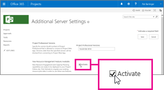

# Activate resource engagements in Project Online

If you're using Project Online, you need to activate the resource engagements features before you can start using them. The engagement features need to be turned on for **each Project Online site** in your organization. [Overview: Resource engagements](https://support.office.com/article/73eefb5a-81fe-42bf-980e-9532b1bdc870)
  
> [!NOTE]
> Resource engagements are only available if you're using Project Professional 2016 or Project Online Desktop Client, connected to Project Online or Project Server 2016. Project Standard 2016 does not include resource engagements. 
  
 **To turn on engagements for a Project Online site:**
  
1. Sign into your Project Online site and choose **Settings** \> **PWA Settings**.
    
    
  
    > [!TIP]
    > If you're in the **Resource Center**, you can click **Additional Server Settings** in the yellow note at the top of the view, and then skip to Step 3. 
  
2. Under **Operational Policies**, choose **Additional Server Settings**.
    
    
  
3. Under **New Resource Management Features Available**, select the **Activate** check box, click **OK** after reading the message about data migration, and then click **Save**.
    
    
  
## What happens to my existing resource plans?

If you've been using resource plans in your Project Online site, those plans will be converted into resource engagements. [Learn more.](faq-resource-engagements-are-replacing-the-old-resource-plans.md)
  

