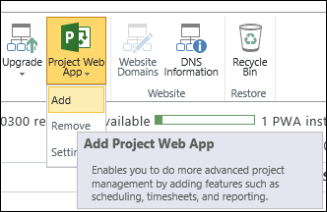

# Add Project Online to a site collection

 *[\< More Project help](project-help.md)* 
  
Adding Project Online to an existing site collection helps you use the permissions and users that you have already set up. It also lets you bring SharePoint tasks into Project Online, and share your enterprise projects on your team or project site.
  
> [!TIP]
> To learn more about using SharePoint and Project Online together, take a look at [Overview: View a SharePoint task list in Project Web App](https://support.office.com/article/720757ef-545c-4635-98f9-c231d662561b). 
  
To enable Project Online on an existing site collection:
  
1. Log on to the Microsoft Office 365 portal site.
    
    Tip If you're not sure of your User ID, refer to the 'Get Started with Microsoft Office 365' email message that includes your User ID and other account information.
    
2. Click the app launcher , and then click **Admin**.
    
3. In the admin center, under **Admin centers**, select **SharePoint**.
    
4. Hover over the URL for the site collection where you want to enable Project Online, and then select the check box that appears to the left of the URL.
    
    
  
    > [!IMPORTANT]
    > You can only add Project Online to a site collection that uses the **Team Site** or **Project Site** template. 
  
5. Click **Project Web App** on the ribbon, and then click **Add**.
    
    
  
6. On the dialog box that appears, click **Enable** to add Project Online to the site collection. 
    
    > [!NOTE]
    > After setting up the site, wait 15 minutes before using it, so that Project Online can finish installing. 
  

