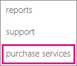

# Add Project Online to your Office 365 account

 *[\< More Project help](project-help.md)* 
  
If you already subscribe to another Microsoft service, such as Exchange Online or SharePoint Online, then you already have an Office 365 account. If you are using Office 365 Enterprise, Government, or Academic, you may be able to simply add Project Online to that account.
  
||
|:-----|
|**How do I know if I have the right kind of Office 365 account?**   To check, go to the [Purchase Services page](https://go.microsoft.com/fwlink/p/?LinkID=402340) in the Office 365 admin center.    |||
|:-----|:-----|
|             |**If you see Project Online listed,** this means you can add it! Keep reading to learn more.    **If you don't see Project Online listed,** this could be because your account isn't Office 365 Enterprise, Government, or Academic. These are the only subscription levels that currently support Project Online.    |
   
|
   
 **To add Project Online to your existing Office 365 account:**
  
1. [Log into](https://portal.office.com) your Office 365 account. 
    
2. On the Office 365 admin center, choose **Purchase Services** on the left menu. 
    
3. Choose **Add** next to the Project Online plan that you prefer, and follow the on-screen instructions. 
    
    
  
    > [!NOTE]
    >  If you are using a trial version and want to pay for a subscription, choose **Buy Now**. 
  

