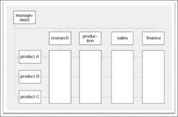

# Balancing the matrix

This article is part of our "From the Trenches" collection. It describes the challenges facing someone who implements Enterprise Project Management (EPM) in an organization that uses a matrix project management environment.
  
To download the Word version of this article, see [Balancing the matrix: white paper](https://go.microsoft.com/fwlink/p/?LinkId=403347).
  
To see more articles, see ["From the Trenches" white papers](https://support.office.com/article/faec6b1a-c217-4c79-b8c4-0514f402106b).
  
## Balancing the matrix

In project management circles we tend to talk often about a matrix management environment. Matrix management isn't anything new. It has become the de facto standard for management in virtually all high-tech organizations.
  
The idea of matrix management came out of management thinking in the early 70s. J.R. Galbraith gives us one of the first published works on the subject in 1971 talking about how to combine organizational and functional responsibilities. The prevailing management environment at the time was hierarchical. 
  
Organizations were huge silos of departments ruled by strong department leaders. That works great until there is more than one project that must span more than one department in order to be completed. The notion of a 'projectized' matrix has been promoted by project managers and associations like the Project Management Institute for over 30 years.
  
In a projectized matrix, we establish a second axis to our organization and we give some responsibility to that part of the organization that manages projects. The result has organizational departments along one side of the display and project managers delivering projects or products down the other.
  

  
Why talk about this while talking about Enterprise Project Management? Because this model has become the cornerstone of virtually every Microsoft EPM Solution deployment. If you're now working on deployment of Project Server then you're sure to run into this model in your travels. There are exceptions to the Matrix Management model which I'll discuss before I'm done here, but suffice it to say that it is close to universal if we look at technology organizations. 
  
If you're now working on a Microsoft EPM Solution deployment, you'll find an organization in one of several states: 
  
1. There is no matrix
    
    The organization is completely silo-based. Each department head manages his or her own department as if it were a subsidiary of the larger organization. Budgets are summarized upwards through the departments in a hierarchical fashion (think of an Organigram). When a project is initiated it is done within each department even when resources might be required from other departments to complete the project. If the project can't be completed with the resources from the department that is managing it, then outside resources are negotiated as inter-department requests.
    
    That actually doesn't sound too bad until you try to manage such a project. If almost every project requires inter-department resources, then figuring out the priorities between groups is impossible. There is no incentive for any one department head to relinquish control over the priority of his or her own resources. It's counter-intuitive to give up such power, so any project that can't be completed within a single department suffers.
    
    Moreover, when we talk to executives who are one level higher than the department heads, the universal lament is that they cannot get any resource capacity planning. This makes perfect sense. There is no cross-department structure for aggregating the information we'd need for resource capacity planning nor any incentive for each department head to submit to the centralized prioritization that would be required for such an analysis.
    
    It's entirely likely in this situation that we'll find not one but multiple project offices—one per department which cooperate very little with each other.
    
    Deploying the Microsoft EPM Solution into this kind of scenario requires doing some thinking about how to adjust the organization at the same time. Often we get calls from these kinds of companies asking us to do the impossible. Train hundreds or even thousands of users, get Project Server installed and be in production in a couple of weeks. The expectation is that because the company has purchased a centralized enterprise project management system, then the organization will immediately line up and operate as a centralized matrixed environment. It's an expensive fantasy. Inevitably, we have to talk with senior management about how the organization will have to be changed. That's typically not great news for management who were hoping that just purchasing the software would be enough of a commitment to have everyone change.
    
    We start such projects by working on plans for a centralized project management office and centralized project management procedures. Project Server gets introduced slowly from the middle out. It's not uncommon for such projects to take 12 to 24 months until the entire organization is finally involved. We just re-started such a project after a 2½ year delay while they worked on their own to create a PMO. 
    
2. There is a balanced matrix
    
    It's great when this happens but it's unfortunately quite unusual. Maintaining a balanced matrix requires constant adjustment and care. But, when we do find a balanced matrix, we're also likely to find a highly evolved set of procedures, defined roles, and a process that's well understood by everyone involved. Deploying the Microsoft EPM Solution into this kind of organization is the best-case scenario.
    
3. There is a matrix but it is unbalanced
    
    This is by far the most common scenario we face and it makes perfect sense. The matrix model carries some inherent conflicts, so we often find the matrix either weighted towards the department with a weak PMO or weighted towards the PMO with weak department heads. Or (and this is by far the most challenging) we find the matrix weighted towards some departments but not others and some project managers but not others, so that the center of gravity in the organization is hard to come by.
    
    Deploying the Microsoft EPM solution in these environments means doing some inventory and discovery work. Where have processes been established that are successful? Where have processes failed? What is working at the centralized project management level which we can leverage to deploy Project Server and what is not? 
    
    In these types of deployments, we need to be very careful to pick and choose the elements of the EPM Solution we want to deploy first and whom to deploy them to. Deploying in a phased approach in this kind of scenario is critical, as a big-bang approach is almost never successful here.
    
### The Matrix Challenge

For those who have grown up knowing only matrix structured organizations, you might not even think to wonder whether it's a good structure or bad or think of what is strong or weak about this kind of management. There is a fundamental challenge with the matrix organization that many don't even question: it is conflict-by-design. The structure sets up two opposing forces: the Department heads and the Project Managers. We'd never say this out loud of course, but just looking at the structure makes it self-evident. 
  
The goal of the department head is to watch out for the staff members in the department. They want to make sure their people are productive, skilled, satisfied employees. If we were to leave the organization just up to the department heads, we'd end up with delighted employees who were well-trained, not too overworked, and well compensated, but who didn't produce much.
  
The goal of the project manager is to watch out for the delivery of the project. They want to make sure their project is done as quickly and cheaply as possible while maintaining the scope and quality that were defined at the project's inception. If we were to leave the organization just up to the project managers, we'd end up with some projects getting done quickly but a huge turnover in staff as we burned out employees in the name of completing the project.
  
The idea of the Matrix Organization is that setting up a conflict between these two forces will happily balance the organization between productivity and employee satisfaction. The premise, though, is that department heads and project managers are ultimately all pretty much as powerful as each other. The challenge, of course, is that people are not created equal. There will always be some project manager who is more experienced than another; some department head who is more skilled than the next. 
  
This lack of equality throws the Matrix out of balance on the first day. Just realizing that the exception is a balanced Matrix Organization often is enough to have PMOs and organizers think about how to maintain order, and that can be a good thing.
  
 Getting a perfect balance isn't as important as making sure that there's some effort towards identifying where the organization's projects and people get stuck. The tools to make a matrix environment work are always the same: processes and communication. A skilled implementer can identify processes and procedures that establish what's important to the organization. 
  
### Giving up the matrix?

Not everyone is a fan of the Matrix Organization. In the last few years, a number of business leaders have voiced the thought that perhaps the Matrix Organization thinking isn't the best plan. "Divide personnel into dedicated project teams," they say "and you'll be happier for it," or "Organize projects to work within each department and give them to the department heads." For more on this, take a look at this article by Rob Enderle to see someone who thinks the Matrix model should be retired.
  
In a number of organizations I've visited lately, I've seen matrix models that have been skewed in one direction or another and each situation causes me to make recommendations that are a bit different in how to deploy Project Server and the Microsoft EPM solution. If there is no centralized PMO at all then that becomes my first recommendation. I've had some organizations approach me saying that they want to use Project Server just to reduce license costs but don't have any intention to work together. That doesn't make a lot of sense. The whole idea of a centralized enterprise project system is to bring data together for analysis and display to allow projects to be managed together. If you don't have any intention to do that, stick with individual Desktop licenses.
  
In some organizations the Matrix model has been displaced by a return to silo thinking. This kind of thing can happen when there is a big organizational change or external stimulus from, say, a big change in the economy. When pressured, some managers will fight for survival by any means possible. I've seen several large organizations recently where department heads successfully described the PMO and their personnel as "redundant project resources" and lobbied to return control to the department heads. 
  
The result of such changes can have the exact opposite effect of what was intended. True, costs drop for a short period, but the loss of efficiency of people whose job it was to generate efficiency through shorter, cheaper projects often carries a rebound awhile later. Still, with large organizations, it can take months or even a year or two before these effects are realized. In the meantime, the Matrix collapses and the power of Project Server can be inhibited.
  
 In the more progressive organization, new emphasis might be placed on the PMO with a newfound respect for its capabilities and, perhaps, even a new level of authority in the face of a challenging economy. 
  
### Restoring (or establishing) balance

For those working on or about to work on EPM deployments, here are a few things to think about with regard to the Matrix Management environment you encounter:
  
First of all, look for the processes and the definitions of roles for each axis of the matrix. While doing interviews, look for where the processes are making the organization more productive as opposed to more bureaucratic. When looking at roles, watch out for the classic "responsibility without authority" challenge that is so often talked about in project management circles. 
  
If you're starting from scratch, you can still find processes in the hierarchical structure that can be adopted and those might well be worth a lot to you. If you can find an existing process or procedure within a department that could be adopted by the entire enterprise, then acknowledging the source of the process gets you two things instantly: First, you have one process in one department that doesn't need to be deployed. It has already been adopted. Second, you can end up with a big ally in your efforts to create the second axis of the matrix where the department head involved can see evidence that you're not intending to throw out everything that has already been done by the departments.
  
If you're creating processes that go across departments and you will have to, then think about involving the very people who might feel disenfranchised. For example, I was assisting an organization recently who had to create a cross-department resource capacity planning process. Needless to say, the department heads weren't overjoyed at this idea as they felt that they would lose some measure of control over the management of their own staff. I recommended creating a portfolio steering committee (including among its members those department heads) that would establish project priorities. The department heads wouldn't feel the authority was being taken from them; instead they'd be included in the new structure of authority for making cross-department decisions. Working this way deflected an otherwise challenging aspect of an EPM Deployment by including the very people who would otherwise oppose it.
  
Finally, think about going "light" on your deployment and establishing the centralized procedures without excessive intervention by working in layers. For example, we're working on a project where the matrix is very organizationally strong. The PMO is in its infancy, and pushing hard against the organizational structure isn't ideal. We've recommended not working down to the individual level for resource management to start. The organization instead will deploy resource management as a centralized process with a very small number of users attached either directly or as emissaries from the departments to the PMO. Resources will all be defined as generic and the goal will not be to drive to the individual task level for each employee to start. Instead, the PMO will start doing resource capacity planning by identifying aggregate resource challenges in upcoming periods and then turning the problem over to the department heads to manage. We expect that in time, there will be demand from the department heads themselves to push the EPM deployment wider to ease the work they have managing resource conflicts themselves.
  
### Conclusion

Regardless of whether you're deploying enterprise project management as a consultant for others or if you're deploying your own EPM within your own organization, you're almost certain to have to confront the challenges of the Matrix Organization. Keeping your matrix balanced is one of the key challenges of EPM and EPM systems like the Microsoft EPM Solution to making them successful. 
  
## About the Author

Chris Vandersluis is the president and founder of Montreal, Canada-based HMS Software, a Microsoft Certified Partner. He has an economics degree from McGill University and over 30 years experience in the automation of project control systems. He is a long-standing member of the Project Management Institute (PMI) and helped found the Montreal, Toronto, and Quebec chapters of the Microsoft Project Users Group (MPUG). Publications for which Chris has written include Fortune, Heavy Construction News, Computing Canada magazine, and PMI's PMNetwork, and he is a regular columnist for Project Times. He teaches Advanced Project Management at McGill University and often speaks at project management association functions across North America and around the world. HMS Software is the publisher of the TimeControl project-oriented timekeeping system and has been a Microsoft Project Solution Partner since 1995. 
  
Chris Vandersluis can be contacted by e-mail at: chris.vandersluis@hms.ca
  
If you would like to read more EPM-related articles by Chris Vandersluis, see HMS's EPM Guidance site (https://www.epmguidance.com/?page_id=39).
  

