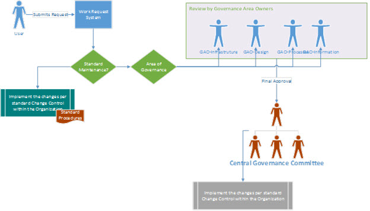

# Beat the Half-life (t 1/2): Governing Your PPM Solution, Post-Implementation

This article is part of our "From the Trenches" collection. It describes how to set up a framework to setup a governance model for your Project Portfolio Management (PPM) solution. It also includes a sample governance plan that could be used as a starting point to set up your own governance strategy.
  
To download the Word version of this article, see [Beat the Half-life (t ½): Governing Your PPM Solution, Post-Implementation: white paper](https://go.microsoft.com/fwlink/?LinkId=393527).
  
To see more articles, see ["From the Trenches" white papers](https://support.office.com/article/faec6b1a-c217-4c79-b8c4-0514f402106b).
  
## Beat the Half-life (t ½): Governing Your PPM Solution, Post-Implementation

### Introduction

In Radioactive Physics, Half-life (t½) is the amount of time required for a quantity to fall to half its value as measured at the beginning of the time period. (Ref: https://en.wikipedia.org/wiki/Half-life).
  
So, how does that apply to your recently implemented, brand spanking new Project Portfolio Management (PPM) solution? The reason it applies is because your PPM solution, implemented successfully, comes with an expiration date. If you do not take the time to plan, design, and execute a governance process around the management of the PPM solution, you can rest assured that the solution will get filled with stale data, bad design changes, processes that are out of sync with actual organizational processes, and the list goes on. Just like a car that never receives maintenance, your solution will stop yielding the ROI that is expected out of it. Your users will become passive, and either stop using the solution or vociferously advocate a different solution.
  
The goal of this paper is to discuss a framework to setup a governance model for your PPM solution. A sample governance plan is also provided that could be used as a starting point to set up your own governance strategy.
  
### The What and the Why

While the word governance could mean different things to different people, at the core, a governance plan is a set of self-imposed policies and procedures, to make sure the application is healthy in all areas and yielding the best return of value for the investment made on the tool. 
  
Why is it necessary to have these restrictions, you ask? It is akin to the maintenance of the house you are living in. Imagine, every time you need something to be fixed or added to your home, a different contractor shows up, and does the work differently than the previous contractor. Pretty soon you can be sure to end up with mismatching windows, multi-design door knobs, and so on. That is why it makes sense for builders to have all those codes and guidelines to follow while building something, standards of components they need to maintain, and so on.
  
Similarly, once your PPM solution is live, there are going to be several changes, enhancements, and removal of features that will come up. Unless you set a standard on 'how' these changes are performed, you can rest assured of a solution that is in complete chaos down the road.
  
### Areas of Governance

When you start considering setting up a governance plan for your PPM solution, you need to consider which areas you actually want to govern. There are many theories and models for establishing a governance plan for enterprise solutions, and you are free to choose the best one that fits your organization. In this article, we will discuss one of these models that will fit most of the PPM implementations.
  
The simplest way to figure out the areas of governance needed is to consider the areas where changes are likely to happen, and then set up a governance plan for managing those changes. 
  
> [!NOTE]
> Even for items that are not 'changes' per se, and rather standard maintenance (Ex: Adding new users, updating Timesheet Periods etc.,), it is important to have a set of standard procedures recorded. 
  
In general, there are four key areas where changes could happen for your PPM solution.
  

  
#### Information Governance

When your PPM solution is implemented, it is reasonable to assume that you start with good 'master' data in the solution. For example, these include Enterprise Resource Details, Enterprise Calendars, related custom fields and so on - essentially all the 'master' data that will enable you to use your PPM solution effectively. However, as you keep using the solution, people change departments, some leave the organization, calendars need to be updated with new holidays, time reporting periods need to be created, fiscal periods may need to be changed, and the list goes on and on. Obviously, if this data is not kept updated, then all your reporting will be inaccurate, and so does your security configuration. 
  
Information governance is taking responsibility to keep this data updated and complete so that the rest of your solution can take advantage if this core data. 
  
#### Design Governance

The second area that needs to be part of your governance plan is the maintenance of "design" of your PPM deployment. As you continue to use the solution, there are going to be requests to tweak the solution design. These could arise out of a particular group wanting to change the way they use the tool, or wanting to take advantage of new features. A classic example is switching the way time reporting is done. You might have chosen to go with a % Work Complete method, whereas with a new department added, you might need to switch it to the 'hours worked per period' method for the sake of integration with other financial solutions. So the question is who will evaluate the impact of this change across your solution, and how are the changes going to be rolled out. 
  
Design governance is the plan to manage changes that impact your overall design of the PPM solution. 
  
#### Process Governance

It is easy to think of this area of governance as part of the design governance, because most of the time, process and design go hand in hand. However, holistically speaking, this area covers more than just the design. It addresses the governance of processes inside and outside of the PPM solution that drive its effectiveness. 
  
For example, take a scenario where your PMO is supposed to submit a report to senior management every Wednesday AM. You might have setup a process to make sure that the timesheets are submitted every Friday by a certain time, and all you project managers update and publish their project plans by Monday AM, before the reporting happens. Now, let's say the senior management asks for reports to be sent Monday AM instead of every Wednesday AM. This triggers a change in the process as to how the PPM solution is used, rather than a change to the design of the PPM solution itself.
  
These kinds of changes will need to be governed by a standard set of rules, defined as part of process governance.
  
#### Infrastructure Governance

This is another one those areas that appears to be easy to silo, however can overlap the other three areas mentioned above. Simply put, the infrastructure that supports your PPM solution should be maintained with the installation. Some examples of the key items that should fall under this kind of governance model are: 
  
- Installation of service packs or cumulative updates.
    
- Installation of new add-ons, or applications.
    
- Upgrade of the infrastructure (addition of application servers, Web servers etc.,) to address performance concerns.
    
- Changes to the infrastructure due to changes to other applications in the organizations (for example, virtualization of all servers).
    
On one side of the equation, the decision to install something or not is purely merit based (for example, whether it will impact any current production solution adversely). The other side of the equation of any infrastructure is to look into the 'process' or 'design' changes that will be caused by the installation. In some cases, the infrastructure change could be the result of any changes in the other areas. As mentioned before, while our attempt is to classify each change as part of one of these areas, it is possible for some changes to completely overlap all four areas. 
  
### Key Questions

 No matter which area of governance you are trying to set up, there are three key questions that need to be answered that will form the core of your governance plan. 
  
- How does the PPM team know that a change needs to happen (for example, what is the trigger for these changes?). Sometimes, these changes are not 'triggered' per se, but are part of regular care and feeding of you PPM implementation (for example, the addition of new views for the Project Center)
    
- Who approves these changes, not just from a business return-on-investment (ROI) standpoint, but from a governance standpoint? 
    
- Who actually makes these changes? For many of these changes, multiple teams are involved. In some organizations some of the change capabilities are transferred to a subset of end users, based on business needs. In these kinds of scenarios it becomes even more important to define who actually will make what changes. 
    
### Governance Team

A key component of any governance strategy is the team that actually works the governance plan. While there are several ways to slice and dice as to what this governance team should look like, the one recommendation that all schools of thought will agree on is to keep it simple. 
  
The following is one way to set up the team structure: 
  
 **Governance Area Owners** These are the owners of each of the governance areas mentioned previously in this article. In general, any change requests that will impact the designated area for these governance owners will become the responsibility of these owners. It will be their role to evaluate, provide recommendations, set up governance around the new features, and so on. 
  
 **Central Governance Committee (CGC)** This would be the team of decision makers who can approve or reject the recommendations made by the governance owners. Having a central governance committee not only helps reduce bureaucracy, but also helps bring all ideas to a common platform, and evaluate them in cognizance of one another. 
  
As mentioned above, depending on the size of the implementation and the current processes that exist in an organization for other applications, the definition and structure of these roles could be smaller or bigger. The important point is that to have at least a minimum structure in place. 
  
### Other Key Components

Some of the other key components for a successful governance strategy include, but are not limited to:
  
- A Work Request solution, which allows users to request changes, features and functionality. This can be as simple as a SharePoint list or a currently used in-house work request solution. 
    
- A process for handling changes, which includes reviews from IT, governance, CGC, and other business functions involved. 
    
-  A process for actually implementing changes. This could be a simple progression of changes from Development to Test to Production Solutions or a full-fledged Release Management per your organization standards. 
    
### The Process

Let's take all the components discussed above as part of building a governance strategy, and build a process around it. Here it how it might look (could vary based on organizational requirements).
  

  
### Conclusion

While it is difficult to predict and plan for every change that can occur to your PPM solution, it is important to have a strategy in pace that is flexible and scalable to any scenario. 
  
As parting thoughts, please consider the following basic common-sense approaches to building your governance strategy.
  
- A governance plan does not need to be a tome with a lot of obscure terminology, and language that no one can use in daily life. It can be as simple as an Excel sheet, with quick answers to the key questions (addressed in Key Questions).
    
- Remember that a governance plan is not a documentation of your configuration. It is a "plan" for protecting, maintaining and changing (if necessary) your configuration. 
    
- A governance plan needs to be easy to be implemented, and should integrate well into the existing processes of the organization. It is not necessary to reinvent the wheel.
    
- Understand that governance of your PPM solution is a constantly evolving process. It is important to not get hung up with paralysis of analysis. Start small, deliver value and then scale it up.
    
## About the Author

Prasanna Adavi (PMP, MCTS, MCITP, MCT) is a Senior Enterprise Project Management (EPM) Consultant and Trainer specializing in the Microsoft Project, Microsoft Project Server, and Microsoft SharePoint platforms. His main focus is to build and enable business solutions to help organizations achieve the best return on their investments. 
  
He also has extensive experience in leading projects end-to-end in a wide spectrum of domains and verticals, including IT, ERP (SAP), Manufacturing, Application Development, Automotive and Creative Services. He is a regular presenter at various Project Server, EPM and SharePoint events across the country/region, and a regular contributor to the SharePoint and EPM Community. 
  
Prasanna is a regular blogger (https://www.prasannaadavi.com) and also runs a bi-weekly podcast (https://www.msprojectpodcast.com), mainly focusing on Microsoft Project and Project Server solutions. Prasanna is a Senior Consultant with EPMA (https://www.epmainc.com). 
  

