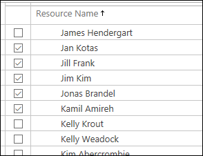
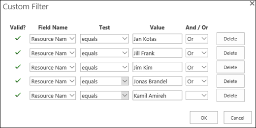
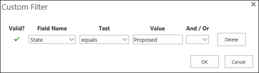

# Best practices to improve Resource Engagements performance

In Project Online, resource managers and project managers can negotiate an agreement, called a [Overview: Resource engagements](https://support.office.com/article/73eefb5a-81fe-42bf-980e-9532b1bdc870), to make sure that resources are being used appropriately and effectively throughout your organization. This article describes ways that resource managers can improve performance, such as reduced page load times and less timeout errors, when using Resource Engagements.
  
## Why is my Resource Requests page taking so long to display?

When you click **Resource Request** in the ribbon of the Resource Center, it will bring up resource requests for  *all selected resources*  in the Resource Center. If all resources are selected in the Resource Center, resource requests for all resources in your Project Online tenant will attempt to load to the Resource Request page. Depending on the number of resources and their requests, this may cause delays and timeouts in loading data to the page. 
  
 ** So what should I do? ** To improve performance, you should try to display resource requests for resources you are interested in as opposed to all resources in your organization. In most cases, resource managers only want to view resource requests for a small subset of resources, such as the resources that are assigned to them. In this case, a resource manager could simply select these individual resources on the Resource Center before going to the Resource Request page. 
  

  
### Can I create a view to show only the resources that I own?

While you can manually select your resources as noted above, resource managers can also easily create a Resource Center view that displays only resources that they manage. This would eliminate the need to find and select your resources each time you go to the Resource Center. For example, you could create a Resource Center custom view (" *Resources I own*  ") that displays all of the resources that you manage. 
  
 **To create a view that displays resource you own**
  
1. In Project Online, in the Quick Start, click **Server Settings.**
    
2. On the Server Settings page, in the Look and Feel section, click **Manage Views**.
    
3. On the Manage Views page, click **New View**. 
    
4. On the New View page, in the Name and Type section:
    
  - In the View Type drop-down, select **Resource Center**.
    
  - In the Name field, enter a name for the view (for example,  *Resources I own*  ). 
    
  - In the Description field, enter a short description of this view.
    
5. In the Table and Fields section, select the fields you want to display in the view and **Add** them to the Displayed fields list. 
    
6. In the Format View section, use the Grouping controls to choose how the items will display the view.
    
7. In the Filter section, click **Filter** to display the Custom Filter control. 
    
  - In the Field Name drop-down, select **Resource Name**.
    
  - In the Test drop-down, select **equals**.
    
  - In the Value box, type the exact name of the resource that is assigned to you.
    
  - Click **OR**.
    
  - Repeat this process to add the remaining resources that are assigned to you.
    
  - Click **OK**.
    
    
  
8. On the New View page, click **Save**.
    
After creating the custom view, you can select it from the View menu in the Resource ribbon in the Resource Center. After selecting it, the Resource Center should display the resources you entered in the custom filter when you created the view.
  

  
Clicking the Resource Request button in the Resource ribbon will then find the resource requests for only these specific resources.
  
Project Online will by default use your custom view when you navigate away and return to the page - you will not have to re-select it the next time you return to the Resource Center.
  
### How can I show only proposed resource requests for my resources?

Now that you know that you can improve performance by filtering for only the resources you are concerned with, you can improve it even more by filtering for resource requests that you need to address.
  
The Resource Request page will by default display resource requests in  *all states*  , including those that have already been committed and accepted. As a resource manager, you may mostly want to view resource requests that are in a proposed state. If this is the case, you can create a Resource Requests view that filters for only proposed resource requests. This can help with performance as it eliminates the need to load the Resource Requests page with resource requests you've already addressed in the past, which could amount to a lot of data. 
  
 **To create a view that only displays proposed resource requests:**
  
1. In Project Online, in the Quick Start, click **Server Settings.**
    
2. On the Server Settings page, in the Look and Feel section, click **Manage Views**.
    
3. On the Manage Views page, click **New View**. 
    
4. On the New View page, in the Name and Type section:
    
  - In the View Type drop-down, select **Resource Requests**.
    
  - In the Name field, enter a name for the view (for example,  *Proposed*  ). 
    
  - In the Description field, enter a short description of this view.
    
5. In the Table and Fields section, select the fields you want to display in the view and **Add** them to the Displayed fields list. 
    
6. In the Format View section, use the Grouping controls to choose how the items will display the view.
    
7. In the Filter section, click Filter to display the Custom Filter control. 
    
  - In the Field Name drop-down, select **State**.
    
  - In the Test drop-down, select **equals**.
    
  - In the Value box, enter **Proposed**.
    
  - Click **OK**.
    
    
  
8. On the New View page, click **Save**.
    
After creating the custom view, you can select it from the View menu in the Engagements ribbon in the Resource Requests page. After selecting it, the Resource Requests page should only display resource requests in a proposed state for your resources.
  
## Do you really need the Time-Phased data view?

If you don't really need to view your resource requests in Time-Phased view, make sure that **Timephased Data** is not selected in the Display section of the Engagements ribbon of the Resource Requests page. 
  

  
Loading your resource engagements in the Sheet view reduces the amount of data that needs to load to the page, reducing the amount of time it takes to display your data.
  
## Why aren't some of my resource engagements displaying?

If some of your resource engagements aren't displaying on the Resource Assignments or Resource Requests pages, it might be because they fall outside of the pages' hard-coded date range filter that removes resource engagements that either:
  
- Ends at least three months in the past.
    
- Begins at least a year in the future.
    
Resource engagements will only display for resource requests that fall within these time periods. The only exception to that will be for resource requests that are in a Proposed state. 
  

