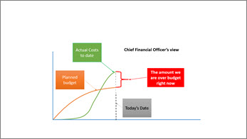
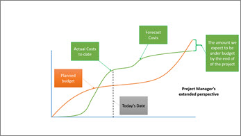

# Breaking Bad...News that is

This article is part of our "From the Trenches" collection. It describes how project managers can share bad news about their projects most effectively and with the least damage to themselves. 
  
To download the Word version of this article, see [Breaking Bad...News that is: white paper](https://go.microsoft.com/fwlink/?LinkId=330205).
  
To see more articles, see ["From the Trenches" white papers](https://support.office.com/article/faec6b1a-c217-4c79-b8c4-0514f402106b).
  
## Breaking Bad… News that is

Following an article ([Cancelling a project without cancelling your career: white paper](cancelling-a-project-without-cancelling-your-career-white-paper.md)) I did a while back, I received a number of comments from project managers expressing their concern at sharing such bad news with their management. "No matter what the potential benefits might be," one said, "I'll be fired if I share news that bad."
  
No matter what your work environment, it seems that some people are better at sharing bad news than others and for project managers, being able to share both good tidings and bad is part of the job description. So let's look for a moment at how a project manager can share bad news most effectively and with the least damage to themselves.
  
### Get all the news before you start sharing

The first and most important lesson is to make sure you have all the news. Whenever I have a staff member who approaches me with some upsetting news I inevitably have questions. If they haven't taken the time to even consider what questions I might ask and what the answers are, it is irritating. So, before rushing to your manager to exclaim how the sky is falling, make sure you pause for a moment to get all the facts. Are you sure the information you have is complete? Is it accurate? Are there extenuating circumstances? Do you know how this bad news came to occur? Is this a temporary condition or something more permanent? Do you have an assessment of the impact of this news?
  
Whew! We're not out of the gate yet and already you have a list of things to do. There's nothing more upsetting to a person in management than to have a problem dumped on their desk by someone on their team but not yet know whether it's a problem or not. It should be easy to determine the initial questions that may arise from whatever your bad news is so get them answered for yourself before you start sharing your news.
  
### Ostrich thinking isn't productive

Like an ostrich which pokes its head into the sand at the first sign of danger in the hope it'll go away, some project managers avoid bad news at all costs. Avoiding bad news is rarely productive. Indeed, it is because not all news is good that project managers have a job in the first place. If all projects always worked just the way they were planned, why would we have project managers? So just because you're not ready to share that bad news yet doesn't mean you won't be sharing it at all. 
  
### Who's to blame?

This may be the least valuable question and the answer is almost certainly of little value also. Yet, many people will default to point a finger at someone else as a reaction to the upset that the bad news is about to cause. Staying away from blame will allow you to focus on "What happened?" and "What should we do next?" as opposed to "Who do I lay the fallout of this problem at the feet of?"
  
### Is it bad news? Are you sure?

I recently had one of my staff appear in my office letting me know that due to resource constraints we would be unable to meet a client's expectations that we do several days of training after hours. "Did we commit to do this?" I asked. There was a long pause. The staff member wasn't sure and it turned out to be a key question. No. We had never promised to do this training. The client had a desire that we would but had not even gone through the proper channels to schedule it. It turned out there really wasn't bad news to share and the appropriate action was to contact the client to schedule some training time at a future date. 
  
Problem solved.
  
A problem typically gets expressed like this: "This was expected but this is what happened". Sometimes just the semantics can make you think about it differently. Try this: "This was expected and this is what happened." Conflict? Perhaps not, but it's healthy to start with seeing if there was as commitment that was broken. If not, perhaps there isn't a problem to deal with. 
  
### Silver linings

When something unexpected happens there is often impact or fallout as a result. If you are pausing or cancelling a project for example, one thing that almost always happens is you have extra resources that were not expected that can be assigned to other work. Pausing a project may have the result of refocusing more effort on other more critical work. 
  
When you have bad news to share, it's common to see everything around you through the filter of "It's all bad" but that is rarely true. Some impact from your bad news will be good and you owe it to your management or your client or whoever you need to share your news with to share not just the bad impact but also the good.
  
### Mitigation

So you have some bad news. One thing that's worth doing before you share it are some mitigation factors. Perhaps your project is behind schedule. That's bad news. But, if you had already hidden some management reserve in your schedule (as many good project managers do) then perhaps you can catch up on your schedule during that period. The bad news is mitigated; neutralized.
  
Mitigation also lets you think of potential solutions to the problem before you share it. Managers greatly appreciate problem descriptions being delivered at the same time as a list of possible solutions. Sometimes those solutions become opportunities to open up a whole new line of thinking. A number of years ago, I was working with a large software company and in the middle of the development of their next major release, they determined that they would need to cut a marquis function from the scope. It was bad news. If no further action was taken, they would release their next version and already be much less functional than many of their competitors. They company selected one of several mitigation plans and went to the market and bought a company who had exactly the functionality they were missing. The end result? The company made the market delivery date, had the appropriate functionality and, moreover because of the acquisition, had a team of highly skilled staff who allowed them to leverage that functionality to leap ahead in the marketplace. 
  
Problem solved.
  
### Presentation is Power

As project managers we often lament that we have all the responsibility and none of the authority. After all, it is rare that a project manager has all the project resources reporting directly to them, yet it is the project manager to whom we turn to ask about progress in the project. 
  
While the project manager may have little authority, they do control one thing that is even more impactful; they control the presentation of information and controlling the presentation is key.
  
Is it any wonder we call it "Power"Point? How you display something can make all the difference. A number of years ago, filmmakers Stephen Spielberg and George Lucas bought an old flight simulator and were amazed to determine that the human body can detect a change in pitch (the angle on which you're standing) of less than ½ of one degree. When augmented by visual cues, the mind will fill in the gaps and the body will react as though an event is actually happening even though it's just a tilting floor and a movie with some sound. 
  
Pilots in training who are using a flight simulator will have the same body reactions (heart rate, breathing, adrenaline etc.) in a simulator emergency as they will in an actual emergency. 
  
The result of Spielberg and Lucas's investigation? The Star Tours ride at Disney World. 
  
By the same token, a project manager controls the visual display. Show a trend line instead of a table of figures and the eye follows the trend all on its own and the mind draws its own conclusions. 
  
Project Managers typically control all the elements of how data is displayed. Showing dashboard data or analytical data or data in a graphical format along with simple bullets on a slide can make an enormous difference. 
  
In one recent engagement I had to explain to the client that their current workload was almost two times the size of their workforce and that no amount of prioritizing would result in all the work being done on time. Before presenting this bad news however, I spent some additional time digging into the data of what work was actually being done. I pulled volumes of timesheet data into Excel and started charting it. Finally a pie chart showed a major nugget of gold. An incredibly high percentage of work was being expended in IT maintenance. Further digging determined that much of this work was either avoidable through strategic decisions (for example, supporting an unusually high number of database products and versions) or through restricting a practice of allowing projects to be sub-divided into such small mandates that they could be handled operationally through a technical support request. The organization had been so challenged in getting work accomplished that many business team leaders had learned to sub-divide projects of 30, 40 or even 60 days in duration into 3 day segments which they would get accomplished through a call to the help desk. This was so prevalent that there was as much unauthorized project work being done this was as there was through the actual project management office. Stopping this practice gave the PMO renewed insight into project requests and the volume of requests dropped significantly. 
  
The data had always been there. The practice was known to many but until we showed the slice of the pie chart in a graphic, no one was aware of how impactful the practice had become. Indeed, the management were shocked at the numbers.
  
### Perspective counts

It's important to not let the urgency of the moment or the concern over how sharing your bad news cloud your perspective. It's easy to get caught up in the upset of the moment but if you don't, if you keep your cool, you can become the voice of reason in an otherwise upsetting day. I have used the following two charts for years to demonstrate the difference in perspective of the Chief Financial Officer vs. the Project Manager and the potentially dramatic impact of not widening your view of information.
  
Here's the CFO view:
  

  
And here's the project manager's view:
  

  
The first chart is of a project which has overspent its expected budget to date. The planned budget was agreed upon by all parties and as of today, the Chief Financial Officer is having a very bad day. The project is clearly way over its expected budget as of today. He would like to take action immediately and is demanding a project review, a halt of the project, cutting of staff and other drastic measures to try to bring this runaway train back under controls 
  
If we extend the perspective just a little and include the project manager's projections, the picture changes dramatically. Yes, the amount spent on the project as of today is higher than was originally project as of today. That's unexpected and at first glance looks like bad news. However, if we include the forward looking forecast, we can see that the project is actually expected to finish on time or earlier and that the project will finish under budget. Taking action to "rescue" this project would be the worst possible course. 
  
Problem solved.
  
It is critical to look at whatever you think might be bad news from more than one perspective before taking dire action. We're just looking at one project and just from a cost-per-time view and already it is clear that just a historic perspective does not give a complete picture. What about other perspectives like schedule, resource usage, quality, market impact and more? Perhaps finishing over budget but earlier would be so impactful from a market perspective that it would more than make up for the unplanned extra expense. That's impossible to discover if you don't pause to consider the news you're about to deliver from more than one perspective.
  
### Wrapping up (Is that the end of the bad news?)

Bad news is part of life and it is certainly part of a project manager's life. If you were hoping as a project manager for only happy news, you'll need to think again. As a project manager you must be able to confront bad news and be able to communicate in a way to provide the most value and avoid the worst damage possible. 
  
A project manager is typically the center of a large web of information about the project and the organization. They are almost always in the best position to share unwelcome news in a way that avoids drama and leaves people in action. A project manager who can communicate this type of news effectively is an asset to any organization.
  
## About the Author

Chris Vandersluis is the president and founder of Montreal, Canada-based HMS Software, a Microsoft Certified Partner. He has an economics degree from McGill University and over 30 years experience in the automation of project control systems. He is a long-standing member of the Project Management Institute (PMI) and helped found the Montreal, Toronto, and Quebec chapters of the Microsoft Project Users Group (MPUG). Publications for which Chris has written include Fortune, Heavy Construction News, Computing Canada magazine, and PMI's PMNetwork, and he is a regular columnist for Project Times. He teaches Advanced Project Management at McGill University and often speaks at project management association functions across North America and around the world. HMS Software is the publisher of the TimeControl project-oriented timekeeping system and has been a Microsoft Project Solution Partner since 1995. 
  
Chris Vandersluis can be contacted by e-mail at: chris.vandersluis@hms.ca
  
If you would like to read more EPM-related articles by Chris Vandersluis, see HMS's EPM Guidance site (https://www.epmguidance.com/?page_id=39).
  

