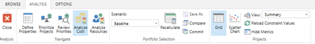

# Committing the selected portfolio scenario

**Summary:** Learn how to progress your selected portfolio scenario into execution.

**Applies to:** Project Online, Project Server 2016, Project Server 2013

Project portfolio analysis is the process by which you select the optimal collection of projects for your organization to perform. This process is enabled by the PWA portfolio analysis interface. This interface lets you model various cost and resource constrained scenarios.

The last step in the planning process is to finalize the portfolio of selected projects. Finalizing the portfolio moves the projects from the Planning stage to the Execution stage. The process of moving projects from one stage to another is referred to within the PWA interface as “committing the portfolio.” Portfolio progression is a core feature of the Project Web Application, and is available in Project Online and supported versions of Project Server.

You must have configured your planning workflow before committing the portfolio.

This article assumes you have selected one of your [saved scenarios](comparing-portfolio-scenarios.md) for progression.

To commit the scenario, navigate to the scenario selected by your organization.

Click on the **Commit** button on the **Analysis** tab in the **Analyze Cost** or **Analyze Resources** interface.

When you click on the **Commit** button, two actions are triggered:

- Several project level fields are populated to capture the output of the portfolio analysis process.

- If configured, workflow will progress the selected projects into [the next workflow stage](configuring-workflow-and-portfolio-analysis.md).

## Populating the associated commit data

Clicking on the **Commit** button will populate six project level fields. Cost fields reflect the output of the cost portfolio analysis. Schedule fields reflect the output of the resource analysis process.

1. Committed Planned End Date

2. Committed Planned Start Date

3. Committed Portfolio Selection Decision (Cost)

4. Committed Portfolio Selection Decision (Schedule)

5. Committed Portfolio Selection Decision Date (Cost)

6. Committed Portfolio Selection Decision Date (Schedule)

Those fields are available for use in **Project Center** views or custom reports and perform the following functions:

<table>
<thead>
<tr class="header">
<th>Field</th>
<th>Options</th>
<th>Description</th>
<th>Workflow available</th>
</tr>
</thead>
<tbody>
<tr class="odd">
<td>Committed Planned End Date</td>
<td>Date</td>
<td>The finish date of the project you calculated during the resource analysis.</td>
<td>No</td>
</tr>
<tr class="even">
<td>Committed Planned Start Date</td>
<td>Date</td>
<td>The start date of the project you calculated during the resource analysis.</td>
<td>No</td>
</tr>
<tr class="odd">
<td>Committed Portfolio Selection Decision (Cost)</td>
<td><ul>
<li>
Selected
</li>
<li>
Unselected
</li>
<li>
Forced In
</li>
<li>
Forced Out
</li>
</ul></td>
<td>Shows the result of a cost constraint analysis on a project.</td>
<td>Yes.1</td>
</tr>
<tr class="even">
<td>Committed Portfolio Selection Decision (Schedule)</td>
<td><ul>
<li>
Selected
</li>
<li>
Unselected
</li>
<li>
Forced In
</li>
<li>
Forced Out
</li>
</ul></td>
<td>Shows the result of a resource constraint analysis on a project.</td>
<td>Yes.2</td>
</tr>
<tr class="odd">
<td>Committed Portfolio Selection Decision Date (Cost)</td>
<td>Date</td>
<td>The committed date of the project.</td>
<td>No</td>
</tr>
<tr class="even">
<td>Committed Portfolio Selection Decision Date (Schedule)</td>
<td>Date</td>
<td>The committed date of the project. (This field is only calculated when committing a resource scenario.)</td>
<td>No</td>
</tr>
</tbody>
</table>

1 [Aliased as 'Optimizer Decision.'](configuring-workflow-and-portfolio-analysis.md)  
2 [Aliased as 'Planned Decision.'](configuring-workflow-and-portfolio-analysis.md)  

## Advancing to execution

You can [configure workflow in PWA](configuring-workflow-and-portfolio-analysis.md) to automatically progress committed projects into execution.

## Related articles
