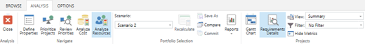
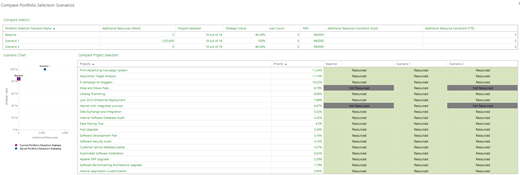
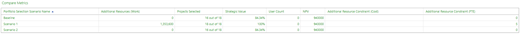
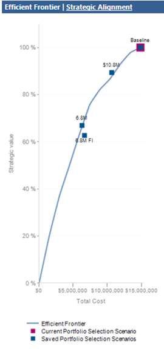
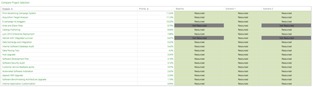
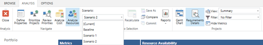

# Comparing multiple portfolio analysis scenarios

**Summary:** Learn how to compare multiple portfolio analysis scenarios in the Project Web Application

**Applies to:** Project Online, Project Server 2016, Project Server 2013

One of the most commonly asked questions in project management is, "Are we delivering the right projects?" The portfolio analysis module in PWA is designed to help organizations answer that question. The portfolio analysis module answers that question by performing the following functions:

- Centralizing a list of requested projects or proposals.

- Developing a list of the estimated costs required to deliver those projects.

- Developing a list of the estimated resources required to deliver those projects.

- Providing several methods to prioritize the list of requested projects or proposals.

- Providing the organization with the ability to explore the various dimensions of the project portfolio.

These features may be combined to create specific scenarios. For example, one scenario may assume annual funding levels of $20,000,000. Other scenarios may assume funding levels of $10,000,000. Some scenarios may prioritize growth. Other scenarios may prioritize risk mitigation.

The process of assessing these scenarios and defining an optimal selection of projects is known as portfolio analysis. Portfolio analysis is a core feature in the Project Web Application, and is available in Project Online and supported versions of Project Server.

This article will teach you how to review the results of the portfolio analysis process.

## Requirements

It is assumed that you have [created and saved several portfolio scenarios](creating-a-portfolio-analysis.md) as part of your cost and resource analysis activities.

## Comparing Scenarios

Within the **Analyze Costs** or **Analyze Resources** interfaces, click on the **Compare** button in the **Analysis** tab.

This will take you to the **Compare Scenarios** interface.

The **Compare Scenarios** screen has three main components:

- Compare metrics

- Efficient frontier/Scenario chart

- Compare project selection

## Compare metrics

The **Compare Metrics** grid summarizes key metrics from all of your saved scenarios.

Specific metrics that are displayed include:

| Metric                            | Analysis type  | Description                                                                                                                                               |
| --------------------------------- | -------------- | --------------------------------------------------------------------------------------------------------------------------------------------------------- |
| Projects selected                 | Cost, Resource | Number of projects you selected in each scenario.                                                                                                         |
| Additional Resources (Work)       | Resource       | Additional hours required from resources to deliver the portfolio. (See the [article on resource analysis](resource-analysis-overview.md) for more information on how this is calculated.) |
| Strategic value                   | Cost, Resource | Total value of the selected projects. This will display as a percent of the total value of the portfolio.                                                 |
| Additional Fields (as configured) | Resource       | If you added additional fields to the **Metrics** grid in the **Analyze Cost** or **Analyze Resources** interfaces, those fields will be displayed here.  |
| Additional Resource Constraint    | Resource       | Displays additional parameters used in the resource analyses (i.e., additional resources added or additional cost of added resources).                      |

## Efficient frontier/scenario chart

The efficient frontier will display if no resource analysis has been saved. Once a resource analysis has been saved, the screen will display a scenario chart.

The efficient frontier is a commonly used calculation in scenario modeling.

Each project is classified by estimated benefits and cost. The optimal combination of projects is then displayed for each cost point.

A portfolio that is on the efficient frontier represents the most value that can be achieved for that cost. A portfolio below the efficient frontier communicates that more value can be achieved for the same cost.

When you save a resource scenario, it will appear on the **Scenario Chart**. The **Scenario Chart** is a scatter graph depicting each of the scenarios by cost and strategic value.

## Compare project selection

This grid will summarize each of the projects you have analyzed. The grid shows which projects were selected for each scenario.

Organizations often use this information to calculate which projects are most likely to be selected – across all calculated scenarios. Being selected in multiple scenarios implies the project will more likely provide value to the organization.

After completing the scenario comparison, select the optimal scenario for your organization.

In the next step, we will [commit these projects to execution](committing-the-scenario.md).

## Related articles
