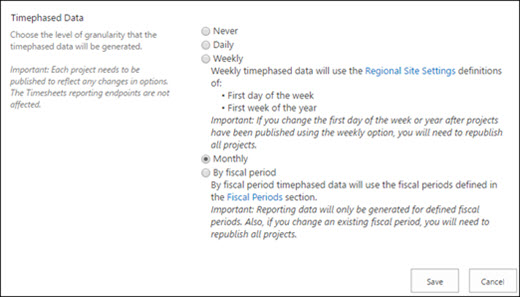

# Configure rollup of timephased reporting data in Project Online

Project admins can configure Project Online to roll up timephased reporting data to different levels of granularity. They can choose to roll up their data daily, weekly, monthly, or by fiscal period and retrieve the data through the timephased OData endpoints:
  
- AssignmentBaselineTimephasedDataSet
    
- AssignmentTimephasedDataSet
    
- TaskBaselineTimephasedDataSet
    
- TaskTimephasedDataSet
    
## Benefits

A key benefit this provides is that it can help to improve report generation performance, especially in organization that have a lot of Project Online reporting data. While retrieving task and assignment timephased reporting data by day was the only option available previously, many organizations do not need this level of granularity. Being able to retrieve their data on a broader scope (such as weekly or month) can greatly improve report generation performance by reducing the amount of records that need to be downloaded. For example, instead of needing to retrieve 300,000 records when set to  *daily*  , setting to  *monthly*  could reduce this to a much lower number, such as 10,000 records. 
  
With broader levels of granularity, publish times will be a lot faster since project data won't need to be broken down in daily levels for publishing. In some cases, it can also improve the performance of interacting with Project Detail Pages. Organizations that have complex workflows that depend on publish to complete to move to the next PDP will see performance improvements.
  
> [!NOTE]
> If your organization has deployed workflows that require a publish job to complete within a step, setting the option to report timephased data to **daily** can result in a poor experience for users filling out Project Detail Pages as the workflow will need to wait on the reporting jobs to complete before moving to the next step. It is recommend not to use **daily** if you have workflows that wait on publish to complete. > If you require resource demand data for resource capacity planning, then do not choose **never** - as that setting will not show resource demand. 
  
## How do I configure this setting?

1. In Project Online home page, select **Server Settings**.
    
2. On the Server Settings page, in the **Enterprise Data** section, select **Reporting**.
    
3. On the Reporting page, in the **Timephased Data** section, select the option that you need: 
    
  - **Never**
    
  - **Daily**
    
  - **Weekly**
    
  - **Monthly**
    
  - **By fiscal period**
    

  
Tip: If you don't use any of the timephased Odata feeds, we highly recommend setting the Timephased Data option to "Never" which provides the added benefit of much faster Reporting Publish queue jobs.
  
## Planning considerations I need to make

- **Republish existing projects** - After changing the Timephased data setting, it will only take affect in an existing project if it is republished. 
    
    > [!NOTE]
    > If you have many projects to republish, you can use the [Office 365 Project Online CSOM Tool(ProjToolV2)](https://go.microsoft.com/fwlink/p/?linkid=850655) to programmatically publish your Project Online projects. You should plan to do this at a time that will be least likely to impact your organization. 
  
- **New instances** - In new Project Online instances, note that the Timephased data default setting is **Never**. Make sure to select the appropriate Timephased data setting after creating your new instance to prevent the need to republish all your projects at a later time. Also consider the tradeoffs associated with a more granular setting (for example, Daily vs Monthly) with regards to the time it takes to publish as well as pull down the timephased OData feed.
  
This table summarizing the considerations and recommended options:
    

    
|||
|:-----|:-----|
|**Setting**   |**Considerations**   |
|**Never**   | For customers who do not use the Timephased Odata feeds and Portfolio Analyses feature, and do not need resource demand data for capacity planning.     This is the default setting for new Project Online instances.     Much faster Reporting Publish queue jobs.     No additional quota consumed (timephased data consumes the most space).    > [!NOTE]>  For more information about the interaction of this setting with the Portfolio Analyses feature is available in the blog post [Project Online: Reporting and Portfolio Analysis](https://go.microsoft.com/fwlink/?linkid=868427).           |
|**Daily**   | Largest performance impact for publishing/reporting.     Generates largest dataset which results in slower downloads of timephased Odata feeds and largest DB quota usage.     Recommended only if you need your current/historical reports on a by day basis.    |
|**Weekly**   | Timephased dataset is about **one seventh smaller than the Daily option.**    Recommended only if you need your current/historical reports on a weekly basis.    |
|**Monthly**   | Timephased dataset is about **one thirtieth smaller than the Daily option**.    **Recommended option**.    |
|**By Fiscal Period**   | Timephased dataset is about **one thirtieth smaller than the Daily option**.     Allows administrators control over the time range where timephased data is published based on the defined fiscal periods.    **Recommended option**.    |
   
## See Also

[Brian Smith Blog post: Project Online-Changes to Granularity of Time phased OData](https://go.microsoft.com/fwlink/?linkid=864201)
  
[Grant reporting access in Project Online](grant-reporting-access-in-project-online.md)
  
[Use Excel 2013 to create a new Project Online report](https://support.office.com/article/d523d604-940c-4c57-a190-59b793ac9d49)
  
[ProjectData-Project OData service reference](https://go.microsoft.com/fwlink/p/?linkid=852876)
  

