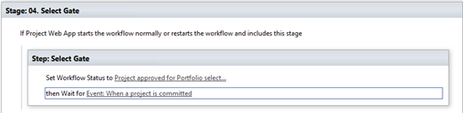
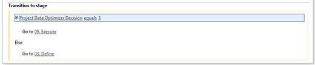

# Configuring workflow to support portfolio analysis

**Summary:** Learn how to configure workflow to support portfolio analysis.

**Applies to:** Project Online, Project Server 2016, Project Server 2013

Workflow automates common tasks within your organization. Workflow may be combined with the PWA portfolio analysis functionality to enable portfolio planning. This allows your organization to easily design and sustain processes designed to achieve your strategic goals.

Workflow is a core feature of the Project Web Application, and is available in Project Online and supported versions of Project Server. You must have SharePoint Designer installed to support the configuration of workflow logic.

This article assumes you have selected one of your [saved scenarios](comparing-portfolio-scenarios.md) to be committed. When you click on the **Commit** button, two actions are triggered:

- Several [project level fields](prioritizing-the-portfolio-with-custom-fields.md)are populated to capture the output of the portfolio analysis process.

- If configured, workflow will progress the selected projects into the next workflow stage.

To commit the scenario, select the **Commit** button on the **Analysis** tab in the **Analyze Cost** or **Analyze Resources** interface.

## Workflow options

This article assumes you have configured a workflow to support moving projects from one stage to another. Please see [this article](/project/create-a-sample-project-web-app-workflow) for more information on configuring basic workflow within PWA.

In **SharePoint Designer**, configure the workflow stage to *Wait for a Project Event*. In the action configuration options, select *When a Project is Committed*.

After adding that step, you can insert logic based on the data captured in the fields that are populated by the commit action:

<table>
<thead>
<tr class="header">
<th>Field</th>
<th>Options (Logical test)</th>
<th>Description</th>
</tr>
</thead>
<tbody>
<tr class="odd">
<td>Optimizer Decision</td>
<td><ul>
<li>
Selected (3)
</li>
<li>
Unselected (2)
</li>
<li>
Forced In (0)
</li>
<li>
Forced Out (1)
</li>
</ul></td>
<td>Shows the result of a cost constraint analysis on a project.</td>
</tr>
<tr class="even">
<td>Planner Decision</td>
<td><ul>
<li>
Selected (3)
</li>
<li>
Unselected (2)
</li>
<li>
Forced In (0)
</li>
<li>
Forced Out (1)
</li>
</ul></td>
<td>Shows the result of a resource constraint analysis on a project.</td>
</tr>
</tbody>
</table>

Many organizations will add logic to move the **Selected** projects to the next stage of execution. If configured, **Unselected** projects may be moved to a **Parked** stage.

For more information on developing custom demand management workflows, refer to the online site for Microsoft Project Server Demand Management resources: <https://technet.microsoft.com/projectserver/ff899331>.

## Related articles