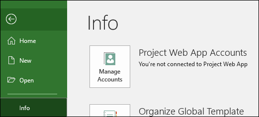
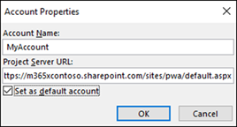
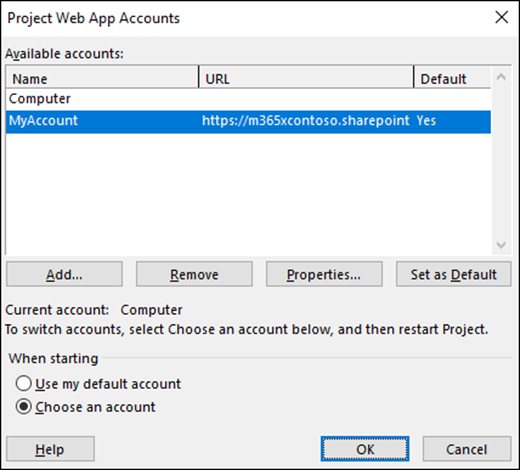
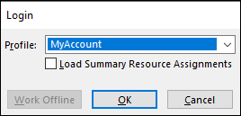

# Connect to Project Online with the Project Online Desktop Client

The Project Online Desktop client is included with your Project Online Professional or Project Online Premium license.  While you can use it as a standalone client to create and manage your project plans offline, you can also use it to connect to Project Online in your Office 365 environment to work with your Project Online users. For example, you can create, save, and publish your projects to Project Online, and team members assigned to your project tasks can use Project Online to give you updates on their task status.

> [!NOTE]
> See [Install Project](https://support.office.com/article/install-project-7059249b-d9fe-4d61-ab96-5c5bf435f281) if you need to learn how to install the Project Online Desktop Client. Follow the instructions to download and install the subscription version (Project Online).
  
## How to connect to Project Online

You can do the following to connect to your Project Online site in your Office 365 environment:

1. After opening the Project Online Desktop Client, at the login screen, for **Profile** select **Computer**, and then select **OK**.

    

2. On the next screen, select **Blank project**.
3. On the new project page, select the **File** menu.
4. On the Backstage menu, select **Info**, and then select **Manage Accounts**.
 
    

1. On the **Project Web Apps Accounts** page, select **Add**.
2. On the **Account Properties** page:
    - For **Account Name**, type a name for this profile.
    - For **Project Server URL** type the URL for your Project Web App home page in Project Online. Check with your Office 365 admin if you do not know what it is.
    - Select **Set as default account** if you want to use this as your default profile each time you open Project Online Desktop Client.
    - Click **OK**.

    

7. Your new account will now show On the **Project Web App Accounts** page.  Click **OK**.

    

8. Close and then reopen the Project Online Desktop Client. At the login window, select your account and click **OK** to connect to Project Online.

    

 
 > [!NOTE]
> You can also connect to Project Online with supported versions of Project Professional. See [Project Online client requirements](project-online-client-requirements.md) for more information.

    

