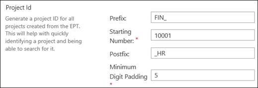

# Create unique Project IDs for my projects in Project Online

  
When creating new projects in Project Online, some companies may want to create a unique Project ID to associate with each project. This allows users to reference each project by a unique Project ID instead of a project name, since project names can be changed.
  
A Project admin can configure Project Online to generate a unique Project ID for each new project through Enterprise Project Type (EPT) configuration settings. You can configure the EPT's Project ID settings so that when a new project is created through the EPT, it will generate a unique Project ID for the new project based on the naming properties you configured.
  
## Configure Project ID settings when creating a new Enterprise Project Type in Project Online

1. On the Project Web App home page, select **Server Settings**.
    
2. On the Server Settings page, in the **Workflow and Project Detail Pages** section, click **Enterprise Project Types**.
    
3. Select **New Enterprise Project Type**.
    
4. On the New Enterprise Project Types page, in the **Name** field, specify a name for the Enterprise Project Type you want to create. For example, if the EPT is going to be used by the  *Finance Department*  for  *high risk projects*  , you could enter ** Finance Dept (High Risk) **.
    
5. In the **Description** field, type a description of the EPT. For example,  *Use this EPT to create high-risk projects for Finance*  . 
    
6. In the **Project ID** section, you need to enter information that will be used to create a unique Project ID for your projects that are created through the EPT template: 
    
  - In the **Prefix** field, you can enter characters that will be at the start of each generated Project ID. For example, you may want the Project ID for projects created through the Finance Department EPT to begin with FIN_. This field is optional. 
    
  - In the **Starting Number** field, enter a number that will serve as a starting point for Project IDs that are going to be generated for this EPT. For example, enter 10001 if you want the first Project ID to be 10001. This field is required. 
    
  - In the **Postfix** field, you can enter characters that can be used to append your Project IDs that are generated by this EPT. For example, if this EPT is used to create only high-risk projects for the Finance department, you could enter _HR. This field is optional. 
    
  - In the **Minimum Digit Padding** field, enter a number of digits that you want to have for newly generated Project IDs. For example, if you enter **3** and have a Starting Number of **1**, then the first three Project IDs that will be generated are **001**, **002**, and **003**. If you enter **5** with a Starting Number of **1**, the first three Project IDs that will be generated are **00001**, **00002**, and **00003**. 
    
    
  
For example, with the sample settings used in the procedure above, the Project IDs generated through the Finance Dept (High Risk) EPT will be:
  
- FIN_10001_HR
    
- FIN_10002_HR
    
- FIN_10003_HR
    
- Etc.
    
> [!NOTE]
> While the Prefix and Postfix fields are optional, the easiest way to ensure uniqueness across all EPTs is to make sure you provide either a unique Prefix or Postfix. 
  
## Best practices

For larger organizations, it is a good idea for the Project admins or PMO to agree upon a Project ID naming convention and a numeric range to ensure uniqueness. Additionally, it is also a good idea to document the EPT settings for reference. For example: 
  
|**Prefix**|**Starting Number**|**Postfix**|**Minimum Digit Padding**|**Used to make projects for this team**|
|:-----|:-----|:-----|:-----|:-----|
|Fin_    |10001    |_HR    |1    |Finance Team: High-risk projects    |
|IT_    |10001    ||1    |Information Technologies Team    |
|MKT_    |10001    ||1    |Marketing Team    |
   
### Other best practices to consider:

- It is important that you come up with a naming convention on how you want to segment your Project IDs before starting the configuration of your EPTs to ensure uniqueness across different EPTs. 
    
- If you're planning to update the Project ID value programmatically via the Client-side Object Model (CSOM), the uniqueness of the value will have to be managed by your custom code to avoid duplicates. 
    
- A Project ID can be edited if it is added to a Project Detail page. You can use this approach to perform ad-hoc edits of the Project ID value if needed. As always, ensure that there is a standardized naming convention in place to ensure uniqueness of your Project IDs if you need to make ad-hoc changes. 
    

