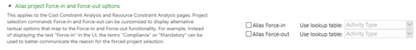
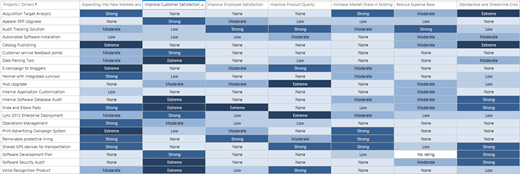
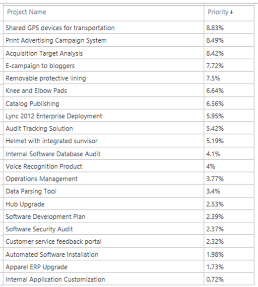

# Creating a new portfolio analysis

**Summary:** Learn how to combine the project portfolio, resource pool, and prioritization mechanism into a single analysis of the project portfolio using the Project Web Application.

**Applies to:** Project Online, Project Server 2016, Project Server 2013

Portfolio analysis is a structured technique to balance identified work requests and available resources. The Project Web App (PWA) enables portfolio analysis with several features:

- Project portfolio definition

- Resource pool definition

- Project prioritization

These features may be combined to create specific scenarios. For example, one scenario may assume annual funding levels of $20,000,000. Other scenarios may assume funding levels of $10,000,000. Some scenarios may prioritize growth. Other scenarios may prioritize risk mitigation.

The process of assessing these scenarios and defining an optimal selection of projects is known as portfolio analysis. Portfolio analysis is a core feature in the Project Web Application, and is available in Project Online and supported versions of Project Server.

## Planning for a portfolio analysis

The following steps should be performed before starting a portfolio analysis.

1. Define your projects and project proposals.

2. Define the key cost elements of these projects (i.e., total cost, capital expense, operational expense, etc.).

3. (Optional) Define the work required to support these projects and project proposals.

4. (Optional) Define the available pool of resources that will be delivering the project portfolio.

5. Define your portfolio prioritization mechanism(s). PWA supports the use of business drivers as well as manual prioritization methods.

## Create a portfolio analysis

To get started creating a portfolio analysis:

1. In the Project Web App, click on **Portfolio Analyses** **Link** in the left navigation menu.

2. Click on the **New Button** to create a new analysis.

3. Populate the fields per the options in the table below.

4. Configure the project Force-in and Force-out options.

5. Move to the next screen to assign project priorities.

Complete the **New Portfolio Analysis Form** as follows:

| Item                                         | Notes                                                                                                                                                                                                               |
| -------------------------------------------- | ------------------------------------------------------------------------------------------------------------------------------------------------------------------------------------------------------------------- |
| Name                                         | Type a descriptive name for this portfolio analysis. For example, you can call this analysis 2019 Marketing Budgeting Planning.                                                                                     |
| Description                                  | Type a description for this portfolio analysis.                                                                                                                                                                     |
| Department                                   | Optional. If you select a department, only custom fields and resources for that department will be available for the analysis. If you don't select a department, all fields and resources will be available.        |
| Prioritization Type                          | Choose whether to use business drivers (recommended) or custom fields to prioritize your projects. If you choose business drivers, then choose the prioritization set that you want to use from the drop-down list. |
| Prioritize these projects                    | Click Select Projects to choose the projects that you want to include in this portfolio analysis.                                                                                                                   |
| Analysis Primary Cost Constraint             | Choose the custom field that you want to use for the project's overall budget.                                                                                                                                      |
| Resource Planning (optional)                 | Select this check box if you want to include resource planning in this portfolio analysis. Your projects must include resource assignments for this to work.                                                        |
| Alias project Force-in and Force-out options | Use the options in this section to customize force in/out options.                                                                                                                                                  |

If the Resource Planning option is checked, the form will expand with the following fields:

| Item                                                       | Notes                                                                                                                 |
| ---------------------------------------------------------- | --------------------------------------------------------------------------------------------------------------------- |
| Planning Horizon and Granularity                           | Choose the date range for which resource scheduling information will be available for the portfolio analysis.         |
| Resource role custom field                                 | Choose the custom field that defines the resource's role.                                                             |
| Resource filtering                                         | Specify if you want to filter the resources that are available to this portfolio analysis by department or RBS value. |
| Resource capacity impact for projects outside the analysis | Choose if you want proposed assignments to affect resource availability in this portfolio.                            |
| Project start and finish dates                             | Choose if you want to use the project schedule for project start and finish dates, or custom fields.                  |

## Defining force-in and force-out aliases

Later in this process, you will be able to force projects into and out of the portfolio analysis. For example, an organization may decide that a project is required to meet newly defined regulatory requirements. That organization may "force in" the project into the portfolio. Regardless of scenario constraints that project will be selected.

Similarly, the organization may also "force out" projects from the portfolio. For example, an executive has declared that we will not do this project as part of the current annual planning. We would then force out the project.

Organizations may define friendly names for these force in/force out options. For example, an organization may rename "force in" as "regulatory compliance, executive selection, etc."

To rename force in/force out options, the user will need to create a look up table with the new values. That lookup table may be assigned to the Force In and Force Out options upon creation of the portfolio analysis.

## Prioritize projects

If business driver prioritization was selected when the portfolio analysis was created, this screen will display all of the selected projects against each of the selected business drivers. Some projects may have already been mapped to business drivers. You can use this screen to confirm that each project has been mapped appropriately.

Visually scan each row to confirm that each project is aligned with at least one business driver. Scan each column to confirm visually that each business driver is represented appropriately:

- No driver is not aligned to a project.

- All projects are only aligned to a single driver (i.e., the driver is overrepresented).

Each project may be mapped to a driver according to the following options:

- No rating (no mapping)

- None

- Low

- Moderate

- Strong

- Extreme

This step will calculate the relative priority of each of the projects within the analysis.

## Review priorities

The projects are now displayed in the order of the calculated priority. The overall value of the portfolio is calculated as 100%. Each of the projects represent a fraction of the 100% portfolio value.

The portfolio analysis process will help you determine the maximum value that can be delivered for the available financial and resource investments.

You are now ready to analyze the portfolio cost.

## Navigating within the portfolio analysis

Use the controls in the **Navigate** section of the Analysis ribbon to move between the pages of the portfolio analysis wizard and change the settings that you chose when you created the portfolio analysis.

| **Control**             | **Description**                                                                                                                                                                                                                          |
| ----------------------- | ---------------------------------------------------------------------------------------------------------------------------------------------------------------------------------------------------------------------------------------- |
| **Define Properties**   | Clicking **Define Properties** takes you to the first page of the new portfolio analysis wizard, where you can change settings including the driver prioritization, the selected projects, and the primary cost constraint.              |
| **Prioritize Projects** | Clicking **Prioritize Projects** takes you to the project prioritization page of the new portfolio analysis wizard, where you can change any of the business driver settings for the projects in the portfolio.                          |
| **Review Priorities**   | Clicking **Review Priorities** takes you to the priority list for the projects in this portfolio, where you can see how the projects in the portfolio have been prioritized based on the business driver settings.                       |
| **Analyze Cost**        | Clicking **Analyze Cost** takes you to the cost analysis page and enables the **Portfolio Selection** and **Projects** sections of the ribbon, where you can analyze project and cost options to get the best return on your investment. |
| **Analyze Resources**   | Clicking **Analyze Resources** takes you to the resource analysis page. This button is available if you chose the **Analyze time-phased project resource requirements against organizational resource capacity** option.                 |

You are now ready to begin assessing portfolio scenarios.

## Related articles
