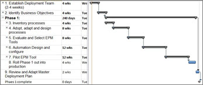

# Creating an EPM Deployment Plan

This article is part of our "From the Trenches" collection. It describes how to create an Enterprise Project Management (EPM) deployment plan. It identifies phases and major points in an EPM Deployment plan, and it estimates times for each, based on a mid-sized organization with several hundred EPM system users. It also identifies factors that can affect the estimated duration times for each phase.
  
To download the Word version of this article, see [Creating an EPM Deployment Plan](https://go.microsoft.com/fwlink/?LinkId=215445).
  
To see more articles, see ["From the Trenches" white papers](https://support.office.com/article/faec6b1a-c217-4c79-b8c4-0514f402106b).
  
## Creating an EPM Deployment Plan

"Can you help us install the EPM system and get it up and running in a few days?" is one of the most common requests EPM deployment firms get. And regardless of the size of the organization, the short answer, is unfortunately, "No." The challenge isn't technology; it's a series of policy, process, procedure and practice questions that have the potential to create far-reaching organizational change. 
  
Let's take a look at what an EPM deployment plan must include and how you can create your own. I've identified the major points and even put in estimated times for how long each phase might take in a mid-sized organization with several hundred EPM system users. Before you dismiss each time estimate as too short or too long, think about what you would need to do in your particular organization in order to accomplish that section. The durations are not work estimates, they are calendar estimates, so keep in mind how long it takes to get certain kinds of people assembled for the kind of work you will need. 
  
### 1. Establish the EPM System deployment team

If we have no project team then our project won't go far. Several people will have to be assembled in order to bring this project from the idea phase all the way to production. With an overview plan already in mind, you will need to think about people who will be with the project as long as a couple of years. 
  
 Key steps in this first phase are: 
  
#### Identify Key Stakeholders

There's often one key stakeholder before the project even starts. It's usually someone at the executive level who is feeling the pain of not having this kind of system. That's a great start but it won't be nearly enough to bring such a project to fruition. Identifying the business owner of the system is critical to a successful EPM deployment and must be done almost immediately. The business owner will be the person who uses the benefits of the completed system and sees the value in going through what it will take to complete it. There may also be one or several executive sponsors. The executive sponsors might be management level staff who have some use for the ultimate results but they might also be people who will work on the project until its completion and then move on with little investment in the final operation of the EPM environment. You can live without an executive sponsor. You can't live without a business owner. 
  
#### Identify internal expertise resources

Having determined who the business owner and possibly the executive sponsors are, the project team should determine what internal expertise is needed and available to move the project forward. Often we'll find a lack of expertise in a particular technology such as the current version of EPM software but that's not the only kind of expertise we require. Internal knowledge of the organization's processes, practices, procedures, roles and responsibilities and where data can be located to drive the process will be essential.
  
#### Engage external expertise (if required)

It's common to determine that there is a knowledge or skill gap in the project team to move from non-enterprise project management to enterprise project management. If that's the case, then there's no substitute for finding someone with know-how. To whatever degree the internal resources are not available, they'll need to be engaged from the outside. These people might be engaged as part of a consulting or outsourcing contract or hired for long term use in the environment that they will help develop. Training for this kind of expertise from the inside is rarely successful. The most common challenge we see in this area is finding out that the internal resources have been given the responsibility but don't have the knowledge or have only a limited knowledge. "I used EPM software once and now I'm being asked to deploy it," is a cry we hear all too often.
  
The size of your team will depend on how wide a scope the project ultimately becomes. It is not uncommon to find some people with the project for several months who are then replaced with others as phases of the project change. The authority of the team and the support of management are also critical to establish at this time. 
  
Oh, and do I need to say it? Treat this project as a project! Amazing as it might sound, EPM deployments are the most likely project in the organization to be deployed without any of the elements you'd put into any other deployment plan (something about a shoemaker's children going barefoot). So, make a project schedule, a budget, a charter, allocate sufficient resources etc. 
  
Time to accomplish this: Four weeks.
  
### 2. Identify Business Objectives

Ok, we've got the team together. Time to get it to work! We've got to now identify the scope of the project, break that scope into phases if it's big and then create a plan for the work.
  
Here's what we'll need to accomplish in this phase:
  
#### Executive and Stakeholder workshops

There's no way to get around this. The whole purpose of creating an EPM environment is to better enable management and end users to make business decisions. So the relevant management personnel will need to invest some time at the beginning of the process to help identify what decisions will be made using the system. I've written about how to conduct such workshops in the past (See [Being a solutions buyer: white paper](being-a-solutions-buyer-white-paper.md)) but how they're done is less important than that they're done. 
  
This is the opportunity for the deployment team to get two other very, very important things while they have management's attention. First, the commitment of management to the process, the effort and the ultimate benefits. Second (and far more important), the managed expectations of management. The most common management expectation is that this can be accomplished in a few days or a few short weeks. When they grasp the impact of what's involved, management support may evaporate. Better to have that happen immediately than to get started on something that can't possibly be delivered with insufficient time or resources. 
  
The results from these workshops (yes, it may take more than one) will be the business objectives that will make up the scope and ultimately determine the schedule.
  
#### Identify management role impact

Once the business objectives have been agreed to by management, there will have to be a session or two identifying the impact on the roles and responsibilities of management. A common example often appears with resource capacity planning. In high tech firms, resource capacity planning is almost always a management request of the EPM system, yet who will have to get the authority in that process to allocate resources, manage conflicts, and prioritize the work of people in different departments? You won't be able to solve these issues at this point as you have no defined process, but identifying who in the executive suite will be affected is important here so that you'll be able to circle back to include them in the process when the time comes.
  
#### Prioritize business objectives and create a Master Deployment Plan

It's almost certain that the plan should break into phases. With virtually every EPM deployment, the desires of management on what benefits the EPM system should deliver are vast. The prioritization of which objectives to go for first is an essential element of success at this point. Get the top two or perhaps three objectives put into a phase and push everything else downstream. Each phase should deliver a working, production EPM environment that is valuable in its own right. 
  
#### Establish milestones and metrics

We're project managers, aren't we?! Let's get some milestones into our project and commit to some measurable metrics. With any enterprise system deployment, making sure it's staying on track is an important part of the process. 
  
We should have enough information now to develop our overall schedule with detail for the first phase.
  
 Time for this work: Four weeks 
  
### Phase 1

 For each phase there will be some tasks that need to be repeated. Steps 3 to 9 are all part of one phase. 
  
### 3. Inventory processes

Before we get anywhere close to the tools, we need to determine what processes will ultimately need to be automated in this phase. 
  
#### What processes exist and can be adopted?

We start with looking at what processes, practices, and procedures already exist in the organization for the business objectives identified in this phase and determine which can be adopted within the new EPM environment. There's a two-sided benefit to finding existing processes that can be adapted with little or no work. First of all, they're created already and known to the users. Secondly, adopting them makes a friend of the person who created them. They can now be named as a subject matter expert in that process and that eases deployment.
  
#### What processes must be designed

We never find all the processes, practices, and procedures we need, but we have to identify what's missing. That can be harder than locating processes that exist already. You're looking for what's not there and that takes an experienced eye.
  
#### Process whiteboard workshops

For those processes that require work to be adapted or for processes that need to be created from scratch, you'll need to get some workshop sessions with a white board underway. Walking through the process and all its implications is best done with the people who will live it once it's done. Document everything.
  
#### Resolve impacted management roles

Remember when we identified which executives or managers might be implicated in the changes that would occur? Time to call them back. For any of the newly designed processes that affect roles, authority, hierarchy, or existing responsibilities, you'll need to organize meetings to resolve them.
  
The final result of this is the draft of a process guide. 
  
 Time to accomplish the processes exercise: Four weeks. 
  
### 4. Adopt, adapt, and design processes

#### Review, adapt, and accept designed processes

Not everyone will have been a part of every process exercise that happened in the last set of tasks. So, getting the draft of the new process guide published to the stakeholders, managers, and affected parties is essential. It's quite common for this guide to go through several reviews and even for additional workshops to be scheduled to resolve conflicts in processes. 
  
The output of this is a completed and accepted process document. Don't be fooled, the "accepted" aspect may take several rounds and even require executive intervention from the highest level before it's complete but without an accepted process, there's nothing to automate. The good news is, even if the deployment process stopped here, this is already of great value. It is inevitable that those who work through these processes internally see things about their organization that they had never considered. They will be more effective as a result starting almost immediately. 
  
 Time to accomplish the completed process guide: Eight weeks 
  
### 5. Evaluate and Select EPM Tools

#### Prepare "problem statement" documents for vendors

If you've read other articles I've done, you know that I believe strongly in giving potential vendors a description of your EPM problems and letting them tell you how they would solve them. After all, they say they're in the solutions business? Great, have them design your solution. This is a little harder than making a spreadsheet of all the functions you would like, but it's important.
  
#### Solicit vendor responses

Never do just one. You may already know who your preferred vendor is, but even if you think it's the right one, get something to compare against. No two vendors will try to solve your problem the same way so be prepared to be surprised and keep an open mind.
  
#### Short list

Even if you're looking at one product but several implementers, get down to who you'd like to meet in person.
  
#### Vendor and implementer presentations

Ahhh, demo day. There's are many things of value to be had from looking at a demonstration but getting caught up in the flash of it isn't one of them. Sales demonstrations are carefully orchestrated by all vendors. If you're particularly excited over a view or a report or a dashboard, ask specifically, "How long would it take to develop that exact view?" 
  
#### Tool selection and acquisition

Ok, time to make the big purchase. I know, you thought that was the starting point, back at the beginning of this article. Well, don't worry. We're finally here. Make your selection of the EPM system and get that purchase order on its way!
  
The end result of this phase is a shiny new EPM product sitting on your desk. 
  
 Time to accomplish this phase: Eight weeks. 
  
### 6. Automation Design and configure

#### Apply the process design document to the selected EPM tool

Now that we know what the tool is we can start creating system design documents that start with our process document and end up in functional specifications. We'll probably want a Development instance of our new EPM system installed so we can test or verify certain design criteria. For the first time, a system expert in the configuration of the actual system is required on board.
  
#### Design and implement standards

There are numerous standards that will have to be established. Each and every one of those standards carries implications in the system architecture and design. The calendar for example is often overlooked. Will we have one calendar or many? Will we have resource calendars? Who will have the authority to change them? Do we know the effects on the schedule and progress data of changing a resource calendar ? And so on … Here are some of the elements of our EPM system that we will need standards for:
  
- Calendars
    
- Naming conventions
    
- Resource hierarchy
    
- Resource load standards for project and non-project work
    
- Rates and costing standards
    
- Roles and responsibilities
    
- Approval structures
    
- Project and task hierarchies
    
- WBS and other coding structures
    
- Document management
    
- Communication templates
    
- Project templates
    
We're also going to need some other design and even possible coding for elements that came out of our Phase One business objectives. Some of the elements that might have to be considered are:
  
- Design and implement custom coding
    
- Design and implement dashboarding
    
- Design and create links to external systems
    
- Design and create workflow
    
- Design and implement reporting
    
- Design and create EPM tool training
    
- Review design with all affected parties
    
The result is an EPM tool that is ready to be taken out for a ride. It should have all the configuration required to move into a working environment.
  
Time required for this phase can vary greatly depending on how much custom work was required but we'll say twelve weeks given we've restricted ourselves to the first phase. 
  
### 7. Pilot EPM Tool

Now that we have our system ready to go, we must identify the pilot group and get them working on it.
  
#### Phase 1 install / configure / migrate data

We'll need to install the newly configured system in a pilot instance (not the development instance. We'll continue to use that for future phases and as a support and training system). We'll also need to update the configuration to match our development instance and migrate the pilot projects from whatever they're in now into our new system. 
  
#### Training

Training is the poor stepchild of project deployments. It's often forgotten in a deployment plan. Make sure our pilot personnel get the training they need to use the system properly.
  
#### Run active projects

Now, have those pilot projects be managed based on the processes, practices, procedures and automation that you've spent so much time defining. The pilot needs to have a schedule itself that is often oriented around how long these projects will last.
  
#### Lessons learned and document

Once the pilot project is complete, it's time to reassemble and see how what was created solved the challenges that were set for it. If there are adjustments, corrections, or basic changes to make, now is the time.
  
 Time for a complete pilot project and review: Twelve weeks. 
  
### 8. Roll out Phase 1 into production

#### Go-live

It's time. Roll out the use of the new system to the appropriate users and migrate the appropriate data. Don't forget training, support, and follow up as the system goes live.
  
 Time to rollout is highly dependent on the number of total users: Four weeks. 
  
### 9. Review and Adapt Master Deployment Plan

Review and adjust master plan in preparation for next phase The master plan probably hasn't been looked at in months. Time to dust it off and see what was originally planned for Phase Two. It's inevitable that the eyes that look at the next phase will see things differently. After all, they now have all the experience of the first phase.
  
Time to complete this phase: Two weeks.
  
### 10. Phase 2 - do steps 3 through 9 again

We've only completed phase one and as you look at future phases you'll need to rework steps 3 through 9 (with the exception of step 5). Remember that each phase should result in a working EPM production that leaves the organization more effective than it was before.
  
Have you been counting the durations for each of the steps for the first phase? It adds up to 58 weeks. Here's a schedule of the summary steps defined above:
  

  
Now, every organization is different. There are many factors that affect the total duration of a project. The most significant of these is the extent to which existing enterprise project management processes are mature. Next is the size of the organization and its complexity. It is obviously simpler to deploy an EPM system into an organization that is all located in one building than it is for an organization that is spread across numerous divisions, offices, cities and even countries. 
  
In each deployment the schedule will look different and not always shorter. There is virtually always pressure to make a schedule that can be accomplished in days or even weeks, but it's vital that more than just the installation of EPM software be considered in order to deliver a successful deployment.
  
## About the Author

Chris Vandersluis is the president and founder of Montreal, Canada-based HMS Software, a Microsoft Certified Partner. He has an economics degree from McGill University and over 30 years experience in the automation of project control systems. He is a long-standing member of the Project Management Institute (PMI) and helped found the Montreal, Toronto, and Quebec chapters of the Microsoft Project Users Group (MPUG). Publications for which Chris has written include Fortune, Heavy Construction News, Computing Canada magazine, and PMI's PMNetwork, and he is a regular columnist for Project Times. He teaches Advanced Project Management at McGill University and often speaks at project management association functions across North America and around the world. HMS Software is the publisher of the TimeControl project-oriented timekeeping system and has been a Microsoft Project Solution Partner since 1995. 
  
Chris Vandersluis can be contacted by e-mail at: chris.vandersluis@hms.ca
  
If you would like to read more EPM-related articles by Chris Vandersluis, see HMS's EPM Guidance site (https://www.epmguidance.com/?page_id=39).
  

