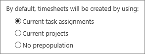
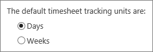
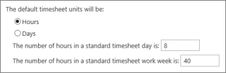
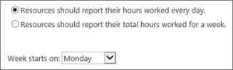
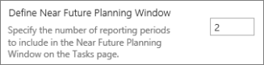

# Customize timesheets and task progress for your organization

There are several ways to customize timesheets and task progress in Project Web App.
  
When choosing the right settings for your organization, there are two different spots where you'll need to make changes. Start by going to **Settings** \> **PWA Settings**.
  
From there, some of the settings will be under **Timesheet Settings and Defaults**.
  

  
Other settings will be under **Task Settings and Display**.
  

  
|**Settings**|**Where to change them**|**What to change**|
|:-----|:-----|:-----|
|**What do you want automatically included?**   |Timesheet Settings and Defaults    |Under **Default Timesheet Creation Mode**, you can choose to pre-populate timesheets with **Current task assignments** or **Current projects**. Things like vacation and sick leave may also be automatically included, based on settings that you choose when you [create administrative time categories](set-up-vacation-sick-leave-and-other-non-project-work-categories.md).    |
|**Report time per day or per week?**   |Timesheet Settings and Defaults    |Under **Timesheet Grid Column Units**, choose whether you want the columns on a timesheet to represent **Days** or **Weeks**. If you choose **Weeks**, each column in a timesheet represents 7 days, and the date in the column reflects the first day of the week.     This setting is tied to the Reporting Display.    |
|**Report time as hours or as days?**   |Timesheet Settings and Defaults    |Under **Default Reporting Units**, you can choose to have team members report time as **Hours** or as **Days**. You can also set how many hours are in a standard timesheet day and in a standard timesheet work week.    |
|**Can team members add personal tasks?**   |Timesheet Settings and Defaults    |Some team members may want to track time spent on their own personal tasks, alongside their hours for tasks and other work. Personal tasks will not show up outside of a team member's timesheet or task status. They are not mapped to any project or task, or to any [administrative category](set-up-vacation-sick-leave-and-other-non-project-work-categories.md) you may have set up.    If you want to allow team members to add personal tasks, select the **Allow new personal tasks** check box, under **Timesheet Policies**.    |
|**Report task progress as hours per day or total hours per week?**   |Task Settings and Display    |Under **Reporting Display**, choose whether you want team members to report task progress as hours per day, or as a total for each week. If you choose weekly reporting, also choose the start day for the week.    |
|**How far ahead do you want to look?**   |Task Settings and Display    |Sometimes team members are assigned to so many tasks that it can be overwhelming to see them all in one big list. By setting the near future planning window, you determine which tasks show up as coming soon, when the team member goes to report task progress.    Under **Define Near Future Planning Window**, set the number of reporting periods that you're considering to be the "near future," in terms of projects and tasks in your organization.     For example, if you consider the next two weeks to be the "near future," and you report time and task progress using weekly [reporting periods](set-up-timesheets.md), you could set the near future planning window to  *2*  to highlight tasks happening in the next two weeks.    |
   

