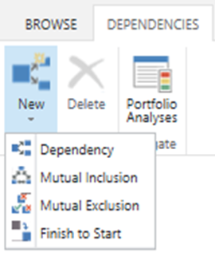
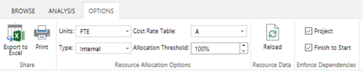

# Defining project portfolio dependencies

**Summary:** Learn how to define project interdependencies that may impact the portfolio analysis calculations.

**Applies to:** Project Online, Project Server 2016, Project Server 2013

PWA helps your organization calculate the optimal portfolio of projects to be delivered. This calculation incorporates many factors, including:

- The estimated resources required to deliver the projects

- The availability of resources within the enterprise resource pool

- Financial constraints

- Proposed start date for projects

- Project dependencies

This article will explain how to incorporate project dependency logic into your portfolio analyses. Project dependencies are a core feature of the portfolio management capabilities of the Project Web Application, and are available in Project Online and in all support versions of Project Server.

## Project dependencies

Project dependencies are relationships between specific projects within a portfolio. These dependencies will be incorporated into the portfolio analysis calculations.

## Dependency types

PWA supports the following dependency types.

<table>
<thead>
<tr class="header">
<th>Type</th>
<th>Description</th>
</tr>
</thead>
<tbody>
<tr class="odd">
<td>Dependency</td>
<td>All dependent (required) projects must be selected before the primary project is selected. If one of the dependent projects is not selected, the primary project is not included in the calculation.</td>
</tr>
<tr class="even">
<td>Mutual Inclusion</td>
<td>All mutually included projects must be selected within the optimal portfolio. If one of those projects is not selected, none of the designated projects are selected.</td>
</tr>
<tr class="odd">
<td>Mutual Exclusion</td>
<td>Only one of the mutually excluded projects will be selected within the optimal portfolio. Once one project has been selected, all other mutually exclusive projects will be excluded from the optimal scenario.</td>
</tr>
<tr class="even">
<td>Finish to Start</td>
<td>
Projects must be executed in order. You may define the sequence in which projects must be completed.

Finish to Start dependencies are only relevant to the resource analysis calculations. They are not applied to the cost analysis.
</td>
</tr>
</tbody>
</table>

## Defining project dependencies

Navigate to the **Portfolio Analyses** screen and click on the **Project Dependencies** button in the Analyses tab.

This will open the screen to create project dependencies.

## Including dependencies in the portfolio analysis calculations

By default, dependencies are not included in the portfolio analysis calculations. To recalculate the portfolio analysis with dependencies, navigate to the screen where you review the results of the specific cost or resource analysis.

1. Click on the **Options** tab and select the dependencies to enforce.

    1. Selecting the **Project** check box will apply the Dependency, Mutual Inclusion, and Mutual Exclusion dependencies.

    2. Selecting the **Finish to Start** check box will apply the Finish to Start dependency. Note that this check box is only available from the **Resource Analysis** screen.

2. Click on the **Recalculate** button in the **Analysis** tab.

You are now ready to run a portfolio analysis.

## Related Articles
