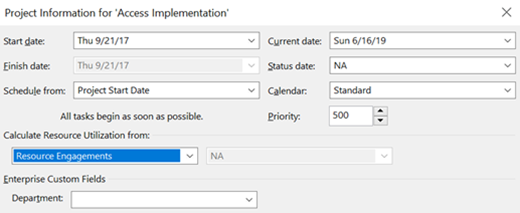

# Using resource engagements to define resource demand

**Summary:** Learn how to define the resource demand through resource engagements in PWA.

**Applies to:** Project Online, Project Server 2016

Resource engagements are a feature in the Project Web Application (PWA) to support high level resource demand estimating. This feature supports the PWA portfolio analysis functionality that compares resource demand with the available supply of resources.

This article will discuss how to configure your projects correctly to support the resource demand calculations. Resource engagements are a core feature of the project management capabilities of the Project Web Application, and are available in all versions of Project Online and Project Server.

## Project tasks and resource engagements

PWA provides two ways for your organization to model resource demand:

<table>
<thead>
<tr class="header">
<th>Method</th>
<th>Description</th>
</tr>
</thead>
<tbody>
<tr class="odd">
<td>Bottom up estimating</td>
<td>Project managers assign resources to project tasks. The project is then published to PWA.</td>
</tr>
<tr class="even">
<td>Top down estimating</td>
<td>
A project or proposal is created within PWA. The project manager submits a summary request for a specific resource type to support the project. The request is routed to the appropriate resource manager for approval.

This resourcing plan allows the project manager to "reserve" the resource for a specific duration.
</td>
</tr>
</tbody>
</table>

This article will focus on top down resource estimating within PWA.

## Resource Engagements

Resource engagements support high level resource estimating. Resource engagements can be created in Project Professional or in the Resource Request screen on the Resource Center Navigation tab.

Please see [this article for more information on resource engagements](https://support.office.com/en-us/article/overview-resource-engagements-73eefb5a-81fe-42bf-980e-9532b1bdc870).

## Committed and proposed bookings

Task assignments may be classified as either proposed or committed. By default, resource engagements are created in a proposed state. Once the resource engagement has been approved by the resource manager, it is changed to a committed state.

When creating the resource analysis, you should pick the appropriate option that is aligned with how your organization is forecasting work. The default setting is that only committed work is calculated. Change the setting to support the calculation of demand from proposed resource engagements.

## Microsoft Project Professional calculations

You will need to "tell" PWA how you are estimating your tasks for each of the projects in the project portfolio. You can designate that the schedule should use the task assignments or associated resource engagements.

To toggle the calculation method, open the schedule in Microsoft Project Professional. Navigate to the Project Information screen and toggle the option marked "Calculate Resource Utilization From..." Save and republish the project for the changes to take effect in any new resource analysis.

If you have an existing resource analysis, you will need to reload the resource data and trigger a recalculation.

You are now ready to run a resource portfolio analysis.

## Related Articles
