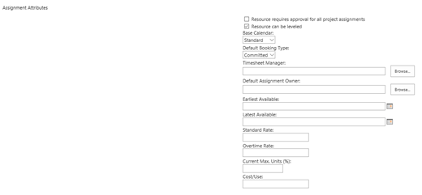
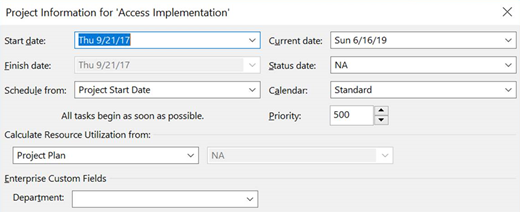

# Using task level assignments to define resource demand

**Summary:** Learn how to define the resource demand through task assignments within the project schedule.

**Applies to:** Project Online, Project Server 2016, Project Server 2013

PWA helps you analyze your resource capacity to determine which projects can be delivered. PWA will also help you identify where you have resourcing gaps.

You must perform two activities prior to starting the resource analysis.

- Define the resource capacity profile.

- Define the project demand profile.

This article will discuss how to configure your projects correctly to support the resource demand calculations. Resource assignments are a core feature of the project management capabilities of the Project Web Application, and are available in all versions of Project Online and Project Server.

## Project tasks and resource engagements

PWA provides two ways for your organization to model resource demand:

<table>
<thead>
<tr class="header">
<th>Method</th>
<th>Description</th>
</tr>
</thead>
<tbody>
<tr class="odd">
<td>Bottom up estimating</td>
<td>Project managers assign resources to project tasks. The project is then published to PWA.</td>
</tr>
<tr class="even">
<td>Top down estimating</td>
<td>
A project or proposal is created within PWA. The project manager submits a summary request for a specific resource type to support the project. The request is routed to the appropriate resource manager for approval.

This resourcing plan allows the project manager to "reserve" the resource for a specific duration.

</td>
</tr>
</tbody>
</table>

(For more information on top down estimating, please review [Using resource engagements to define resource demand](establishing-the-demand-profile-engagements.md).)

This article will focus on bottom up estimating within PWA.

## Booking type

Task assignments may be classified as either proposed or committed. Many organizations use these booking types to drive logic within the resource analysis calculations. The resource administrator may assign a default booking type to each of the resources listed in the PWA Resource Center.

The booking type also impacts some of the resource capacity calculations in the Resource Center. For example, some organizations decide not to review the demand assigned to proposed bookings. It is assumed that these assignments have not been confirmed, and thus should not count towards forecast resource demand.

When creating the resource analysis, you should pick the appropriate option that is aligned with how your organization is forecasting work. The default setting is that only committed work is calculated.

## Configuring the schedule

You will need to "tell" PWA how you are estimating your tasks for each of the projects in the project portfolio. You can designate that the schedule should use the task assignments or associated resource engagements. (By default, project task assignments are calculated within the resource analysis.)

To toggle the calculation method, open the schedule in Microsoft Project Professional. Navigate to the Project Information screen and toggle the option marked "Calculate Resource Utilization From..." Save and republish the project for the changes to take effect in any new resource analysis.

If you have an existing resource analysis, you will need to reload the resource data and trigger a recalculation.

You are now ready to run a resource portfolio analysis.

## Related Articles
