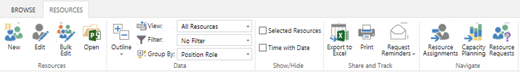

# Establishing the resource pool

**Summary:** Learn how to create a resource pool that supports resource analysis activities within Project Web Application (PWA).

**Applies to:** Project Online, Project Server 2016, Project Server 2013

PWA helps you analyze your resource capacity to determine which projects can be delivered. PWA will also help you identify where you have resourcing gaps. The resource analysis will provide a forecast of the additional cost required to deliver your target portfolio.

This article will discuss how to configure your resource pool to correctly define the capacity in the resource analysis. Resource analysis is a core feature in the Project Web Application, and is available in Project Online and supported versions of Project Server.

## Resource Center

The PWA Resource Center is where you populate the resources that will make up your available resource capacity. Your administrator is usually responsible for keeping this up to date. Organizations generally define the resource pool using a combination of approaches:

- Importing resources from a spreadsheet or database.

- Importing resources from your organization's Active Directory list of user accounts

Once the data has been imported, the administrator will need to add additional fields and values to correctly define resource capacity.

## Generic vs. named resources

Generic resources are placeholders with specific skills, such as Developer, Marketing Analyst, etc. These resources are often used in the project proposal process. During this time, most organizations do not know which specific named resources will be performing the work. Generic resources do not count towards your organization's capacity to deliver work.

Named resources are specific resources that work within your organization. Named resources allow your organization to assign tasks to specific individuals. Named resources also support the calculation of available resource capacity in the resource analysis.

Consider the following example:

- Assume your organization has a role of Marketing Analyst. That role is assigned to three projects, showing a requirement for three Marketing Analysts.

- Your organization has two people assigned to the role of Marketing Analyst, John Smith and Jane Doe. John and Jane are named resources.

- The resource analysis will determine a need for three Marketing Analysts, and compare this with the available capacity of two named resources. The resource analysis will conclude that only two projects may be performed.

Many organizations define a standard list of roles. This list is defined as a resource-level custom field linked to a standard lookup table. Each role is then mapped to at least one generic resource and several named resources.

Make a note of the field you are using to assign standard roles. You will need this field name when you create the resource analysis.

## Configuring the resource pool

To create a new resource:

1. Navigate to the **Resource Center**.

2. Click on the **New Button** on the **Resource Tab**.

The resource pool represents the supply of available resources within the organization. The system administrator must configure the resource pool to support the portfolio analysis process.

Following are key resource settings for consideration when configuring the enterprise resource pool:

| Configuration Item | Notes                                                                                                                                                                                                                                                                                                                   |
| ------------------ | ----------------------------------------------------------------------------------------------------------------------------------------------------------------------------------------------------------------------------------------------------------------------------------------------------------------------- |
| Maximum Units      | The total resource availability in the Resource Analysis component is calculated as the total of the resource availability.                                                                                                                                                                                             |
| Resource Calendars | Total availability is reduced by any exceptions to the resource calendars, i.e. holidays.                                                                                                                                                                                                                               |
| Role               | Each resource should be assigned a specific role within Project Server. The Portfolio Analysis module uses this field to calculate the total role availability and the average cost for a resource in that specific role. This field must be created as an enterprise custom field and linked to a custom lookup table. |
| Standard Rates     | The system utilizes the Standard Rate field to approximate the incremental costs of adding resources to a given portfolio.                                                                                                                                                                                              |

## Standard rate

The resource analysis will suggest the additional cost of hiring new resources to support the project portfolio. This additional cost is calculated from the average standard rate of each resource assigned to the role.

For example, assume we have two resources assigned to the role of Marketing Analyst, John Smith and Jane Doe. John has a rate of $125 per hour. Jane has a rate of $150 per hour. The resource analysis will assume new Marketing Analysts can be hired for a cost of $137.50. This cost is calculated as the average of John and Jane's hourly rates.

The resource pool has now been configured. You are ready to [define the resource demand](establishing-the-demand-project-demand-profile.md).

## Related articles
