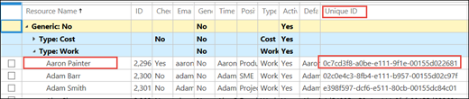
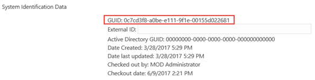
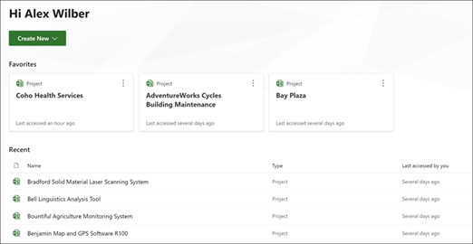

# Export user data from Project Online

Your organization can export a specific user's content from your Project Online environment. To export this content, an Office 365 global administrator can follow these steps: 
  
- [Step 1 - Download the export script files](export-user-data-from-project-online.md#scripts)
    
- [Step 2 - Find all Project Web App sites in your Office 365 environment](export-user-data-from-project-online.md#BKMK_FindallPWAsitesthattheuserispartof)
    
- [Step 3 - Find the user's Resource ID in each PWA site (optional)](export-user-data-from-project-online.md#BKMK_LookuptheusersresourceID)
    
- [Step 4 - Export your user's data from the PWA site](export-user-data-from-project-online.md#BKMK_RuntheExportPowerShellscript)
    
- [Step 5 - Review your exported content](export-user-data-from-project-online.md#BKMK_Reviewexportedcontentandchoosewhattosharewithuser)
    
- [Step 6 - Find and save custom views, custom filters, attachments, and macros](export-user-data-from-project-online.md#FindViews)
    
- [Considerations for master and inserted projects](export-user-data-from-project-online.md#ConsiderationsForMaster)

- [Considerations for Project Home favorite and recently viewed projects](export-user-data-from-project-online.md#ProjectHomeProjects)
    
 **Work with your Project Admins**
  
Depending on your company, your Office 365 global admin might be knowledgeable about managing Office 365 administrative tasks, but may know little about Project Online administration. If this is the case, we recommend that the Office 365 global admin work collaboratively with their PWA site admins to accomplish these tasks. For example, a Office 365 global admin would probably be best suited to run the PowerShell script to find all PWA sites, but would probably need to work collaboratively with the PWA admin to accomplish the remaining steps and for help regarding business rules and configuration of each PWA site.
  
## Step 1 - Download the export script files
<a name="scripts"> </a>

You will need the use of several PowerShell script files for the procedures in this article. The script files referenced in this article are contained in the [Project Online User Content Export and Delete script package](https://go.microsoft.com/fwlink/?linkid=871953). Download and unzip the files to a location you can reference.
  
Some of the files included in this package are used to delete user data in Project Online and will not be needed for this article.
  
### Unblock your files

You will need to "unblock" the files you downloaded in the Project Online User Content Export and Delete script package in order to user them in PowerShell. This is because by default, executing scripts downloaded from the Internet is not allowed. Do the following to unblock your files:
  
1. In File Explorer, go to the location where you saved the zip file.
    
2. Right click on the zip file, and click **Properties**. 
    
3. On the **General** tab, select **Unblock**. 
    
    
  
4. Click **OK.**
    
All files contained in the zip file should now be Unblocked. You can verify this in the individual files by checking to see if the **Unblocked** checkbox option no longer appears in the **General** tab of the file's **Properties** page. 
  
> [!NOTE]
> If you only have access to unzipped files, you can also unblock each file individually. 
  
## Step 2 - Find all Project Web App sites in your Office 365 environment
<a name="BKMK_FindallPWAsitesthattheuserispartof"> </a>

Global admins will need to use the [SharePoint Online Management Shell](https://go.microsoft.com/fwlink/?linkid=867805) to connect to their SharePoint Online Admin Center and run the **[Get-SPOSite](/powershell/module/sharepoint-online/get-sposite)** PowerShell cmdlet to get a listing of URLs for each PWA site in their Office 365 environment. 
  
> [!NOTE]
> To run the Get-SPOSite PowerShell cmdlet, you need to be either in a Global admin or SharePoint admin role. 
  
1. In the SharePoint Online Management Shell module, connect to your SharePoint Online Admin Center with the **[Connect-SPOService](/powershell/module/sharepoint-online/connect-sposervice)** cmdlet: 
    
  ```
  Connect-SPOService -URL <AdminSiteURL> 
  ```

  For example:
    
  ```
  Connect-SPOService -URL https://contoso-admin.sharepoint.com 
  ```

2. After connecting to your SharePoint Online Admin Center, use the [Get-SPOSite](/powershell/module/sharepoint-online/get-sposite) PowerShell cmdlet to find all PWA sites in your Office 365 environment: 
    
  ```
  Get-SPOSite | ?{$_.PWAEnabled -eq "Enabled"} | ft -a Url,Owner
  ```

   After successfully running, a list of all PWA sites and site owners in your Office 365 environment will display.
    
## Step 3 - Find the user's Resource ID in each PWA site (optional)
<a name="BKMK_LookuptheusersresourceID"> </a>

> [!NOTE]
> If you have the user's login account, this step is optional. You will need either the user's **login account** or **Resource ID** for each PWA site in order to run the export script. 
  
If you want to find the user's resource ID, PWA site admins can to do the following on each PWA site that you found in the previous step:
  
1. In the Project Online **Server Settings**, in the **Enterprise Data** section, click **Resource Center**.
    
2. On the **Resource Center** page, in the **Resource Name** column, locate the user's name then look in that row to see if you can find a value in the **Unique ID** column. This value is the user's Resource ID. For example, in the graphic below, you can see Aaron Painter's Resource ID value listed in the Unique ID column. 
    
    
  
    In some cases, your table may be customized so that the Unique ID column is not available. If so, select the checkbox to the left of the user name and then click **Edit** located in the **Resources** tab in the ribbon, and then go to the next step. 
    
3. On the **Edit Resource** page for the specific user, go to the **System Identification Data** section and find the value listed for the **GUID**. The GUID is the users resource ID for this PWA site.
    
    
  
> [!NOTE]
> If you have multiple PWA sites, each PWA site will have a different Resource ID for the same user. Make sure to pair the Resource ID your find for the user with the specific PWA site URL. 
  
## Step 4 - Export your user's data from the PWA site
<a name="BKMK_RuntheExportPowerShellscript"> </a>

Next, you will need to run the **ExportProjectUserContent** PowerShell script in order to export your user's data from each PWA site in your Office 365 environment. In order to run the script, you need to make sure you and your environment meet the prerequisites, and then you can run the script. 
  
The ExportProjectUserContent PowerShell script is included with the [Project Online User Content Export and Delete script package](https://go.microsoft.com/fwlink/?linkid=871953).
  
### Prerequisites

- **License for Project Online**: You need to be assigned a **Project Online Premium** or **Project Online Professional** license. 
    
- **Project Online Desktop Client**: You will need the Project Online Desktop Client and be connected to the Project Online instance. The Project Online Desktop Client is included with a **Project Online Premium** or **Project Online Professional** license. 
    
    To connect your Project client to your Project Online instance:
    
1. Click the **File** tab to open the Backstage view. Click **Info**, and then click **Manage** Accounts. 
    
2. In the **Project Web App Accounts** dialog box, click **Add**. 
    
3. In the **Account Properties** dialog box, type a name for this account in the **Account Name** box. 
    
4. Enter the URL of the PWA site you are connecting to in the **Project Server URL** box. 
    
5. Click **OK**. 
    
6. In the **Project Web App Accounts** dialog box, select **Set as Default,** and then click **OK**. 
    
7. Restart Project, and log on to the PWA site.
    
- **Permissions**: In order to have the required permissions to run the script, you need to do at least one of the following:
    
  - Add yourself as a site collection admin to the PWA Site for which you are running the script.
    
  - If you are in Project permission mode, be assigned **Manage Users and Groups** and the **Access Project Server Reporting Service** permissions on the Project Online instance. If you are in SharePoint permission mode, be in the Global admin or SharePoint admin role. 
    
### Run the ExportProjectUserContent script

Use the ExportProjectUserContent.ps1 PowerShell script to export your user's data.
  
1. In the [SharePoint Online Management Shell](https://go.microsoft.com/fwlink/?linkid=867805), run the ExportProjectUserContent script. You will need to configure the following parameters when running the script:
    
|||
|:-----|:-----|
|**Parameter** <br/> |**Description** <br/> |
|-URL  <br/> |URL of the PWA site  <br/> |
|-ResourceID  <br/> |Resource ID of the user.  <br/> |
|-LoginName  <br/> |Login name of the user.  <br/> |
|-OutputDirectory  <br/> |Location to store the export files.  <br/> |
|-Region  <br/> | This optional parameter specifies the Office 365 environment you are using. The values you can use for this parameter include:  <br/> **Default** - Project Public Cloud.  <br/> **China** - Gallatin.  <br/> **Germany** - BlackForest.  <br/> **ITAR** - Office 365 United States Government.  <br/>  If the parameter is not used, the default value is used (  *Default*  ).  <br/> |

You can chose to run the script either by specifying the user's Resource ID or login name.

**To run the ExportProjectUser script using the users Resource ID**

You would use the following command in PowerShell with the parameters listed above:

    
  ```
  .\ExportProjectUserContent.ps1 -Url <PwaSiteURL> -ResourceUid <UsersResourceID> -OutputDirectory <LocationToStoreOutput>
  ```
For example, if you want to export user data from the Costoso PWA1 site (site URL of https://contoso/sites/pwa1) for a user with a Resource ID of cb5c91cf-fd6b-e711-80d0-00155da4a406, and have the export files save to c:\pwa1siteOutput, you would enter:
    
  ```
  .\ExportProjectUserContent.ps1 -Url https://contoso/sites/pwa1 -ResourceUid cb5c91cf-fd6b-e711-80d0-00155da4a406 -OutputDirectory c:\pwa1siteOutput
  ```

 **To run the ExportProjectUser script using the users Login Name**
    
You would use the following command in Powershell with the paramaters listed above:
    
  ```
  .\ExportProjectUserContent.ps1 -Url <PwaSiteURL> -LoginName <UsersLoginName> -OutputDirectory <LocationToStoreOutput>
  ```

For example, if you want to export user data from the Costoso PWA1 site (site URL of https://contoso/sites/pwa1) for a user with a Login Name of AdamB@contoso.onmicrosoft.com, and have the export files save to c:\pwa1siteOutput, you would enter:
    
  ```
  .\ExportProjectUserContent.ps1 -Url https://contoso/sites/pwa1 -LoginName AdamB@contoso.onmicrosoft.com -OutputDirectory c:\pwa1siteOutput
  ```
After the script runs successfully, all exported data will be stored in the -OutputDirectory you specified.
    
### Select specific feature-related user data files to export

Some of the exported user content you receive will include a number of json formatted files that includes feature-specific user information. For example, the Security.json file contains data about the user's security groups, categories, and permissions settings. These feature-related json files are described in more detail in the next section. By default, you will receive all 27 feature-related json files when you run the ExportProjectUserContent script. However, you can use the **-Options** parameter to select specific json files to download. These include the following: 
  
|**-Options values**|**Json files you receive**|
|:-----|:-----|
|All  <br/> |All feature-related json files, all project-specific json files, and all project-list files.  <br/> |
|Timesheets  <br/> |Timesheets_Reporting.json, Timesheets_page#.json  <br/> For the Timesheets_page#.json, you will get file per page.  <br/> |
|TaskStatus  <br/> |Rules.json, TaskStatus_AssignmentsHistory_page#.json, TaskStatus_AssignmentsSaved.json, TaskStatus_AssignmentsSubmitted.json  <br/> |
|Security  <br/> |Security.json  <br/> |
|Portfolio  <br/> |BusinessDrivers.json, DriverPrioritizations.json, PortfolioAnalyses.json  <br/> |
|StatusReports  <br/> |StatusReports.json  <br/> |
|Engagements  <br/> |Engagements_page#.json  <br/> |
|ResourcePlans  <br/> |ResourcePlans_page#.json, ReportingResourcePlans.json  <br/> |
|Projects  <br/> |DraftProjectList.xml , PublishedProjectList.xml. ReportingProjectList  <br/> You will also receive one of each of the following for each project that the user was a part of:  <br/> Project_projName_draft.json, Project_projName_draft.mpp, Project_projName_draft.xml,  <br/> Project_projName_published.json, Project_projName_ published.mpp, Project_projName_ published.xml,  <br/> Project_projName_reporting.json, Project_projName_reporting_Tasks, Project_projName_reporting_Assignments, Project_projName_reporting_Resources, Project_projName_reporting_Baselines, Project_projName_reporting_TaskTimephased, Project_projName_reporting_AssignmentTimephased, Project_projName_reporting_TaskBaselineTimephased, Project_projName_reporting_ AssignmentBaselineTimephased  <br/> |
|UserViewSettings  <br/> |UserViewSettings.json  <br/> |
   
Using the -Options parameter can be helpful if you want to export user data from the PWA site for specific features. For example, if you are only concerned with your user's data in the Portfolio Analysis feature, you can run the -Options parameter with the value of Portfolio:
  
```
.\ExportProjectUserContent.ps1 -Url https://contoso/sites/pwa1 -ResourceUid cb5c91cf-fd6b-e711-80d0-00155da4a406 -OutputDirectory c:\pwa1siteOutput -Options Portfolio
```

This will allow you to export the three json files that contain your user's data that pertains to the Portfolio Analysis feature (BusinessDrivers.json, DriverPrioritizations.json, PortfolioAnalyses.json).
  
## Step 5 - Review your exported content
<a name="BKMK_Reviewexportedcontentandchoosewhattosharewithuser"> </a>

After you run the ExportProjectUserContent PowerShell script successfully, you will have the following output in the output directory you specified when running the command:
  
- **Project list files** - You will receive three .xml files that provide a list of projects contained in the Project Draft and Published schemas in which the user was a part of. This means the user was involved in the project as at least one of the following: 
    
  - Was the project owner.
    
  - Has a task assigned to him or her in the project.
    
  - Is an assignment owner of a task in the project.
    
  - Is the status manager of a task in the project.
    
    These three .xml files are:
    
|||
|:-----|:-----|
|**Name** <br/> |**Description** <br/> |
|DraftProjectList.xml  <br/> |List of projects from the Draft schema that corresponds to the conditions above.  <br/> |
|PublishedProjectList.xml  <br/> |List of projects from the Published schema that corresponds to the conditions above.  <br/> |
|ReportingProjectList.xml  <br/> |List of projects from the Reporting schema that corresponds to the conditions above.  <br/> |
   
   The list of projects may differ slightly for each of the three .xml files. For example, a user can save the project but not publish, meaning that it will appear in the DraftProjectList.xml file, but not the PublishedProjectList.xml or ReportingProjectList.xml files.
    
   A project admin can use the Project list .xml files to give them information about which project-specific export files they be interested in analyzing to decide how much of the exported content should be shared with the user.
    
   All three of the ProjectList.xml files will have the following properties for each project listed:
    
|||
|:-----|:-----|
|**Property** <br/> |**Description** <br/> |
|SiteId  <br/> |The unique identifier for the PWA site in which the project exists.  <br/> |
|Proj_UID  <br/> |The unique identifier for the project.  <br/> |
|Proj_Name  <br/> |Name of the project.  <br/> |
   
- **Feature-related files** - For each PWA site that the user is part of, the following feature-specific .json files will be exported to the specified output directory. The feature-specific files will contain user data as it pertains to the feature use throughout the PWA site. For example, the Drivers.json file will include data about Portfolio Analysis business drivers the user created or owned. If the user has no data relating to the feature on the specific PWA site, the file will contain no data. 
    
    The feature-specific .json files include:
    
|**Name**|**Description**|
|:-----|:-----|
|[AdminAudit](project-online-and-project-server-export-data-definitions.md#AdminAudit) <br/> |Project Web App server settings change data.  <br/> |
|[BusinessDrivers](project-online-and-project-server-export-data-definitions.md#Drivers) <br/> |Portfolio analysis business drivers data.  <br/> |
|[Calendars](project-online-and-project-server-export-data-definitions.md#Calendars) <br/> |Enterprise calendar data.  <br/> |
|[CustomFields](project-online-and-project-server-export-data-definitions.md#CustomFields) <br/> |Custom field data.  <br/> |
|[Delegations](project-online-and-project-server-export-data-definitions.md#Delegations) <br/> |Delegation data.  <br/> |
|[DriverPrioritizations](project-online-and-project-server-export-data-definitions.md#Prioritizations) <br/> |Business driver prioritizations data.  <br/> |
|[Engagements](project-online-and-project-server-export-data-definitions.md#Engagements) <br/> |Resource engagement data.  <br/> |
|[LookupTables](project-online-and-project-server-export-data-definitions.md#LookupTables) <br/> |Lookup table data.  <br/> |
|[PortfolioAnalysis](project-online-and-project-server-export-data-definitions.md#Analyses) <br/> |Portfolio analyses data.  <br/> |
|[QueueJobs](project-online-and-project-server-export-data-definitions.md#QueueJobs) <br/> |Data about user jobs process through the Queue Service.  <br/> |
|[ReminderEmails](project-online-and-project-server-export-data-definitions.md#ReminderEmails) <br/> |Reminder email data.  <br/> |
|[ReportingResource](project-online-and-project-server-export-data-definitions.md#ReportingResource) <br/> |Resource reporting data.  <br/> |
|[Resource](project-online-and-project-server-export-data-definitions.md#Resource) <br/> |Resource data.  <br/> |
|[ResourcePlans](project-online-and-project-server-export-data-definitions.md#ResourcePlan) <br/> |Resource plan data.  <br/> |
|[Rules](project-online-and-project-server-export-data-definitions.md#rules) <br/> |Rules data.  <br/> |
|[Security](project-online-and-project-server-export-data-definitions.md#Security) <br/> |Data about security groups, categories, and permissions.  <br/> |
|[StatusReports](project-online-and-project-server-export-data-definitions.md#StatusReports) <br/> |Status report data.  <br/> |
|[SubscribedReminders](project-online-and-project-server-export-data-definitions.md#SubscribedReminders) <br/> |Subscribed reminders data.  <br/> |
|[TaskStatus_AssignmentsHistory](project-online-and-project-server-export-data-definitions.md#StatusAssignHis) <br/> |Statusing assignments history data.  <br/> |
|[TaskStatus_AssignmentsSaved](project-online-and-project-server-export-data-definitions.md#StatusAssignSaved) <br/> |Statusing assignments save data.  <br/> |
|[TaskStatus_AssignmentsSubmitted](project-online-and-project-server-export-data-definitions.md#StatusAssignsub) <br/> |Statusing assignments submit data.  <br/> |
|[Timesheets](project-online-and-project-server-export-data-definitions.md#Timesheets) <br/> |Data about timesheets.  <br/> |
|[Timesheets_Reporting](project-online-and-project-server-export-data-definitions.md#Timesheets_Reporting) <br/> |Reporting data about timesheets.  <br/> |
|[UnsubscribedAlerts](project-online-and-project-server-export-data-definitions.md#UnsubscribedAlerts) <br/> |Unsubscribed alerts data.  <br/> |
|[UserViewSettings](project-online-and-project-server-export-data-definitions.md#UserProp) <br/> |User view settings data.  <br/> |
|[Workflow](project-online-and-project-server-export-data-definitions.md#Workflow) <br/> |Project workflow data.  <br/> |
|[WorkspaceItems](project-online-and-project-server-export-data-definitions.md#WSS) <br/> |Data about SharePoint items from project sites.  <br/> |
   
   Certain feature-specific json files have the possibility of being large, so to improve performance, the following json files will spawn across multiple files:
    
  - Engagements.json
    
  - ResourcePlans.json
    
  - Timesheets.json
    
  - TaskStatus_AssignmentHistory.json
    
    > [!NOTE]
    > To learn more about the objects contained in each of the feature-specific .json files, see the [Feature-specific data](project-online-and-project-server-export-data-definitions.md#featurespec) section of [Project Online export json object definitions](project-online-and-project-server-export-data-definitions.md). 
  
- **Project-specific files** - If the user is part of any project, then for each of those projects, several individual files will be exported to the output directory. This will happen if the user is part of the specific project as one of the following: 
    
  - The project owner
    
  - Has a task assigned to him or her in the project
    
  - Is an assignment owner of a task in the project
    
  - Is the status manager of a task in the project
    
    Project-specific data differs from the Feature-related data in that the data is specific to a single project. Feature-related data can include user data across many projects in the PWA site that the user was a part of, but pertaining to a single feature.
    
    > [!NOTE]
    > For all project-specific files you receive, they will be prefixed with the specific project's **Project Name**. For example, if a project has a Project Name of **Project1**, all project-specific files we describe in this section will be prefixed with **Project1**. 
  
    For each project the user is a part of, you will received the following three sets of files:
    
    **- An .xml file for the project from the draft and published databases:**
    
|||
|:-----|:-----|
|**Name** <br/> |**Description** <br/> |
|\<projectName\>_draft.xml  <br/> |The project file from the draft schema saved as .xml format.  <br/> |
|\<projectName\>_published.xml  <br/> |The project file from the published schema saved as .xml format.  <br/> |
   
  > [!NOTE]
  > See the [Project XML Data Interchange Scheme Reference](/office-project/xml-data-interchange/project-xml-data-interchange-schema-reference) to understand the Project XML data contained in these files. 
  
  **- An .mpp file for the project from the draft and published databases:**
    
|||
|:-----|:-----|
|**Name** <br/> |**Description** <br/> |
|\<projectName\>_draft.mpp  <br/> |The project file from the draft schema saved as a Project .mpp file.  <br/> |
|\<projectName\>_published.mpp  <br/> |The project file from the published schema saved as a Project .mpp file.  <br/> |
   
   > [!NOTE]
   > You can open the .mpp file with Project Professional 2019, Project Professional 2016, or the Project Online Desktop client. 
   > Saving the exported .mpp files back to Project Online or Project server is not supported.
  
   **- Eight .json files for the project from the reporting schema:**
    
|**Name**|**Description**|
|:-----|:-----|
|[Reporting_AssignmentBaselineTimephased](project-online-and-project-server-export-data-definitions.md#AssignmentBaselineTimephased) <br/> |Assignment Baseline Timephase data for the project from the reporting schema.  <br/> |
|[Reporting_AssignmentTimephased](project-online-and-project-server-export-data-definitions.md#AssignmentTimephased) <br/> |Assignment Timephase data for the project from the reporting schema.  <br/> |
|[Reporting_ProjectBaseline](project-online-and-project-server-export-data-definitions.md#ProjectBaseline) <br/> |Project Baseline data for the project from the reporting schema.  <br/> |
|[Reporting_Tasks](project-online-and-project-server-export-data-definitions.md#ProjectTasks) <br/> |Project tasks data for the project from the reporting schema.  <br/> |
|[Reporting_Assignments](project-online-and-project-server-export-data-definitions.md#Assignments) <br/> |Assignment resources data for the project from the reporting schema.  <br/> |
|[Reporting_Resources](project-online-and-project-server-export-data-definitions.md#reporting_Resources) <br/> |Resources data for the project from the reporting schema.  <br/> |
|[Reporting_TaskBaselineTimephased](project-online-and-project-server-export-data-definitions.md#TaskBaselineTimephased) <br/> |Task baseline timephased data for the project from the reporting schema.  <br/> |
|[Reporting_TaskTimephased](project-online-and-project-server-export-data-definitions.md#TaskTimephased) <br/> |Task timephased data for the project from the reporting schema.  <br/> |
   
   > [!NOTE]
   > To learn more about the objects contained in each of the .json files, see the [Project-specific user data from the reporting data](project-online-and-project-server-export-data-definitions.md#projectspec) section of [Project Online export json object definitions](project-online-and-project-server-export-data-definitions.md). 
  
   **- Three .json files with the project's metadata from the draft, published, and reporting schemas:**
    
|||
|:-----|:-----|
|**Name** <br/> |**Description** <br/> |
|\<projectName\>_draft.json  <br/> |Project metadata file from the Draft schema  <br/> |
|\<projectName\>_published.json  <br/> |Project metadata file from the Published schema  <br/> |
|\<projectName\>_reporting.json  <br/> |Project metadata file from the Reporting schema  <br/> |
   
   > [!NOTE]
   > To learn more about the objects contained in each of the .json files, see the [Project-specific Metadata files](project-online-and-project-server-export-data-definitions.md#ProjSpecMeta) section of [Project Online export json object definitions](project-online-and-project-server-export-data-definitions.md). 
  
## Step 6 - Find and save custom views, custom filters, attachments, and macros
<a name="FindViews"> </a>

After receiving the exported user content, you can use your data to find the user's custom views, custom filters, custom tables, attachments, and macros. To find these, you will need to have the MPP and XML file for each project in which you want to search. For more information on how to do this, see [Find customized user items in Project Online and Project Server user export data](find-customized-user-items-in-project-online-and-project-server-user-export-data.md).
  
## Considerations for master and inserted projects
<a name="ConsiderationsForMaster"> </a>

As noted earlier, the export script will only export projects that the user was a part of as an owner, has an assigned task, is an assignment owner of a task, or is the status manager of a task. When the user is part of an inserted project, but not the master project, only the inserted project will be exported. Similarly, if the user is only part of a master project and not any of the inserted projects, only the master project will be exported.
  
When saving a master project that a user was a part of, you will not need to save any associated inserted projects if you are prompted.

## Considerations for Project Home favorite and recently viewed projects
<a name="ProjectHomeProjects"> </a>

Data for a user's favorite and recently viewed projects in Project Home can only be accessed directly in-app. The user needs to log in with their Office 365 account credentials to access their Project Home page and see the projects that are listed.

1. Log in to Office 365.
2. In your browser, navigate to the URL **project.microsoft.com** to open your Project Home page.
3. On the Project Home page, take a screenshot of the projects listed in the Favorites and Recent sections.
  
    
## See Also
<a name="ConsiderationsForMaster"> </a>

[Project Online export json object definitions](project-online-and-project-server-export-data-definitions.md)
  
[Delete user data from Project Online](delete-user-data-from-project-online.md)
