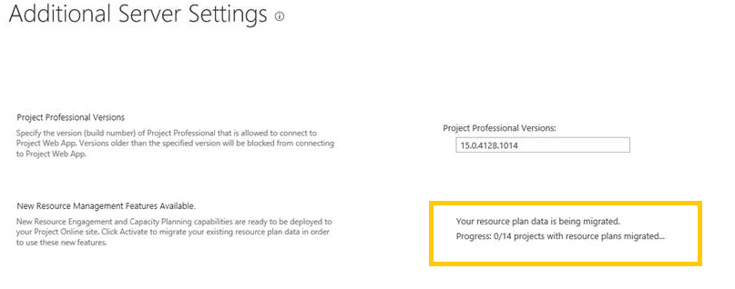

# FAQ: Resource engagements are replacing the old resource plans

Resource engagements are new for Project Online, but what happens to the old resource plans? Read on about this new feature and how old resource plans are converted into resource engagements.
  
## I've heard about this new resource engagements feature. How do I get it?

Starting on September 22, 2015, we will begin rolling out the new feature, and Project Online administrators will have the option to turn on the new feature at their convenience once it becomes available. This process is phased, and it might take some time before everyone is able to see it. This is a site-level activation. Once an administrator has activated the feature, anyone on that site will be able to see the new **Resource Requests** page and be able to start creating and managing requests. 
  
For any new Project Online sites created after the feature is available for the tenant, the administrator will still need to activate the feature for the new instance.
  
We recommend that the Project Online administrator turn on the feature in a spare Project Web App (PWA) instance first to become familiar with it before turning it on in the main PWA instance.
  
Please note, once the feature has been activated for a site it cannot be de-activated. This is a one-way operation.
  
## How long can a Project Online administrator wait to turn on the feature?

For any new PWA site created on April 4, 2016 or later, the resource engagements feature will already be on—no need to activate them.
  
For PWA sites created before April 4, 2016, the Project Online administrator can choose to turn on engagements at any point. The feature will no longer be automatically activated on September 22, 2016.
  
## I'm excited about the new resource engagements, but what happens to my old resource plans?

The good news is, once the new feature has been turned on, your old **published** resource plans will be converted into resource engagements. When the feature is activated we will start migrating the old published resource plans. Before you activate this feature, we recommend that you: 
  
- Make sure your existing resource plans have timephased data.
    
- Republish any existing resource plans.
    
 Since engagements are time-based, if your resource plan does not contain any timephased information (resources only), no engagements will be created. We will do our best to convert resource plans into engagements, provided all of the necessary data is available. Once the activation is complete, you will no longer be able to access the old resource plans, but can start creating new engagements to replace them. 
  
For every published resource plan, we will use some of the data to create new engagements. The status will match that from the resource plan and all of the timephased data will be transferred.
  
After the feature has been activated, you will no longer be able to access the old resource plan UI, and that page will be deprecated.
  
## How do I know if my resource plans were successfully migrated into engagements?

Once the Project Online administrator has activated the feature, there will be a section in **Additional Server Settings** that shows the progress. 
  

  
After migration is complete, the **New Resource Management Features Available** section will disappear. You should now be able to visit the **Resource Requests** page and view the newly created engagements that were based on your old resource plans. 
  
## What about my existing reports involving resource plans?

Your existing reports will no longer return any data since the old resource plans will be deleted from the reporting database. You will be able to create any new reports you like using engagement data. We have added support through OData to create new reports on engagements.
  
## What about portfolio analysis? Our organization used to use resource plans to do resource modeling.

Portfolio analysis will now include engagement data instead of resource plan data. Similar to how the old resource plans were handled, you will have the option to include both proposed and committed engagements, or just committed ones, when doing your analysis. 
  
## What about extensibility? Can I access the APIs for engagements?

There are resource engagement APIs available, the Project Server CSOM class details are here: [Microsoft.ProjectServer.Client Namespace](/dotnet/api/microsoft.projectserver.client)
  
## When will this be available to Project Server customers?

In the next release of Project Server, customers will be able to access all of these features.
