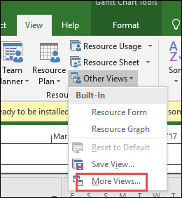
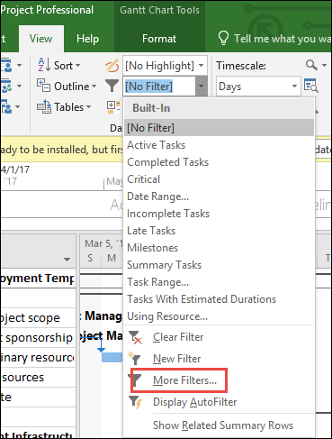
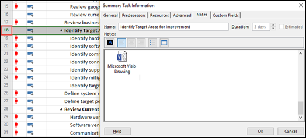
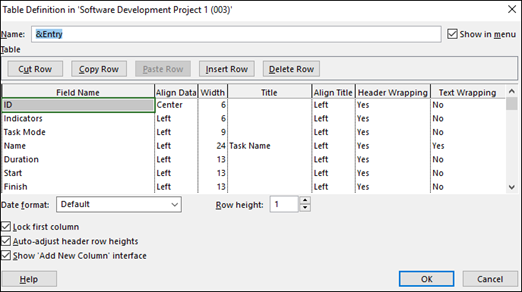

# Find customized user items in Project Online and Project Server user export data

This article describes how to search for a specific users customized items (views, filters, attachments, tables, and macros) in a project when you do an export of the users data in Project Online or Project Server. This includes: 
  
- [To find and save customized views](find-customized-user-items-in-project-online-and-project-server-user-export-data.md#Custviews)
    
- [To find and save customized filters](find-customized-user-items-in-project-online-and-project-server-user-export-data.md#CustFilt)
    
- [To find and save attachments](find-customized-user-items-in-project-online-and-project-server-user-export-data.md#Attach)
    
- [To find and save customized tables](find-customized-user-items-in-project-online-and-project-server-user-export-data.md#About)
    
- [To find and save user macros](find-customized-user-items-in-project-online-and-project-server-user-export-data.md#Macros)
    
The procedures in this article require you to have the following:
  
- The MPP file for the project
    
- The XML file for the project
    
For Project Online, both files were provided to you when you exported the user data through the procedures in [Export user data from Project Online](export-user-data-from-project-online.md).
  
For Project Server, you will need to save the specific project file to XML format to create the XML file.
  
> [!NOTE]
> When saving a project file to XML format with Project Professional, make sure that you have applied the latest updates. 
  
## To find and save customized views
<a name="Custviews"> </a>

1. Open the specific project's XML file in a text editor.
    
2. In the text, search for **\<Views\>** to find a list of user views for the project. 
    
3. In the list of Views, look for any views that have the **IsCustomized** property set to **true**. For example, the following means a View named Active Tasks has been customized from the global/default template: 
    
  ```
  <View>
  <Name>Task Sheet</Name>
  <IsCustomized>true</IsCustomized>
  </View>
  
  ```

4. Now open the project's MPP file in the Project Online Desktop Client or Project Professional 2016. 
    
5. Click the **View** menu to open the ribbon, and in the ribbon select the ** Other View ** dropdown menu, and then click **More Views**. 
    
6. In the ** More Views ** window, in the Views list, select the view you are looking for, and then click **Apply**. 
    
    
  
7. The selected view will display. Take a screenshot of the view and save it.
    
8. Use the same procedure for all remaining custom views you found in the XML file.
    
You can repeat this procedure on each project in which you want to search for your user's customized views.
  
## To find and save customized filters
<a name="CustFilt"> </a>

1. Open the specific project's XML file in a text editor.
    
2. In the text, search for **\<Filters\>** to find a list of user filters for the project. 
    
3. In the list of Filters, look for all filters that have the **IsCustomized** property set to **true**. For example, the following means a filter named Active Tasks has been customized from the global/default template: 
    
  ```
  <Filters>
  <Name>Active Tasks</Name>
  <IsCustomized>true</IsCustomized>
  </Filter>
  
  ```

4. To save the view, open the project's MPP file in the Project Online Desktop Client or Project Professional 2016. 
    
5. Click the **View** menu, and in the ** Filters ** dropdown menu, select **More Filters**. 
    
6. In the ** More Filters ** menu, select the filter you are looking for, and then click ** Edit **. 
    
    
  
7. The filter definition for the selected filter will display. You can take a screenshot of the filter definition and save it.
    
8. Use the same procedure for all remaining custom filters you found in the XML file.
    
You can repeat this procedure on each project in which you want to search for your user's customize filters.
  
## To find and save attachments
<a name="Attach"> </a>

1. Open the specific project's XML file in a text editor.
    
2. In the text, search for **\<Tasks\>** to find a list of user tasks for the project. 
    
3. In the list of tasks, look for all tasks that have the **NoteContainsObjects** property set to **true**. For example, the following means that task 18 contains an attachment: 
    
  ```
  <Task>
  <UID>18</UID>
  <NoteContainsObjects>true</NoteContainsObjects>
  </Task>
  
  ```

4. To save the attachment, open the project's MPP file in the Project Online Desktop Client or Project Professional 2016. 
    
5. Click the **Tasks** menu, and open the task associated with the attachment (for example, task #18). 
    
6. In the ** Task Information ** screen, select the **Notes** tab. You should see the attachment item listed. 
    
    
  
7. Open the attachment item and save it.
    
8. Use the same procedure for all remaining attachments you found in the XML file.
    
You can repeat this procedure on each project in which you want to search for your user's attachments.
  
## To find and save customized tables
<a name="About"> </a>

1. Open the specific project's XML file in a text editor.
    
2. In the text, search for **\<Tables\>** to find the tables in the project. 
    
3. In the list of tables, look for any tables that have the **IsCustomized** property set to **true**. For example, the following means the Entry table has been customized from the global/default template: 
    
  ```
  <Tables>
  <Table>Entry</Name>
  <IsCustomized>true</IsCustomized>
  </Table>
  
  ```

4. Now open the project's MPP file in the Project Online Desktop Client or Project Professional 2016. 
    
5. Click the **View** menu to open the ribbon, and in the ribbon select the **Tables** dropdown menu, and then click **More Tables**. 
    
6. In the ** More Tables ** window, in the Tables list, select the table you are looking for, and then click **Edit**. 
    
    
  
7. The Table definition will display for the selected table. Take a screenshot of all the information in the definition window and save it.
    
8. Use the same procedure for all remaining customized tables you found in the XML file.
    
You can repeat this procedure on each project in which you want to search for your user's customized tables.
  
## To find and save user macros
<a name="Macros"> </a>

> [!NOTE]
> A project's XML files will not flag if it contains VBA macros. You will need to manually open the user's projects to verify if it contains a VBA macro. 
  
1. Open the project's MPP file in the Project Online Desktop Client or Project Professional 2016. 
    
2. Click the **View** menu to open the ribbon, and in the ribbon select the **Macros** dropdown menu, and then click **View Macros**. 
    
3. On the **Macros** page, select **Visual Basic** to open the Visual Basic Editor. 
    
4. In the Visual Basic editor, you can save each of the users custom VBA files. 
    
You can repeat this procedure on each project in which you want to search for your user's customize macros.
  
## See also
<a name="Macros"> </a>

[Export user data from Project Online](export-user-data-from-project-online.md)
  
[Export user data from Project Server](https://support.office.com/article/c85c548f-4406-4663-8487-192ee065a803)

