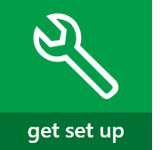
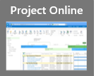

# Get started with Project Online

|||
|:-----|:-----|
|             |]                      |

## [Overview](#tab/)
  
|||
|:-----|:-----|
|             |**[Project Online](https://go.microsoft.com/fwlink/p/?linkid=402127) is web-based, and is great for:**    Managing multiple projects.     Tracking work on timesheets.     Balancing broad resource needs.     *(If you're looking for a hosted version of Project Server, this is it!)*    |
   
 **To be clear, Project Online is NOT a web-based version of Project Professional.** Project Online is an entirely separate service that offers full portfolio and project management tools on the web. It includes Project Web App, and can, depending on your subscription, also include Project Online Desktop Client, which is a subscription version of Project Professional. 
  
### Got the wrong thing?

 **If you need to cancel and subscribe to something else,** choose **Billing** \> **Subscriptions** in the Office 365 admin center, choose the subscription you want to cancel, and then click **Cancel subscription** in the pane on the right. Then, you can find the right product to subscribe to and add that to your existing Office 365 account. 
  
### Need help?

Take a look through the [Project help](https://support.office.com/article/afac1e38-1219-4a88-bd22-81534778d528) on Office.com. If you're still stuck, try posting your questions and issues on the [Project Online discussion forum](https://social.technet.microsoft.com/Forums/projectserver/en-US/home?forum=projectonline).
  

  

   
---

