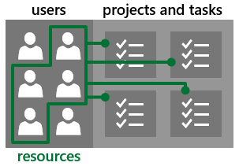
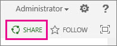
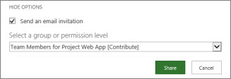

# Get started with Project Online

## [Overview](#tab/)
  
|||
|:-----|:-----|
|             |**[Project Online](https://go.microsoft.com/fwlink/p/?linkid=402127) is web-based, and is great for: **    Managing multiple projects.     Tracking work on timesheets.     Balancing broad resource needs.     *(If you're looking for a hosted version of Project Server, this is it!)*    |
   
 **To be clear, Project Online is NOT a web-based version of Project Professional.** Project Online is an entirely separate service that offers full portfolio and project management tools on the web. It includes Project Web App, and can, depending on your subscription, also include Project Online Desktop Client, which is a subscription version of Project Professional. 
  
### Got the wrong thing?

 **If you need to cancel and subscribe to something else,** choose **Billing** \> **Subscriptions** in the Office 365 admin center, choose the subscription you want to cancel, and then click **Cancel subscription** in the pane on the right. Then, you can find the right product to subscribe to and add that to your existing Office 365 account. 
  
### Need help?

Take a look through the [Project help](https://support.office.com/article/afac1e38-1219-4a88-bd22-81534778d528) on Office.com. If you're still stuck, try posting your questions and issues on the [Project Online discussion forum](https://social.technet.microsoft.com/Forums/projectserver/en-US/home?forum=projectonline).
  

  
## [Sign up](#tab/)
  
### First, subscribe to Project Online

|||
|:-----|:-----|
|             |
|||
|:-----|:-----|
|**Start from scratch**   New to Office 365? Start here!    |**Add Project Online to Office 365**   If you already have an Office 365 account, you may be able to add Project Online to that account by choosing **Activate offers** from the left menu on the Office 365 admin center under **Billing**. [Learn more](add-project-online-to-your-office-365-account.md)   |
   
|
   
### Next, make sure you can get in!

|||
|:-----|:-----|
|             |It may seem a little backwards, but after you sign up, the first thing you should do is **make sure your account is assigned a Project Online license**. Some accounts are and some aren't.    **To check if you're assigned a license:**   Choose Users \> Active Users from the left menu on the Office 365 admin center. Choose your account. Confirm that the Project Online is listed under Product licenses. **Even if, as the administrator, you don't actually plan to use Project Online,** the only way you'll be able to see that Project Online is, in fact, included in your Office 365 account is by giving yourself a license to use it. You can go back in later and remove your license to free it up for another user, if needed.    |
   
### Be patient...

|||
|:-----|:-----|
|             |It takes a while for Project Online to finish getting set up. Go have a cup of coffee or catch up on email. **Setup will generally be done within 30 minutes to an hour**, but it can sometimes take longer (or shorter!). Don't panic if yours is taking longer!    When you come back to check on setup, refresh the page. If you see **Project** listed in the app launcher , you're ready to go!    > [!TIP]>  Need more than one Project Online site? [You can set up as many as you need.](set-up-another-project-online-site.md)          |
   
## [Add people](#tab/)
  
Start by adding users in the Office 365 admin center. If you are adding Project Online to an existing Office 365 subscription, you may have already added all the users you need and can skip this step.
  
> [!IMPORTANT]
> **Planning to use your own domain (like contoso.com)?**[Add a domain to Office 365](https://support.office.com/article/6383f56d-3d09-4dcb-9b41-b5f5a5efd611), before adding your Project Online users. **Changing domains after you've added users is not supported!**
  
|||
|:-----|:-----|
|             |**When you're ready to add someone to Project Online, start by adding users:**   Choose Users \> Active Users from the left menu on the Office 365 admin center. At the top of the list of users, choose + Add a user. Fill out the account information. Under Product licenses, make sure a Project Online license is assigned, and then choose Add. Choose whether to send the new user's password in email, and then add another user. For more information, see [Add users individually or in bulk to Office 365 - Admin Help](https://support.office.com/article/1970f7d6-03b5-442f-b385-5880b9c256ec)   |
   
### 2. Next, group people by what they'll be doing with Project Online

Now that you've added people to Project Online, the next step is to divide them into groups by how they'll be using it. 
  
 **Not everyone needs access to everything** available in Project Online. Usually, your organization can be sorted into the following roles: 
  
||||
|:-----|:-----|:-----|
|Role    |Description    |Permission name    |
|Admins    |People who need full control over your Project Online subscription. Admins manage your user list, who gets what level of access, and also manage all the main project settings.    |**Administrators for Project Web App [Full Control]**   |
|Project managers    |People who will create and manage project files. Project managers will create projects and tasks, assign resources, manage timesheets, and otherwise be in charge of projects and project files.    |**Project Managers for Project Web App [Design, Manage Subsites]**   |
|Team members:    |People who perform project tasks. Team members receive assignments and fill out progress and timesheets.    |**Team Members for Project Web App [Read]**   |
   
For the full list of permissions available with Project Online, see [Plan SharePoint groups in Project Online](plan-sharepoint-groups-in-project-online.md).
  
|||
|:-----|:-----|
|             |**To more easily manage people in Project Online, create a security group for each of the roles you need:**   Choose Groups \> Groups from the left menu on the Office 365 admin center. At the top of the list of groups, choose + Add a group. For type, choose Security group. There are other group types in Office 365, but this is the one that can most easily manage your Project Online users. For more information on different types of groups, see Compare groups. Type a name for your group. It might be easiest to pick a name that refers to the permission level. For an organization named Contoso, you could name your group "Contoso admins" or "Contoso team members". Choose Add. |
   
Then, add users to groups.
  
|||
|:-----|:-----|
|             |**To add users to groups:**   Choose Users \> Active users. Select the check box for each user you want to add to your first security group, and choose + Add to group in the Bulk actions pane. Choose a group from the Group memberships list, and then choose Save \> Close. |
   
### 3. Then, add people as resources

|||
|:-----|:-----|
|**Not every user needs to be a resource.** Sometimes, people like higher-level executives only need access to Project Online to keep an eye on how projects are going across the organization.    |             |
   
|||
|:-----|:-----|
|||
|             |**If you know a person will work on projects and tasks, make that user a resource:**   On the Office 365 app launcher , choose Project.  Choose Resources on the left menu. You can either:   Add many resources at a time: If you haven't added any resources yet, you can synchronize with an existing group.   On the Resource Center page, choose click here in the first sentence: "To add resources, click here to synchronize with an existing group."   On the Active Directory Enterprise Resource Pool Synchronization page, type the name of a security group in the Active Directory Group box.   Choose Save.   Repeat for any other security groups you want to create resources for. When you've added all the security groups you want, choose Save and Synchronize Now.   Add resources one at a time:   On the Resource Center page, choose Resources \> New.   There are a lot of things you can fill out here, but only two things are really important right now:   Under Identification Information, choose Associate resource with a user account.   Under User Authentication, in the User logon account box, type the name of the user you want working on projects and tasks.   Choose Save when you're done.  |
   
### 4. Finally, share Project Online with the people you added

Now that you've added people to Project Online, the next step is to share the site with them so they can actually get in!
  
 **When you share the Project Online site with a user, you also decide what they can do in Project Online:**
  
1. In Project Online, choose **Share**, just below your name in the top-right portion of the page.
    
    
  
2. You can share with individuals or security groups. Share by security group if you've created security groups for each permission level you want to use. Type either the name of the security group or the name of the individual user in the top box, and then choose **Show Options**.
    
    
  
3. Under **Select a group or permission level**, choose the permission level that matches what the security group or person's role is in your organization. For example, for the Contoso admins security group, choose **Administrators for Project Web App [Full Control]**.
    
    
  
4. Choose **Share**.
    
5. Repeat this process for all additional groups or individuals you want to use Project Online.
    
## [Next steps](#tab/)
  
 **At this point, if you really want to, you can dive right in and [Create a project in Project Web App](https://support.office.com/article/072e676d-d798-457d-a4d1-66baaaf6c552)!** Everything is there for you to just jump in and run. But...there are a few things that you can set up now, to make Project Online more useful for your organization. 
  
### Set your time zone

|||
|:-----|:-----|
|             |**Got users in different time zones?** Project Online stores times and dates in UTC (Coordinated Universal Time) format, and then converts times to the local time zone of your Project Web App site when you view a page. If you have users in time zones outside [the time zone for your Project Web App site](https://support.office.com/article/e9e189c7-16e3-45d3-a090-770be6e83c1a), you should have them [change their personal time zone settings to match their location](https://support.office.com/article/CAA1FCCC-BCDB-42F3-9E5B-45957647FFD7) to ensure that they're seeing times and dates properly in Project Online.    |
   
### Set up timesheets

|||
|:-----|:-----|
|             |**Want your team members to turn in timesheets for the work they're doing?** Before your team members can start filling out timesheets, you need to [set up a few things](set-up-timesheets.md).    |||
|:-----|:-----|
|**Basic**   [Set up timesheets](set-up-timesheets.md)          [Set up your fiscal year](set-up-your-fiscal-year.md)          [Set up categories for timesheet rows](set-up-categories-for-timesheet-rows.md)          [Set up vacation and sick leave time](set-up-vacation-sick-leave-and-other-non-project-work-categories.md)   |**Advanced**   [Set up how time and task progress are captured](set-up-how-time-and-task-progress-are-captured.md)          [Customize timesheets and task progress for your organization](customize-timesheets-and-task-progress-for-your-organization.md)          [Set up time and task progress approval](set-up-time-and-task-progress-approval.md)   |
   
|
   
### Set up a streamlined way to manage users and resources

|||
|:-----|:-----|
|             |**Want to use groups to manage who's doing what in Project Online?** You can set up Project Online to use the same Active Directory groups you might already have set up in SharePoint Online. This can make it a little easier to keep track of who's doing what across the different tools in your organization.    If you want to go this route:    Make sure you're in SharePoint Permission Mode . Plan SharePoint groups in Project Online . Configure the Resource Center to use your Active Directory groups . |
   
### And there's more...

|||
|:-----|:-----|
|             |**There are lots of ways to map Project Online to the way you run your business.** Here are a handful of other things you can start looking through, when you're ready to dive deeper. Some of these resources are written with Project Server in mind, but the steps are relatively similar.    ||
|:-----|
|**This is complicated stuff.** If you're not ready for complicated, ignore this section and move on to [Create a project in Project Web App](https://support.office.com/article/072e676d-d798-457d-a4d1-66baaaf6c552). You don't need to know this advanced level of setup to be able to use Project Online. (It's okay if you let out a sigh of relief now!)    |
   
 **If you're ready for complicated, here are some places to start:**   [Enterprise custom fields and lookup tables in Project Web App](https://technet.microsoft.com/library/gg709725.aspx)   [Using workflow for demand management in Project Online](using-workflow-for-demand-management-in-project-online.md)   [Portfolio analysis overview](https://technet.microsoft.com/library/dn641991.aspx)   **If you get overwhelmed or confused,** the [discussion forums on TechNet](https://social.technet.microsoft.com/forums/en-us/category/project) are a great place to get your questions answered.    |
   
### Ready to move past setup?

|||
|:-----|:-----|
||**Next up, [Create a project in Project Web App](https://support.office.com/article/072e676d-d798-457d-a4d1-66baaaf6c552)!**   **Stuck?** Try the [Project discussion forums](https://social.technet.microsoft.com/forums/en-us/category/project) on TechNet!       |
   
---

