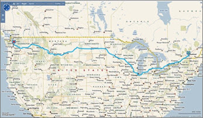
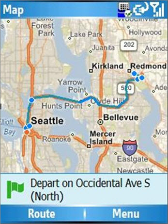
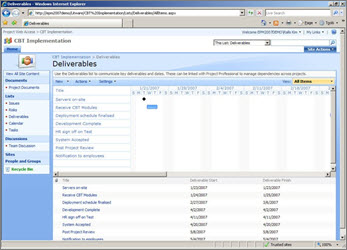

# GPS assistance in roadmapping an EPM deployment

This article is part of our "From the Trenches" collection. It describes how to make an Enterprise Project Management deployment "roadmap" when you plan to implement EPM. It uniquely describes factors to consider when you plan your deployment path.
  
To see more articles, see ["From the Trenches" white papers](https://support.office.com/article/faec6b1a-c217-4c79-b8c4-0514f402106b).
  
## G.P.S. Assistance in Roadmapping an EPM Deployment

In my last column, I talked about using a phased approach to making your plans for a deployment of Microsoft's Enterprise Project Management (EPM) Solution. Today we'll tackle making an EPM deployment roadmap as part of your project plan.
  
If you've been to Microsoft Live Maps you know that directions require two things: A destination and a point of origin. When we apply this analogy to an EPM deployment we have to think in similar terms:
  
1. Point of origin defined in technology, process, and personnel terms
    
2. Destination defined in business terms and prioritized
    
We may also want to define some 'way stations' or interim stops where you can regroup, take pictures, enjoy the scenery for awhile and replenish your supplies for the next leg of the voyage.
  
When making a roadmap or directions, it's pretty common to have two scales. We keep the next leg of the trip in great detail, down to a turn-by-turn route. We might also, however, keep a higher level map of the entire trip in less detail to keep our current leg in the context of the entire trip. In project management terms, we call this "rolling-wave planning."
  
### "Directions"

When making an EPM deployment roadmap, we always start with the vision or intention of where the company is heading in terms of its EPM efforts. This gives us the destination we'll need to make directions just like Microsoft Live Maps would.
  

  
If we were just to ask, "What do you want?" the answer almost invariably comes in terms of a solution. People are likely to say "I need a report that looks like this" or "Our firm needs portfolio analysis."
  
For those of us in the solutions business, we know these kinds of design notes are fraught with risk. We train our consultants to be listening for clients who describe their problem as a solution. "That's a solution to a problem," we'll say, "not the problem. Let's define the problem."
  
So we tend not to ask "What do you want?" Instead, questions that may be useful during an envisioning might include: 
  
"What business decision are you now unable to make or are able to make only with great difficulty, the making of which would be made easier as a result of this EPM deployment?"
  
Or:
  
"What aspect of the organization do you believe could be made more efficient either through an increase in throughput or a decrease in effort through this EPM Deployment?"
  
Now, who should we be asking these questions of? Why, the people who make these decisions, of course! If you've ever had a minivan full of kids and turned to ask them where you should go as a destination, you know that you'll get 50 answers. 
  
By the same token, we need to make sure that the organization's decision makers are a key part of this process or we run the risk of picking a direction that the "driver" isn't prepared to travel to. There's an additional benefit to bringing senior management into the EPM roadmapping process at this time. Aside from being a critical participant in choosing the direction the EPM deployment should go, they are also able to get a sense of the magnitude of the project. One of the most common and difficult challenges to a successful EPM deployment is long-term management support. Some senior executives have not considered just how much this might change existing practices and procedures and how disruptive, even temporarily, this might be. They may also not have an appreciation of how much effort a culture-change project like EPM may be.
  
During our work with senior management as well as project management and perhaps line personnel, we try to connect business decisions or business efficiency with process and technology. Is there a process that must be created in order to fulfill this requirement? What would it need to accomplish? Is there a system function that either exists or must be created to serve that business decision? What would it need to deliver? 
  
Basic systems analysis is key in this phase. We start from the business decision "output" and work our way back to the data elements required to make those decisions. In some cases, we find that the basic data simply isn't there and this results in that element of the roadmap being flagged as "high risk." After all, we'll now need to include collecting data in a new format or structure to capture those new data elements before we can even think of delivering the better business process, and that can be a tall order in some cases.
  
We have one more thing to do before we close off the destination process and that's prioritizing the different elements of the final vision. It is very common to think at the beginning of the roadmapping process that the priorities will go one way but find that as you go to actually record them that they go very differently. Interestingly, by the time everyone has agreed on what targets are included in our destination, there is remarkable consensus on what the top priorities should be.
  
The next thing we need for directions is a point of origin and we manage that through an inventory of where the organization is now in relation to the goals we've chosen.
  

  
We look at existing personnel. Are they trained in project management for their particular roles? Do we have sufficient personnel with sufficient experience to accomplish the goals that have been set? Remember that we have to look at multiple measures here because different people will have a different role in the eventual enterprise project management process. It makes no sense to train every employee to be a project scheduler if, in fact, they'll never be responsible to create schedules. By default, we think of four roles: Administrator, Project Manager, Individual Resource, and Executive. If timesheets are involved, we think also of Supervisors as fifth role. Of course, depending on what destination we've defined in our original envisioning process, the roles may be quite different. That changes the skills inventory process profoundly, which is why we always start by defining the destination before thinking about the point of origin.
  
We also look at existing process. Is there a stated or documented project management process? How is it maintained? Who is in charge of it? If there is a Project Management Office already established, then a lot of this effort is focused there. After all, there's no point in creating new procedures if there are existing procedures and processes that are already effective. We may inventory existing processes that are both inside the current project management process and outside, depending on what the ultimate goals of the EPM environment will be. 
  
For example, we may have decided that contract management is going to be a significant element of our new EPM environment, and that this has never before been part of the project management processes within this organization. Yet, if we look a little farther afield, we may find that the organization has a strong set of controls for managing documents and existing workflow already moving documents, perhaps in SharePoint. This would be an ideal process for us to adopt and, if need be, adjust to make sure it will empower this aspect of the new enterprise project management environment. Doing so carries a triple-edged benefit. First, we don't need to expend the effort creating a new process. Second, we know that the personnel already have the skills and habits to use the process in this way, which means no training effort or effort to get the personnel to comply. Finally we don't have the difficult situation of trying to create a separate process that might be at odds with an existing process for managing documents, such as contracts.
  
We know that one of our biggest challenges is going to be compliance. Not building the system, but getting everyone to use it and to use it consistently. The more we can adopt existing habits, practices, and procedures that are embedded in the organization, the easier compliance becomes.
  
Finally, you need an inventory of the technology platform. Since the Microsoft EPM Solution is built on a platform of technology, it is likely to find some of that technology already in place, but it's also possible the organization will have to upgrade some of its platform in order for the solution you're designing to function. SharePoint and SQL Server are obvious elements of deploying Microsoft Office Project Server, but you may also need to check on browser compatibility (is everyone using the latest version of Internet Explorer?), security status (will the system be outward facing?), what version of SQL Server is deployed (is OLAP Services or SQL Server Reporting Services already being used?). You may also need to consider other systems with which you'll need to interface or integrate. How will you get access to those systems in production?
  
The size of the planned system may also necessitate looking at hardware, network, and other infrastructure elements to ensure the system will have the structure it requires when it arrives. 
  
As with any enterprise system, you'll want to plan both a production and staging area so that updates and enhancements can be created in the lab rather than on the live system over time. You may also have to make plans for a Pilot or Proof of Concept phase; something I'll talk more about in my next column.
  
### "Recalculating Route"

When the G.P.S. unit in my car discovers that I've missed a turn, a very nice lady's voice says "Recalculating route". Moments later, the line through my map changes and I've got new directions. In an EPM deployment we need to be ready for a detour or a turn that's blocked for repairs. Perhaps we missed that freeway exit. How do we deal with replanning? There are two things to ask when you go off course: First, are you still going to the same place? Second, how do we get there from here? One of my favorite project management quotes on this subject comes from Napoleon Bonaparte, who once said, "A battle plan lasts until contact with the enemy." 
  

  
In an EPM deployment how do we apply this same principle? First of all, you need a measure to determine if you're no longer on course. If one team member has an emergency dentist's appointment tomorrow and is absent from the office for four hours, should we then let that discrepancy change all downstream tasks, reschedule everyone from tomorrow at noon through the end of the project, and then e-mail everyone with their new assignment times? 
  
Of course not. 
  
A discrepancy of four hours for one resource over the six-month lifetime of a project involving dozens of people isn't enough of an interruption to warrant changing our path. What we need to do in starting any kind of enterprise project is to set thresholds of acceptable progress. The aerospace and defense world is finding a new term for this lately, "Tripwires," which is very descriptive. We can establish what criteria would indicate to us that our route needs to be recalculated. There are several typical metrics or measures to consider. First, if the projected completion cost varies by more than X percent from the original budget, then that might constitute a project plan review. You might do the measure of cost in labor hours or money. Either is effective. Perhaps if the forecasted finish date varies by more than X days from the originally planned finish date, then that might constitute a project plan review. 
  
You might also decide that missing certain key milestones by more than a certain number of days is a tripwire, or you might identify certain risks being realized as a tripwire, or you might determine that a change of certain key project team members such as the executive sponsor is a tripwire. It's more important to set some criteria than to get the criteria exactly right. Also, remember you're going to need to measure against these criteria throughout the lifetime of the project, so if you choose 50 or 100 different metrics, you could end up spending more time measuring the project than doing the project!
  
Once you've determined you're off course, the best way to get back on track is to conduct a project plan review. We recommend including representation from both the original group of senior management who helped establish our destination in the first place and from the group within the project management team who helped do the original inventory. Project Plan reviews can get mired down in assigning blame for why the project is off track and why a certain tripwire has been triggered. Such effort can be hugely counterproductive. We recommend focusing on the following questions:
  
1. What happened? 
    
2. Where have we ended up? What's our current point of origin?
    
3. Are we still committed to our original destination or is there a compelling reason to review that process or even redo the envisioning process?
    
4. Do we need to reset any of our intermediate milestones or phases?
    
5. Do we need to change any of our project team?
    
6. Do we need to reset any of our tripwire metrics?
    
Questions which we've found to be less productive include:
  
- Whose fault is it that we're here? Who's responsible? Who's to blame?
    
- How do we get "back" on track; back to the old plan?
    
The most common reason for a project plan review is that the organization's priorities shift. For example, items that were designed to be in Phase 3 are being demanded in Phase 2. This is usually a sign of a healthy dynamic within the organization and the result of people starting to think seriously about the implications of the EPM System's deployment.
  
### Bad Weather

Before you set out on a long drive you probably check the Weather Channel (or weather.msn.com) to make sure no inclement weather will affect your voyage. Risks are a part of life. Remember, if there were no risks, there'd be no need for project managers! Planning for the most glaring risks is not a complicated process. Start at the beginning of the envisioning process, and as you look at each of the elements of the destination you are designing, ask the group what barriers to reaching this destination they can think of. In some cases the risks will be significant. It's not uncommon for an organization to desire a particular result, only to find that the raw data required to deliver that result has never been gathered and that there may be considerable resistance to the collecting of that data. 
  

  
In one example, we found an organization that wanted resource capacity planning. That was going to require a complete accounting of all of the resource availability of all project personnel and a complete accounting of all of the possible workloads that could be applied to those staff. When we asked if both of those were available, we were told that sure, they were available but only for two-fifths of the organization. When we then discovered that the three-fifths of the organization that the data was not available for weren't even represented at the envisioning meeting, we said, "Let us guess. The problems you're experiencing with resource capacity planning are in those three divisions." Naturally they were, and we had to identify enrolling the division leaders of those divisions as a separate phase of the project and very high risk.
  
As you move on to work with the project management and line personnel in the inventory process, ask during the interviews for any risks these personnel might be able to identify.
  
Once the risks have been identified, it's important to organize them. If you've not done this before, the most basic information will be the most valuable. Include:
  
1. A short description of the risk
    
2. The area or phase of the project which it may impact
    
3. The severity of the risk if the criteria is realized
    
Finally, one of the most important things you can do is to add some details on risk mitigation. Just thinking about a risk is a huge mitigating factor, but while the EPM deployment is in its infancy, entering some notes on how you might deal with a particular risk during the project can be invaluable. It's common for decisions to be made in haste in an emotional context when risks are realized. Having some notes that were thought out while cooler heads prevailed may be useful.
  
### Let's drive the car we're building

Here's a tip on making your roadmap that may pay huge dividends: Use Project Server and the Microsoft EPM Solution to help make and manage your roadmap plan. It seems obvious perhaps, but it's rare enough for organizations to do that we mention it here. 
  

  
I had a senior manager once tell me that his project staff had asked him if he thought using the Microsoft EPM solution to deploy the Microsoft EPM Solution wasn't overkill. "If we built jet planes for a living, we wouldn't fly them to work," they said. "Are you kidding?" he replied. "If I could fly a jet plane to work, I'd do it every day!" 
  
In fact, using the Microsoft EPM Solution for the EPM deployment team is a great idea.
  
Installing Project Server and the other elements of the Microsoft EPM Solution isn't a huge technical challenge, and with the absolute minimum of configuration you can be up and running with a small deployment team as the users within a couple of days. This is a great way for those users who will become your deployment champions to become familiar with the use and benefits of the system before it arrives at the desks of the bulk of the staff.
  
This deployment shouldn't be your production environment. You'll almost certainly be configuring that and customizing it to fulfill the vision of the original destination. You almost certainly won't be working on things like multi-project scheduling or resource capacity planning or portfolio optimization in your EPM deployment iteration of Project Server, but you'll be able to deliver a system that can deliver great benefits. We'd recommend:
  
1. Do a rolling wave schedule as a published project. 
    
    A rolling wave schedule highlights the current phase in great detail and future phases as more of a summary. This lets the team members know what they need to be working on now and still lets them see the project in a larger context.
    
2. Manage the vision document in the Project Workspace. 
    
    The Project Workspace is a SharePoint site tied to the project which by default includes an area for Issues, Risks, and Documents. Why not put all your project documents here for the EPM deployment project and institute SharePoint's version control so that you can always get back to the original version?
    
3. Put your milestone sign-offs and "gates" in the Project Workspace deliverables. 
    
    This is a simple task list that you can link into tasks in Project Server. It will give a very high-end view of the project and is an easy tool to use for threshold management to determine when you go "off course."
    
4. Put change management into the Project Workspace as issues. 
    
    Change management is one of the great challenges of technology projects. As new suggestions for changes to the project arise, get them into the Issue area as a potential change to be managed. By adding a few fields to this area you can get a list of high-priority items and who is responsible for them at any time.
    
5. Put the project risks into the Project Workspace. 
    
    Aside from documents and issues, the risk area of the Workspace is the ideal spot to add your risks and mitigation plans. In fact, the default screen has all the fields there ready for you to use.
    
### Are we there yet?

"Almost. We'll be there soon." 
  
An EPM deployment can bring an organization to so many different places that there's no way to simply publish the default schedule for everyone. But a few minutes searching the Internet may provide you with lots of possible examples for different parts of the project. If I summarize the roadmap exercise above, you are likely to end up with a project that has a few obvious phases:
  
1. Roadmap exercise
    
1. Envisioning (Choose the destination)
    
2. Inventory of existing processes (Identify the point of origin)
    
3. Inventory of existing personnel (Identify the point of origin)
    
4. Inventory of technology (Identify the point of origin)
    
2. Deployment of EPM solution for EPM team
    
3. Phase 1
    
1. Design
    
2. Configuration, Customization, Documentation
    
3. Pilot
    
4. Training
    
5. Roll-out
    
6. Review of Phase 1 and adjust Phase 2 as required
    
4. Phase 2
    
5. Phase 3
    
6. Phase 4
    
7. Project wrap up
    
Applying a roadmap exercise to your EPM deployment can change the experience from chaotic to manageable very quickly. Just remember to pick your destination first, figure out your point of origin next, and draw the path between them. 
  
Happy traveling!
  
## About the Author

Chris Vandersluis is the president and founder of Montreal, Canada-based HMS Software, a Microsoft Certified Partner. He has an economics degree from McGill University and over 30 years experience in the automation of project control systems. He is a long-standing member of the Project Management Institute (PMI) and helped found the Montreal, Toronto, and Quebec chapters of the Microsoft Project Users Group (MPUG). Publications for which Chris has written include Fortune, Heavy Construction News, Computing Canada magazine, and PMI's PMNetwork, and he is a regular columnist for Project Times. He teaches Advanced Project Management at McGill University and often speaks at project management association functions across North America and around the world. HMS Software is the publisher of the TimeControl project-oriented timekeeping system and has been a Microsoft Project Solution Partner since 1995. 
  
Chris Vandersluis can be contacted by e-mail at: chris.vandersluis@hms.ca
  
If you would like to read more EPM-related articles by Chris Vandersluis, see HMS's EPM Guidance site (http://www.epmguidance.com/?page_id=39).
  

