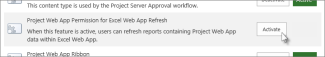

# Grant reporting access in Project Online

 *[\< More Project help](project-help.md)* 
  
Before you can use Project Online reports in Excel Online, the tenant administrator needs to activate this feature for the Project Online site collection.
  
1. [Where to sign in to Office 365 for business](https://support.office.com/article/e9eb7d51-5430-4929-91ab-6157c5a050b4) with your admin account. 
    
2. At the top of the page, select **Projects**. Or, select the app launcher , and then select **Projects**.
    
3. Select **Settings**\> **Site Settings**.
    
4. Under **Site Collection Administration**, select **Site collection features**.
    
5. Scroll down in the list to **Project Web App Permission for Excel Web App Refresh**, and then select **Activate**.
    
    
  
    > [!TIP]
    >  If you have more than one Project Online site collection, make a note about which one has **Project Web App Permission for Excel Online Refresh** activated. When you activate it on one site collection, it is activated for all site collections in your Office 365 tenant. However, if you ever want to deactivate it, you can only turn it off from the site collection where you activated it initially. 
  
You should now be able to refresh your Project Online reports in Excel Online.
  
> [!IMPORTANT]
>  Before using the default Project Online reports ( **Project Overview**, **Resource Overview**, and **Project Overview Dashboard**), you may need to open each report in Excel 2013, refresh the data, and then save the report back to Project Online. This will update the report so that it is supported by Excel Online. 
  

