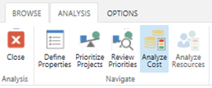
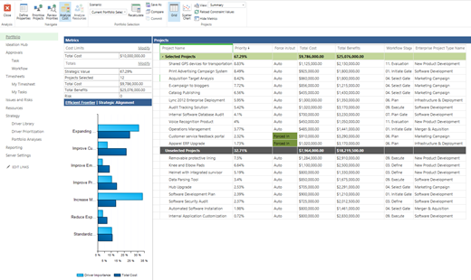
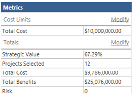
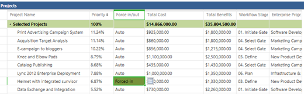
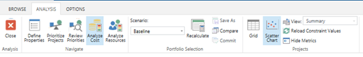
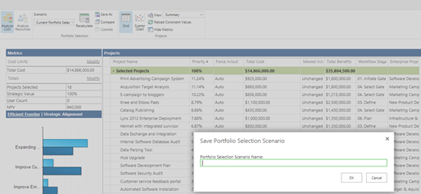
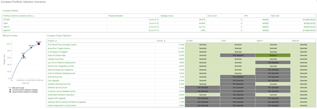
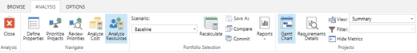

# Modeling cost scenarios in portfolio analysis

**Summary:** Learn how to use the PWA portfolio analysis functionality to model the optimal combination of projects within your planned budget.

**Applies to:** Project Online, Project Server 2016, Project Server 2013

Cost analysis is the process of matching work demand with available funding. It is one of the project portfolio analysis methods enabled by the Project Web Application (PWA). Cost analysis is a core feature in PWA, and is available in Project Online and supported versions of Project Server.

PWA also supports resource constraint analysis to match work demand with resource supply.

Three inputs are required to perform cost analysis in PWA:

- Defined project portfolio, with costs estimated

- Project prioritization

- Understanding of available funds

These features may be combined to create specific scenarios. For example, one scenario may assume annual funding levels of $20,000,000. Other scenarios may assume funding levels of $10,000,000. Some scenarios may prioritize growth. Other scenarios may prioritize risk mitigation.

This article will teach you how to interpret and use the **Analyze Cost** screen in PWA to create these scenarios.

This screen is split into three components:

- Metrics

- Portfolio efficient frontier (or strategic alignment)

- Project portfolio summary (depicted as a grid or scatter chart)

## Metrics

The metrics grid in the top left of the screen displays high level scenario calculations. You may also use this grid to add new constraints to the cost calculation.

1. To add constraints, click on the **Modify** link in the **Cost Limits** section of the **Metrics** grid.

2. Add additional fields from the **Available Constraints** list. These fields will now appear in the **Cost Limits** section.

3. Click into the **Cost Limits** section to assign a constraint to the newly added field.

4. Click **Recalculate** in the **Analysis Tab** to recalculate the portfolio based on the new constraints.

## Efficient frontier

The efficient frontier is a commonly used tool in scenario modeling.

Each project is classified by estimated benefits and cost. The optimal combination of projects is then displayed for each cost point.

A portfolio that is on the efficient frontier represents the most value that can be achieved for that cost. A portfolio below the efficient frontier communicates that more value can be achieved for the same cost.

You can use the efficient frontier to communicate the value trade offs that take place as part of your portfolio prioritization discussions.

## Strategic alignment

You can use the strategic alignment graphic to assess if your projects are aligned with your goals.

For example, you may have said that *Expanding the Customer Base* is your primary organizational goal. The strategic alignment graphic shows that most of your spending is on *Improving Customer Satisfaction*. You may wish to reconsider how your spending is allocated.

## The project data grid

The project data grid is your primary interface on this screen.

Review the columns on this grid to understand the state of the portfolio. Your PWA administrator is responsible for modifying which columns appear on the screen.

Within this grid, you can tell PWA to force a particular project in or out of the analysis. You might do this if a project must be completed to keep your organization in regulatory compliance.

Forcing projects in or out of a scenario often results in a sub-optimal project portfolio. Refer to the efficient frontier after recalculating your portfolio to assess the impacts of forcing in or out a project.

## The scatter chart

You may also review the portfolio on a scatter chart.

The scatter chart shows all projects by their total cost and total delivered value.

The scatter chart is color coded to four different possible classifications for each project:

| Status     | Definition                                                                  |
| ---------- | --------------------------------------------------------------------------- |
| Selected   | The project has been selected in the scenario currently under analysis.     |
| Unselected | The project has not been selected in the scenario currently under analysis. |
| Forced In  | The project was forced into the scenario under review.                      |
| Forced Out | The project was forced out of the scenario under review.                    |

## The cost analysis view

Use the controls in the **Projects** section of the ribbon to change the view or to load new constraint values.

You would reload constraint values if you have changed the underlying cost of projects within the portfolio analysis, and need to update the calculations with the new cost.

Other controls in the **Projects** section include:

| **Control**                  | **Description**                                                                                                                                                                       |
| ---------------------------- | ------------------------------------------------------------------------------------------------------------------------------------------------------------------------------------- |
| **Grid**                     | Click **Grid** to display a grid of projects, their priorities, costs, and other project data.                                                                                        |
| **Scatter Chart**            | Click **Scatter Chart** to display a chart of project cost versus value.                                                                                                              |
| **View**                     | Use the **View** menu to select a view. You can add new views on the PWA Settings page.                                                                                               |
| **Reload Constraint Values** | Click **Reload Constraint Values** to reload the constraint values from the Project Web App database. Use this option if the values have been updated since you started the analysis. |
| **Hide Metrics**             | Click **Hide Metrics** to hide the Metrics table and the Efficient Frontier chart. Click **Hide Metrics** again to show these.                                                        |

The initial calculation is automatically saved as the baseline scenario. The baseline scenario represents the unconstrained selection of every project within the portfolio. Users may perform what-if analysis on the scenario by changing the various options and recalculating the optimal solution within the new parameters.

## Saving the scenario

You may save any created scenario for further review.

The scenario is now added to the list of scenarios available for review.

After creating a scenario model, save the scenario for further review. If you configured resource analysis during the analysis creation, saving a scenario will activate the **Analyze Resources** button.

This will allow you to further examine your scenario for potential resource capacity issues.

You may also consider finalizing the scenario by [committing your selected projects to execution](committing-the-scenario.md).

## Related articles
