# Modeling resource scenarios in portfolio analysis

**Summary:** Learn how to use the PWA portfolio analysis functionality to model resource scenarios.

**Applies to:** Project Online, Project Server 2016, Project Server 2013

Resource analysis is the process of matching work demand and resource supply. It is one of the project portfolio analysis methods enabled by the Project Web Application (PWA). Resource constraint analysis is a core feature in PWA, and is available in Project Online and supported versions of Project Server.

PWA also supports cost constraint analysis to match work demand with available funding.

Three inputs are required to perform resource analysis in PWA:

- Defined project portfolio, with resources estimated

- Defined resource pool

- Prioritized project list

This article will teach you how to interpret and use the **Analyze Resources** screen in PWA. This screen will become available after [you have saved a scenario](perform-cost-optimization.md) in the **Analyze Cost** screen.

This Analyze Resources screen is split into three components:

- Metrics

- Scenario chart

- The Project Gantt Chart/Requirements Details

Additional features are available using the various reports available from the ribbon.

## Metrics

The metrics grid in the top left of the screen displays high level scenario calculations.

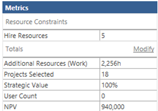

You may add custom fields to the **Totals** section. These fields will provide calculated indicators of the variables impacting your portfolio.

The various calculation options may be controlled through the **Options** tab. The primary control on this tab is the **Units** field. **Units** may be set as either FTE or Cost.

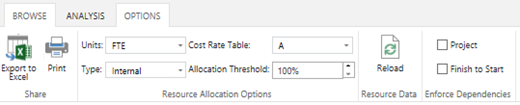

If you set the **Units** option in the **Options** tab to "*FTE*," the **Hire Resources** cell in the **Resource Constraints** section is editable. You can enter the number of additional resources you expect to hire to support the portfolio. The system will calculate the cost of these additional resources.

If you set the **Units** option in the **Options** tab to "Cost," Additional Resources are displayed in the Resource Constraints section. You can enter additional funding for resources in this field. The system will calculate the number of additional resources that may be hired with these funds.

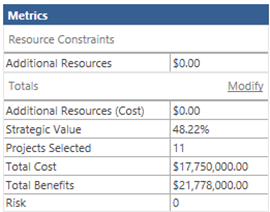

The **Options** tab controls several other calculation variables:

<table>
<thead>
<tr class="header">
<th>Item</th>
<th>Options</th>
<th>Impact</th>
</tr>
</thead>
<tbody>
<tr class="odd">
<td>Units</td>
<td>
FTE

Cost
</td>
<td><ul>
<li>
"FTE" toggles the <strong>Resource Constraint</strong> to display <strong>Hire Resources</strong>. You may then enter the number of resources you are willing to hire to support the portfolio. The system will estimate a cost based on the roles required and their average rate.
</li>
<li>
"Cost" toggles the <strong>Resource Constraint</strong> to display <strong>Additional Resources</strong>. You may then enter the additional funds you are willing to spend to support the portfolio. The system will estimate the roles to be hired based on the project demand and the average rate of the required roles.
</li>
</ul></td>
</tr>
<tr class="even">
<td>Type</td>
<td>
Internal

External
</td>
<td><ul>
<li>
Internal resources are hired full time when there is first a gap for their skills. As internal hires, these resources remain on staff for the remainder of the portfolio planning period. (Internal resources may be significantly more expensive than external resources.)
</li>
<li>
External resources may be hired only for a short period and then terminated. External resources may also be hired part time. The minimum allocation for external resources is set in the <strong>Allocation Threshold</strong> cell.
</li>
</ul></td>
</tr>
<tr class="odd">
<td>Cost Rate Table</td>
<td>A-E</td>
<td>Each resource may have up to five standard cost rates. These rates are stored in Cost Rate Table A, B, C, D and/or E. The system will calculate the standard rate for a role as the average of the cost for all resources in that role. You can toggle this field to select different rates to be used for the estimating of additional resource costs.</td>
</tr>
<tr class="even">
<td>Allocation Threshold</td>
<td></td>
<td>The allocation threshold controls the minimum allocation that an external resource may be hired for. For example, you may set the allocation threshold to 25% to calculate external resources in units of .25 FTE.</td>
</tr>
</tbody>
</table>

## Modeling additional resources

PWA can assess the impact of adding resources on the overall portfolio. Simply type the number of resources that you want to add in the **Hire Resources** box, and then click **Recalculate** on the ribbon. These calculations are affected by the settings in the **Options** tab.

The resource analysis view will update to show you how many projects you can deliver, and the **Hired Resources Report** (under **Reports** on the ribbon) will update to show which resource roles need to be hired.

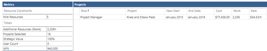

## Scenario chart

When you save a resource scenario, it will appear on the **Scenario Chart**.

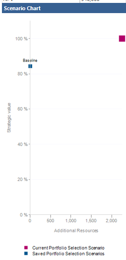

The **Scenario Chart** is a scatter graph depicting each of the scenarios by cost and strategic value. Note that the cost depicted on this chart is the additional cost required to hire more resources (i.e., the **Additional Resource** cost).

## The Gantt Chart view

The Resource Analysis functionality allows the user to perform what-if analysis on the projects within the scenario.

The following variables may be modified to assess the impact on the overall portfolio:

| Variable                                 | Interface                        |
| ---------------------------------------- | -------------------------------- |
| Force projects in or out of the analysis | Gantt Chart: Force In/Out Column |
| Change project start dates               | Gantt Chart: New Start column    |
| Adding resources                         | Metrics                          |
| Project dependencies                     | [Project dependency interface](define-project-dependencies.md)     |

### Forcing Projects In/Out

Projects may be forced in or out of the calculation in the Gantt Chart view.

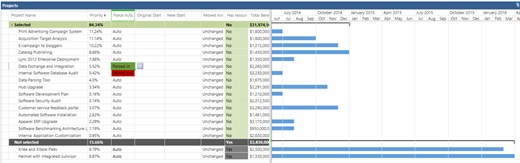

This feature works much like the similar function in the Cost Analysis module. You may force projects out of the calculation. This will free the resources from those projects to support other projects. You may also force projects into the calculation. Forcing a project in may divert resources from other projects.

### Shifting the project start date

You can move projects forward or backward on the calendar to see how this affects your resource allocation.

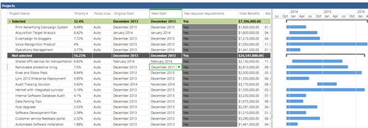

Experimenting with various project schedules may help you fit more projects into the portfolio.

To move a project's start date, click **Gantt Chart** on the ribbon, then choose a **New Start** month for the project that you want to move, then click **Recalculate**.

Changing the start date in the Resource Analysis Gantt chart does not affect the actual start date of your projects. When you choose to **Commit** the scenario, the new date will be stored in a field called **New Start Date Field**.

## Requirements Details

PWA provides several ways to analyze the impact of scenarios on your resource pool.

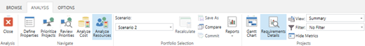

The Requirements Details view lets you examine the calculated scenario in more detail.

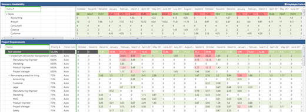

The **Resource Availability** section at the top of the page displays a summary of the resources defined in the **Enterprise Resource Pool**.

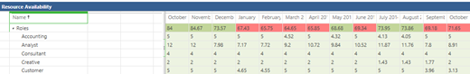

Toggle the **Highlight Deficits** option on the top right of the page to highlight those roles that are overcommitted to the project portfolio.

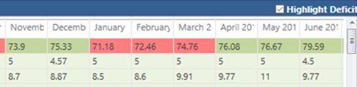

The **Project Requirements** grid displays a number of useful fields.

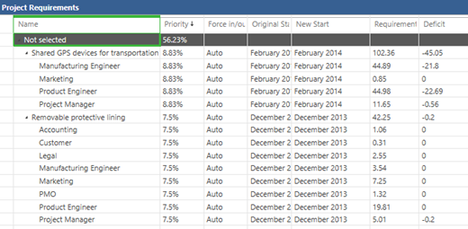

| Field          | Description                                                                                               |
| -------------- | --------------------------------------------------------------------------------------------------------- |
| Priority       | The priority that you set for the project.                                                                |
| Force In/Out   | Displays the status of the project as you set it.                                                         |
| Original Start | The start date of the project as scheduled in the project plan.                                           |
| New Start      | The new start date that you have defined in the resource analysis.                                        |
| Requirements   | The Requirements field represents the total number of person months required for the project.             |
| Deficit        | The Deficit field represents the total number of person months that exceed the available resource supply. |

## The Deficit and Surplus Report

Click on the **Reports** button on the **Analysis** tab to access the two reports provided within PWA:

- The Deficit Surplus Report

- The Hired Resources Report.

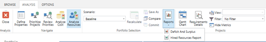

The Deficit and Surplus Report displays a summary of the resource pool.

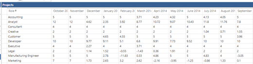

Positive numbers show where you have more resources than needed. Negative numbers indicate that you do not have enough resources. These numbers are based on all the projects in your cost analysis scenario.

## The Hired Resources Report

Run the Hired Resource Report to see the impact of the resource analysis recalculation.

This report displays key details about the resource the system is proposing to be hired to fill those the deficits.

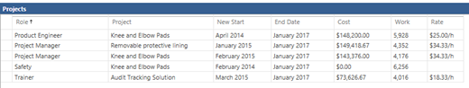

The Hired Resource Report displays the following fields and calculations:

| Field     | Description                                                                                                                                                                                         |
| --------- | --------------------------------------------------------------------------------------------------------------------------------------------------------------------------------------------------- |
| Role      | The role identified by the system that needs additional resources.                                                                                                                                  |
| Project   | The project requiring the resource.                                                                                                                                                                 |
| New Start | The start date of the resource.                                                                                                                                                                     |
| End Date  | The end date of the resource. This will be impacted by the option you selected in the **Options** tab for Internal or External resources.                                                           |
| Cost      | Calculated summary of the total resource cost, based on duration X average rate per role.                                                                                                           |
| Work      | The number of hours that the resource will work between the New Start and the End Date. This will be impacted by the option you selected in the **Options** tab for Internal or External resources. |
| Rate      | The rate is the average standard rate of all resources in the resource pool mapped to the specific required role.                                                                                   |

You are now ready to save the scenario and compare it with other [saved scenarios](comparing-portfolio-scenarios.md).

## Related articles
