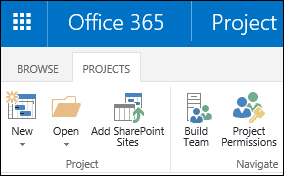

# Plan to move your project data to Project Online

If you are planning to move to Project Online, it might be likely that one of the reasons you are moving to it is you want to improve on your current system of managing projects. One thing Project admins or your Project Management Office (PMO) needs to think about is how to transition from your current project management system to Project Online. This can include how to handle change, training, or implementing process among other things, but one key item to think about is how to move any existing project data to Project Online. For example, your company can have project and resource information in Microsoft Excel spread sheets, and wants to know if there is a way to import this information into Project Online, or will they have to manually create it all this data. This article describes factors you need to consider that will help you to decide whether to try to import your data if possible, or whether it is easier to "start fresh" in Project Online.
  
> [!NOTE]
> For more information about things to consider when moving to Project Online, see [Supporting your Project Online adoption with a Project Management Office (PMO)](supporting-your-project-online-adoption-with-a-project-management-office-pmo.md). 
  
## Should I migrate my project data, or start fresh?

When planning to move your project data to Project Online from what you were using to manage projects, one of the first things you should think about is whether you should do it at all. It may be more beneficial to end your existing projects in your current project management system you are using, and to start all new projects in Project Online. The benefit of this is that you will not need to migrate or recreate the projects in Project Online, especially if there are factors that make project migration harder to do. For example, your company may…… 
  
One drawback of starting fresh will be that you will be running two project management systems at the same time until all projects that are run in your current project management system are completed. 
  
### Create milestones for current projects

Another method you can use is to create a milestone in your existing projects at which you can end progress, and then complete the remainder of the project in Project Online. This might be especially helpful on projects with longer durations. The challenge might be to find a suitable point in which to stop progress on certain projects. The benefit is that your users will not have to be using two project management systems at the same time.
  
For example....
  
## What are you moving from?

Odds are that a lot of companies who are moving to Project Online had previously used one or a combination of the following to manage projects:
  
- Project client
    
- Project Server
    
- SharePoint tasks lists
    
- Microsoft Excel
    
- Outlook tasks
    
How easy it is to migrate projects from what you previously used has a big say in whether or not you might want to start fresh in Project Online.
  
## Moving from Project client (.MPP files) to Project Online

If your company used Project client (Project Standard or Project Professional) as part of their project management system, project files (.MPP) can be imported to Project Online through the Project Online Desktop Client. 
  
 **To import an MPP file to Project Online**
  
1. First, you'll need to [Log on to Project Web App](https://support.office.com/article/7e7bbf48-60dc-4a39-8f65-24f154a97028).
    
2. Once that connection is established and you are logged on to Project Web App, the next step is to [Save and publish a project to Project Web App](https://support.office.com/article/97f63e43-4599-46fc-9869-4ac51bca8da0).
    
    Another way you might import a project from Project Professional is by [Sync with a SharePoint tasks list](https://support.office.com/article/fb956d2c-723d-4d5a-b7e5-710ef82aa27a), and then [Add an existing SharePoint task list to Project Web App](https://support.office.com/article/6f7b8294-2284-43ed-be4b-a8480f472674).
    
If you are in a small or medium company with a smaller number of project files that you need to migrate, publishing each individual project to Project Online is certainly doable. If you have development skills, you.... 
  
There are additional issues you'll need to address using this manual method:
  
- If local resources are included in the project, they will be added as resources to Project Online. You might need to resolve for duplicate resources.
    
- Issues with migrating project metadata. \<Efren's notes: Need more info on this.\>
    
## Moving from Project Server to Project Online

Currently Microsoft doesn't include the capabilities to move your on-premises Project Server databases to Project Online. However, there are 3rd party tools available through Microsoft partners that can be used to do this. \<Efren's note: I need to find a way to talk about FluentPro and any others. I can't mention the company directly, but I can point to a MS Partners list that might specialize in migration of data to Project Online. Need to talk to PMG about this.\>.
  
## Moving Excel data to Project Online

If you are using Excel to manage projects, you can first [Import Excel data into Project](https://support.office.com/article/cb3fb91a-ad05-4506-b0af-8aa8b2247119). When your project data is in .MPP files, you can then save and publish them to Project Online.
  
\<Efren's note: Not too sure about this area. If you have resource data with names, rates, expertise, etc., is there a way to import this information?\> 
  
## Moving SharePoint tasks to Project Online

Here's one way to add an existing SharePoint task list to Project Web App:
  
1. In the **Project Center**, click the **Projects** tab, and then click **Add SharePoint Sites**.
    
    
  
2. Select the check box next to the site with the task list you're importing, change the **Project Name** if you'd like, choose the **Tasks List** you want to import, and then choose **Add**.
    
    > [!NOTE]
    > Only those sites you can access are listed. If the list you want to add is on a site you can't access, you'll need to request permissions to access that site before you can import the task list to Project Web App. 
  
 **Looking for other options?** You can also import a SharePoint task list by [Add an existing SharePoint task list to Project Web App](https://support.office.com/article/6f7b8294-2284-43ed-be4b-a8480f472674) to a page on the SharePoint site, and then linking the task list to Project Web App. 
  
 **Start simple, expand later.** Once your project is through initial planning, you may want to take advantage of the more robust project planning, tracking, and reporting features in Project Web App. You can easily [Change a SharePoint task list into an enterprise project](https://support.office.com/article/d1387254-9478-4d9d-90d7-a4aee16b1f3c).
  
## Outlook tasks to Project Online

\<Efren's notes: Should this be included? I am guessing it is used in conjunction with something else. \>
  

