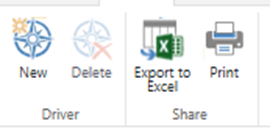
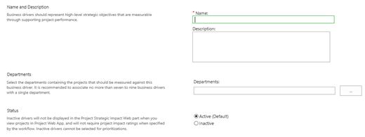
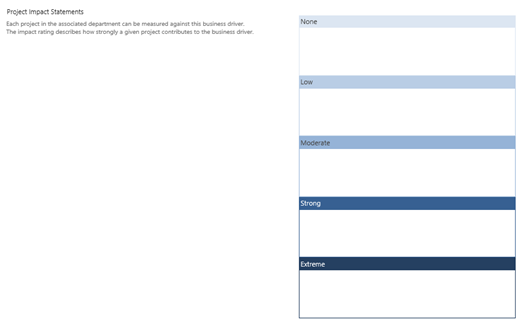

# Defining portfolio analysis business drivers

**Summary:** Learn how to define and configure the portfolio analysis business drivers that support project prioritization in the Project Web Application.

**Applies to:** Project Online, Project Server 2016, Project Server 2013

PWA provides two main features to support the prioritization of the project portfolio:

- Business driver-based prioritization

- Prioritization based on manually calculated fields

This article will discuss how to define and configure business drivers within PWA. Other articles will discuss how to prioritize the project portfolio manually using custom fields.

Business drivers are one function in the portfolio analysis feature within the Project Web Application. The portfolio analysis feature is available in Project Online and supported versions of Project Server.

## Business drivers

A business driver is a fundamental goal that your organization is working towards. Some examples of business drivers may include:

- Improve customer satisfaction

- Expand market share

- Reduce IT costs

Your organization will benefit from business drivers. The process of defining business drivers creates clear agreement on the organization’s critical business objectives. This enhances the chance that you will have shared priorities across all of the project portfolio’s stakeholders.

PWA will support the mapping of each project and proposed project to a set of business drivers. This will allow PWA to calculate the optimal mix of projects based on organizational priorities and constraints.

To get started creating business drivers:

1. Navigate to the **Driver Library**.

2. Select the **New Button** on the **Driver Tab**.

3. Type a name and description for the driver.

4. If this driver is for a specific department, select the department in the **Departments** box. If you do not select a department, then the driver will be available to all departments.

5. Fill in descriptions for each project impact statement.

6. On the ribbon, click **Save & Close**.

## Driver description

Enter a description that clearly describes the driver. The description should also provide a suggested measure for how to assess performance against the driver.

For example, a driver called "Enhance Customer Satisfaction" may be tied to a specific survey that is performed over time to assess customer satisfaction.

## Project impact statements

Impact statements should be measurable. For example, a "Strong" impact on the Enhance Customer Satisfaction driver may include an increase of 10 percentage points on an annual customer satisfaction survey.

Project impact statements should be written in a positive way that describes a desirable outcome. For example, if the organization wishes to decrease its exposure to risk, a strong impact statement may be written as, "The project will reduce our corporate exposure to IT risk by closing at least 2 high profile findings from our last audit."

Once you have created the business drivers that you want to use, the next step is to [prioritize them](portfolio-analysis-driver-prioritization.md).

## Related Articles
