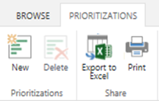
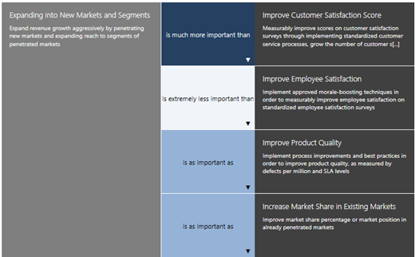
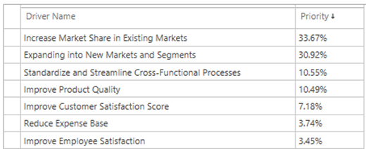
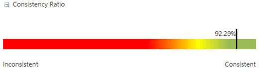

# Prioritizing portfolio analysis business drivers

**Summary:** Learn how to prioritize your portfolio analysis business drivers in the Project Web Application.

**Applies to:** Project Server 2016, Project Server 2013

This article will discuss how to create a set of prioritized business drivers to support portfolio analysis within PWA.

## Portfolio analysis

Portfolio analysis is a structured technique to define the optimal collection of projects to be executed. Portfolio analysis is a core feature in the Project Web Application, and is available in Project Online and supported versions of Project Server.

PWA provides two main features to support the prioritization of the project portfolio:

- Business driver-based prioritization

- Prioritization based on manual prioritization

This article will discuss how to create a set of prioritized business drivers within PWA. Other articles will discuss how to prioritize the project portfolio manually using custom fields.

This article assumes you have already created business drivers.

## Business driver prioritization sets

A set of business drivers is a collection of business drivers that have been prioritized against each other. Your organization can create multiple sets of prioritized business drivers. This allows you to calculate priorities for different groups. For example, the Marketing Department may have different priorities than the Accounting Department. A set of business drivers can be created for the Marketing Department. A different set of business drivers can be created for the Accounting Department.

Each business driver can be in multiple prioritization sets simultaneously. In the above example, this allows the Marketing Department to prioritize a business driver such as "Increase market share" differently than the Accounting Department.

To get started creating a driver prioritization set:

1. Navigate to the **Driver Prioritization Screen** and click on the **New Button** on the **Prioritization Tab** to create a new prioritization set.

2. Select the drivers to include in the prioritization set.

3. Navigate to the **Prioritize Drivers Screen** and assign priorities.

4. Navigate to the **Review Priorities Screen** and assess the calculated driver priorities.

## Prioritize drivers

Now that you have created a set of drivers, you can assign relative priorities. You will now prioritize each driver against each of the other drivers. For example, you may have two drivers:

- Driver A: Enhance customer satisfaction.

- Driver B: Enhance employee satisfaction.

You must choose as an organization which driver is most important. You may select from the following options:

- Driver A is extremely more important than Driver B.

- Driver A is much more important than Driver B.

- Driver A is more important than Driver B.

- Driver A is equally as important as Driver B.

- Driver A is less important than Driver B.

- Driver A is much less important than Driver B.

- Driver A is extremely less important than Driver B.

You will need to prioritize each driver and click on the Next Driver button.

## Review priorities

Upon completion of the driver prioritization activity, PWA will calculate a driver priority score.

Note that it is common for organizations to introduce logical errors into the driver prioritization exercise. PWA will calculate a consistency ratio for all driver prioritizations. The consistency ratio measures how many logical conflicts may exist in the driver prioritization. For example, the system allows you to perform the following calculations:

- Driver A is as important as Driver B.

- Driver C is significantly more important than Driver B.

- Driver A is more important than Driver C.

In this example, we are saying Driver A is both as important as Driver B and more important than Driver B. The consistency ratio assesses how many of these logical flaws exist in our prioritization.

A consistency ratio of 80% or higher is generally considered acceptable for most organizations.

You are now ready to [create a new portfolio analysis](creating-a-portfolio-analysis.md) with the business driver prioritization set.
