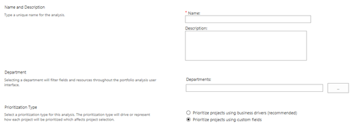
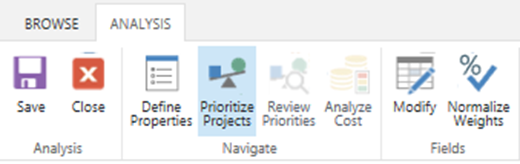
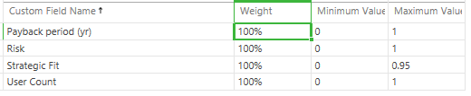
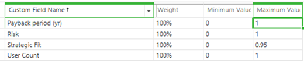

# Prioritizing the portfolio with custom fields

**Summary:** Learn how to define and configure custom fields that support the portfolio prioritization calculation in the Project Web Application.

**Applies to:** Project Online, Project Server 2016, Project Server 2013

PWA provides two main features to support the prioritization of the project portfolio:

- Business driver-based prioritization

- Prioritization based on manually calculated fields

This article will discuss how to manually prioritize the project portfolio. Manual prioritization is a core feature of the portfolio management capabilities of the Project Web Application and is available in Project Online and all versions of Project Server released after 2010.

Other articles will address how to prioritize the project portfolio using the native [PWA business driver functionality](portfolio-analysis-business-drivers.md).

## Manual prioritization

There are several reasons to manually prioritize the project portfolio:

- Your organization already has a tool or process that performs project prioritization.

- The native business driver prioritization process is not aligned with your needs.

## Creating an enterprise custom field

Manual prioritization will be captured in an enterprise custom field that is created by your PWA administrator. This field must satisfy the following characteristics:

- The field should be defined as a project level field.

- The field should be a number or cost field.

You will then need to assign field values for each of the projects under consideration.

## Creating the portfolio analysis

New portfolio analyses will use the business driver prioritization mechanism by default. To use the manual prioritization mechanism:

1. Select the option to prioritize using custom fields when creating a new portfolio analysis.
 

2. Click on **Modify** in the **Analysis Tab** to open the field selection screen.
 

## Assigning prioritization parameters

You can assign prioritization parameters to each of the custom fields in the Manual Prioritization screen.

Assign specific weighting to each of the fields. Click Save and PWA will normalize the weight for each of the fields to a value between 1% and 100%.

By default, PWA will display the minimum and maximum values assigned to projects for each of the custom fields.

The ranking for each project is calculated within this range. Adjust the range to model your prioritization logic more accurately. Click on the **Next** button to review the calculated priorities.

## Review priorities

The projects are now displayed in the order of the calculated priority.

The total sum of all projects will be 100%. This is the value of the entire portfolio.

You are now ready to analyze the portfolio cost to determine the maximum value that can be delivered within your constraints.

## Related articles
