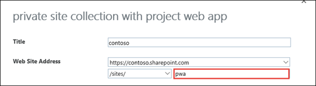

# Project Online: software boundaries and limits

  
There are some important limitations that you should know if you are using Project Online. These limitations apply regardless of whether you are using Project Online by itself, or with other Office 365 plans.
  
> [!TIP]
> **Want more info about Project Online and Office 365 plans?** Take a look at the service descriptions for [Project Online](http://technet.microsoft.com/en-us/library/project-online-service-description.aspx) and [Office 365](http://technet.microsoft.com/en-us/library/office-365-platform-service-description.aspx). 
  
## Limits in Project Online

To keep Project Online performing at its best, there are some limits to how much data you can realistically store:
  
- 30,000 projects per Project Web App site.
    
  - The project sites for these projects must not exceed 2000 sites in any one site collection - and for best performance with large numbers of projects aim to have none of the project sites in the PWA site collection itself.
    
- Initial quota of 25GB per Project Web App site. Please see [Tune Project Online performance](tune-project-online-performance.md) for more information. 
    
    > [!NOTE]
    > The 25GB limit for each Project Online database is separate from the [SharePoint Online limits](https://support.office.com/article/8f34ff47-b749-408b-abc0-b605e1f6d498) where Project Web App is enabled. The number of PWA sites within a tenant is the same as the maximum number of SharePoint Site Collections allowed in a tenant. 
  
For reporting, there are also limits to how many single-value custom fields, of each type, get stored in the reporting schema.
  
|**Project custom fields**|**Timesheet custom fields**|**Task and Resource custom fields, combined**|
|:-----|:-----|:-----|
|450 text fields    |450 text fields    |450 text fields    |
|450 lookup tables    |450 lookup tables    |450 lookup tables    |
|450 of all other custom field types (cost, date, duration, number, flag)    |450 of all other custom field types (cost, date, duration, number, flag)    |450 of all other custom field types (cost, date, duration, number, flag)    |
   
> [!NOTE]
> While you can create more custom fields than these limits, only this many custom fields will be included in the OData feed. You are not able to choose which of the fields are included. 
  
Also for reporting, if an individual report's source Excel file is larger than 10MB, it cannot be refreshed in Excel. Instead, you can:
  
- Refresh the report using Excel 2013.
    
- Consider getting [Power BI](https://powerbi.microsoft.com/en-us/) to extend that 10MB limit and refresh the report in Excel. 
    
[File size limits for workbooks in SharePoint Online](https://support.office.com/article/9e5bc6f8-018f-415a-b890-5452687b325e).
  
### Determining your PWA site usage

An admin can check how much of your 25GB quota your PWA site is currently using through your PWA Settings. 
  
1. [Where to sign in to Office 365 for business](https://support.office.com/article/e9eb7d51-5430-4929-91ab-6157c5a050b4) with your admin account and go to Project Online. 
    
2. In Project Online, click the **Settings** icon, and select **PWA Settings**.
    
3. On the **PWA Settings** page, in the **Operational Policies** section, select **Additional Server Settings**. 
    
4. In the **Project Web App usage** section, it will show your current Project Web App size in relation to your quota. 
    
    For example: Project Web App size - Using 11MB of 25600MB available.
    
> [!NOTE]
> You need to be a Site Collection Admin for the PWA site in order to view the PWA site usage settings on the Additional Server Settings page. 
  
## Other considerations

Beyond the data and custom field limits, there are a couple of other variables to consider.
  
### Changing domains is not supported

If you want to use your own domain, like contoso.com, instead of the default domain, like contoso.onmicrosoft.com, you need to [set up your domain](https://support.office.com/article/d6eed598-2060-4fbe-ad5c-d8263b69722f) *before*  adding users to Project Online. **Changing domains after you've added users is not supported.**

### Master page customizations
Modifying or changing out the default master page template can result in unexpected rendering or display issues and is not supported. 

### Using period symbols in your PWA site collection site address

Period symbols in the site name portion of a PWA site collection site address is not supported.  This is configured when your admin creates a PWA site in the SharePoint admin center.

> [!NOTE]
> Periods are allowed in PWA site names, but not in the site name portion of the site address. 
 
### It takes more time to load more projects

Because it takes more time to load more projects, someone who has access to a lot of projects may find it takes longer to do some things, like opening the Project Center or changing views in the Resource Center. Consider setting up filters to cut down on the load time for those users who have access to a large amount of information.
  
### It takes more time to calculate multiple calendars

When a project, task, or resource has its own custom calendar, Project Online takes a little longer to calculate the dates for the work going on in your organization. Consider whether it makes sense to make some of the calendar changes on a broader scale, across your entire organization.
  
### Your connection speed matters

If your connection to Project Online is running slowly, it can take a little longer to do things like load reports with a lot of data, or open, save, and publish a project through the Project Online Desktop Client.
  
## Related Topics

[Tune Project Online performance](tune-project-online-performance.md)
  

