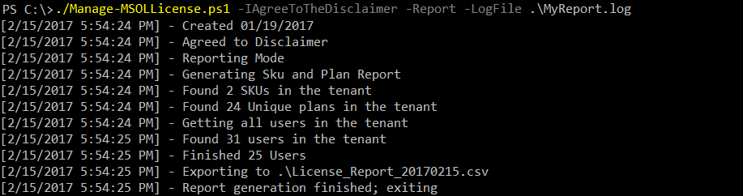
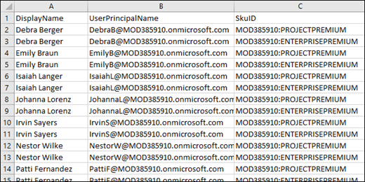

# Renew your Project Online plans in a larger organization

In August of 2016, there were changes in the Project Online plans that will be available to you, as some plans expired at the end of 2016 and new ones became available. Many of you may now need to renew your retired Project Online plans and move your users to the newer available plans. 
  
For most organizations, the Project Online license renewal process can help you through purchasing and reassigning licenses to your users. However, if you need to renew 3000 or more Project Online licenses, you need to reassign user licenses with the steps documented in this article. These steps are:
  
1. [Step 1: Determine my current licenses and users](renew-your-project-online-plans-in-a-larger-organization.md#step1)
    
2. [Step 2: Determine which new Project Online SKUs you need for your users](renew-your-project-online-plans-in-a-larger-organization.md#step2)
    
3. [Step 3: Buy the Project Online Skus that you need](renew-your-project-online-plans-in-a-larger-organization.md#step3)
    
4. [Step 4: Assign the new licenses to your users](renew-your-project-online-plans-in-a-larger-organization.md#step4)
    
5. [Step 5: Verify you have moved your users to the new SKUs](renew-your-project-online-plans-in-a-larger-organization.md#step5)
    
## You'll need Windows PowerShell to do this

For the procedures in this article, you'll need to run scripts that will require you to connect to Office 365 from Windows PowerShell. You'll need to install the following:
  
- The 64-bit version of the [Microsoft Online Services Sign-in Assistant for IT Professionals RTW](https://go.microsoft.com/fwlink/p/?LinkId=286152).
    
- The 64-bit version of the [Windows Azure Active Directory Module for Windows PowerShell (64-bit version)](/collaborate/connect-redirect?DownloadID=59185).
    
For more information, see [Connect to Office 365 PowerShell](/microsoft-365/enterprise/connect-to-microsoft-365-powershell).
  
After you complete your installation, open the Windows Azure Active Directory Module for Windows PowerShell on your desktop and type the following at the prompt:
  
```
Connect-MsolService
```

This lets you to enter your credentials needed to connect to Office 365.
  
## Step 1: Determine my current licenses and users
<a name="step1"> </a>

As a first step, you need to know which Project Online licenses you have and which users they are assigned to. This will help you to determine which new Project Online licenses they will need.
  
We suggest using the [Manage your Office 365 Licenses](/samples/browse/?redirectedfrom=TechNet-Gallery) script that you can download from the Microsoft Code Gallery. This script lets you create a comprehensive report of assign skus and enabled plans that prints out to a .CSV file. We can also use it for replacing your users assigned sku, which is described later in this article. 
  
Make sure to run  *Get-Help*  on the script to get more information about usage and examples. 
  
After downloading the Manage-MSOLLicense.ps1 file that contains the script, open your Microsoft Azure Active Directory Module for Windows PowerShell, log in, and enter the following cmd to run the script:
  
```
./Manage-MSOLLicense.ps1 -IAgreeToTheDisclaimer -Report -Logfile .\MyReport.log
```

This will agree to the disclaimer, create a log file called MyReport.log and save it to the current location, and will create a License Report CSV file and save it to the default location.
  

  
If you open the log file, it will contain the output displayed in the module when you run the script.
  
If you open the License Report CSV file in Excel, you will see a listing of your users and the SKUs that are assigned to them:
  

  
For example, in the graphic above, you can tell that each user listed has both a Project Online Premium and an Office 365 Enterprise E5 sku assigned to them.  *MOD385910*  is the org id. 
  
You can use your column filters in Excel to easily group users that are assigned specific licenses. For example, you could find out which users are all using the Project Lite, Project Online, and Project Online with Project Pro for Office 365 Skus.
  
### Project Online SKU strings

The following tables lists the possible Project Online Sku strings that you will see in the script results. You can use the following table to help you determine which Project Online skus are based on the Sku strings.
  
|**Retired Sku strings**|**Sku name**|
|:-----|:-----|
|PROJECTONLINE_PLAN_1  <br/> |Project Online Plan 1  <br/> |
|PROJECTONLINE_PLAN_1_STUDENT  <br/> |Project Online Plan 1 Student (for educational institutions)  <br/> |
|PROJECTONLINE_PLAN_1_FACULTY  <br/> |Project Online Plan 1 Faculty (for educational institutions)  <br/> |
|PROJECTONLINE_PLAN_2  <br/> |Project Online Plan 2  <br/> |
|PROJECTONLINE_PLAN_2_STUDENT  <br/> |Project Online Plan 2 Student (for educational institutions)  <br/> |
|PROJECTONLINE_PLAN_2_FACULTY  <br/> |Project Online Plan 2 Faculty (for educational institutions)  <br/> |
|PROJECTCLIENT  <br/> |Project Pro for Office 365  <br/> |
|PROJECTCLIENT_FACULTY  <br/> |Project Pro for Office 365 (for educational institutions)  <br/> |
|PROJECTCLIENT_STUDENT  <br/> |Project Pro for Office 365 (for educational institutions)  <br/> |
|PROJECT_ESSENTIALS  <br/> |Project Lite  <br/> |
   
You will also need to know what the new Project Online sku strings mean when you need to assign them to your users later in this article.
  
|**New Sku strings**|**Sku name**|
|:-----|:-----|
|PROJECTPREMIUM  <br/> |Project Online Premium  <br/> |
|PROJECTPROFESSIONAL  <br/> |Project Online Professional  <br/> |
|PROJECTESSENTIALS  <br/> |Project Online Essentials  <br/> |
|PROJECTPREMIUM_STUDENT  <br/> |Project Online Premium Student (for educational institutions)  <br/> |
|PROJECTPROFESSIONAL_STUDENT  <br/> |Project Online Professional Student (for educational institutions)  <br/> |
|PROJECTESSENTIALS_STUDENT  <br/> |Project Online Essentials Student (for educational institutions)  <br/> |
|PROJECTPREMIUM_FACULTY  <br/> |Project Online Premium Faculty (for educational institutions)  <br/> |
|PROJECTPROFESSIONAL_FACULTY  <br/> |Project Online Professional Faculty (for educational institutions)  <br/> |
|PROJECTESSENTIALS_FACULTY  <br/> |Project Online Essentials Faculty (for educational institutions)  <br/> |
|PROJECTCLIENT_STUDENT  <br/> |Project Online Desktop Client Student (for educational institutions)  <br/> |
   
## Step 2: Determine which new Project Online SKUs you need for your users
<a name="step2"> </a>

Now that you know which Skus are assigned to specific users, you need to determine which new Project Online plans to renew them to. You first need to know your new Project Online plans and what they do. Look to the following resources to provide you more information about how to best select the Project Online Skus for your users:
  
|**Resource**|**Description**|
|:-----|:-----|
|[Project Online Service Descriptions](/office365/servicedescriptions/project-online-service-description/project-online-service-description) <br/> |Use this article to get a detailed look into what each of the new Project Online plans provides you in terms of features and functionality.  <br/> |
|[Project Online plans and pricing](https://go.microsoft.com/fwlink/p/?linkid=842835) <br/> |Use this site to see pricing and a high-level comparison of Project cloud-based solutions.  <br/> |
   
If you are looking to provide your users with similar functionality as they did in their retired Project Online SKU, this table gives you some general guidance, but look to the above resources for more detail:
  
|**If you previously used this**|**You most likely need this**|
|:-----|:-----|
|Project Lite  <br/> |Project Essentials  <br/> |
|Project for Office 365  <br/> |Project Online Professional  <br/> |
|Project Online  <br/> |Project Online Premium  <br/> |
|Project Online with Project Pro for Office 365  <br/> |Project Online Premium or Project Online Professional  <br/> |
   
## Step 3: Buy the Project Online Skus that you need
<a name="step3"> </a>

Now that you know what you need, you can now purchase the needed number of licenses you need for each new Project Online Skus. You can do this through the Microsoft 365 Admin Center through the Billing page. You will want to [Buy licenses for your Office 365 for business subscription](https://support.office.com/article/36081d8d-b3fa-4948-8c34-e217bba825e1#buy4later).
  
## Step 4: Assign the new licenses to your users
<a name="step4"> </a>

After purchasing the Project Online Skus that you need, you now need to assign them to your users. You can use the Manage-MSOLLicense script you ran earlier to do this, but it will require additional parameters.
  
```
$users=Get-MSOLUser
```

```
./Manage-MSOLLicense.ps1 -IAgreeToTheDisclaimer -users $users -Logfile c:\temp\license.log -NewSKU orgID:NewSKU -ExistingSKU orgID:ExistingSKU
```

|**orgID**|**NewSKU**|**ExistingSKU**|
|:-----|:-----|:-----|
|Your Office 365 domain name.  <br/> |The Sku you are assigning to the user.  <br/> |The Sku you are replacing.  <br/> |
   
### Example 1

In a very simple example, your company (Contoso) wants to assign new Project Online Essential Skus to all of its users who currently have Project Lite Skus. I would run the script as the following:
  
```
$users=Get-MSOLUser
```

```
./Manage-MSOLLicense.ps1 -IAgreeToTheDisclaimer -users $users -Logfile c:\temp\license.log -NewSKU CONTOSO:PROJECTESSENTIALS -ExistingSKU CONTOSO:PROJECT_ESSENTIALS
```

After populating the $users variable with your Office 365 users in your tenant, the script first agrees to the disclaimer, sets the log file location, and then sets the new Sku as  *Project Online Essentials (PROJECTESSENTIALS)*  for all users who have the old  *Project Lite*  Sku  *(PROJECT_ESSENTIALS)*  . 
  
### Example 2

In another example, let's say that at Contoso, you want to update all of your users in your HR department from their old  *Project Online Plan 2*  licenses and assign them new  *Project Online Premium*  licenses. However, there are a few users in HR that have already been assigned  *Project Online Premium*  licenses, and we don't want to make any changes to these users. You would run the following script: 
  
```
C:\PS>$users=Get-MSOLUser | where {($_.Department -like "*HR") -and ($_.Licenses.accountskuid -notlike "*PROJECTPREMIUM")}
./Manage-MSOLLicense.ps1 -IAgreeToTheDisclaimer -users $users -Logfile c:\temp\license.log -NewSKU CONTOSO:PROJECTPREMIUM -ExistingSKU CONTOSO:PROJECTONLINE_PLAN_2
```

This command reads all of your users who are in the HR department and who do not already have a  *Project Online Premium Sku (PROJECTPREMIUM)*  . The script then agrees to the disclaimer, sets the log file location, and then sets the new Sku as Project Online Premium for all users who have the old Project Online Plan 2 sku. 
  
> [!NOTE]
> As mentioned previously, run the  *Get-Help*  command to take a look at detailed usage information and additional examples. It will also provide you information about additional uses of the script that are not needed for this article. 
  
## Step 5: Verify you have moved your users to the new SKUs
<a name="step5"> </a>

When you have completed assigning your Project Online Skus to your users, you need to verify that your users no longer have any of the old Project Online Skus assigned to them. You can do this by simply running the script again to generate a new license report:
  
```
./Manage-MSOLLicense.ps1 -IAgreeToTheDisclaimer -Report -Logfile .\MyReport.log
```

After running it, open the newly generated License Report in Excel and search for any occurrences of the old Project Online skus.
  
Also verify that if you have any unassigned old Project Online skus, that you cancel them in the Microsoft 365 Admin Center on the Billing page. You can search for retired skus by simply searching the file for occurrences of the retired Project Online sku strings.
  
If you have any issues in trying to move to your new Project Online skus, you can [Contact support for business products - Admin Help](https://support.office.com/article/32a17ca7-6fa0-4870-8a8d-e25ba4ccfd4b) for assistance. 
  
## Related Topics
<a name="step5"> </a>

[Brian Smith's Project Support Blog: How to handle Project Online sku changes](https://go.microsoft.com/fwlink/p/?linkid=842803)
