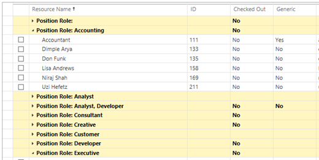
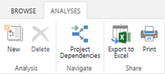
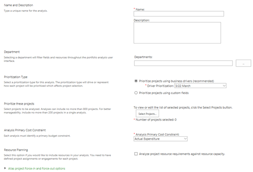
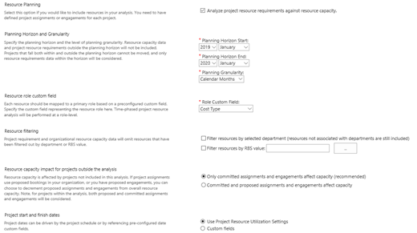

# Resource analysis in the Microsoft Project Web Application

**Summary:** Learn what a resource analysis is and how to get started doing resource analyses in the Project Web Application (PWA).

**Applies to:** Project Online, Project Server 2016, Project Server 2013

PWA helps you analyze your resource capacity to determine which projects can be delivered. PWA will also help you identify where you have resourcing gaps. The resource analysis may also provide a forecast of the additional cost required to deliver your target portfolio.

There are several tasks required to perform resource analysis:

- Define the project demand profile.

- Define the resource capacity profile.

- Perform portfolio analysis and save at least one cost analysis.

The resource analysis is performed within a specific cost analysis scenario. Once you have completed the cost analysis, you can start performing a resource analysis. Resource analysis is a core feature in the Project Web Application, and is available in Project Online and supported versions of Project Server.

## Configuring the resource pool

The resource analysis process compares the project demand for resources with the available supply of resources.

The available supply is defined by the PWA resource administrators in the resource pool. Each resource in the resource pool may be assigned one or more of the following attributes:

- Availability

- Skills

- Cost

- Organizational unit

- Other customizable characteristics (as defined by the PWA administrator)

## Creating a Resource Analysis

If you are using an existing cost analysis, confirm that the Resource Planning option was in the Define Properties screen. If using a new analysis, ensure that the Resource Planning option has been selected. This will allow the user to define specific variables that will impact the resource analysis function.

To get started creating a portfolio analysis:

1. In the Project Web App, click on **Portfolio Analyses** **Link** in the left navigation menu.

2. Click on the **New Button** to create a new analysis.

3. Populate the fields per the options in the table below.

4. Select the option to *Analyze project resource requirements against resource capacity.*

The following settings may be found in the Define Properties screen of the Portfolio Analyses menu.

These settings impact the resource analysis calculations.

| Field                                                         | Description                                                                                                                                                                                                                                          |
| ------------------------------------------------------------- | ---------------------------------------------------------------------------------------------------------------------------------------------------------------------------------------------------------------------------------------------------- |
| Planning Horizon                                              | Defines the start and end dates for the analysis.                                                                                                                                                                                                    |
| Planning Granularity                                          | Controls the time periods used in assessing work allocations for specific roles. Most organizations select monthly.                                                                                                                                  |
| Resource Role Custom Field                                    | Specify the custom field representing the resource role here.                                                                                                                                                                                        |
| Resource Filtering                                            | Project requirement and organizational resource capacity data will not include resources that have been filtered out.                                                                                                                                |
| Resource Capacity Impact for Projects Outside of the Analysis | Determines whether to include projects with [proposed bookings](establishing-the-demand-project-demand-profile.md#booking-type) in the analysis.                                                                                                                                                                       |
| Project Start and Finish Dates                                | Some organizations may rely on other tools to assess the optimal start date, for instance an ERP system. For those organizations, the proposed start date may be generated outside of Project Server and then input as a custom project level field. |

## Defining the project demand profile

After configuring the resource pool, the resource demand must also be defined. PWA allows users to implement two separate methods for defining the resource demand profile:

| Resource Demand Estimation Method | Description                                                                                                                                                                                                                                                                                                                                                                                                      |
| --------------------------------- | ---------------------------------------------------------------------------------------------------------------------------------------------------------------------------------------------------------------------------------------------------------------------------------------------------------------------------------------------------------------------------------------------------------------- |
| Bottom Up                         | Project managers or schedulers assign resources to specific tasks, and then publish the schedule to Project Server.                                                                                                                                                                                                                                                                                              |
| Top Down                          | A project is created within Project Server. Instead of assigning resources to specific tasks, the project manager or scheduler creates a high level resourcing plan. The resourcing plan allows the project manager to "reserve" the resource for a defined period of time. This option is usually used early in the project planning cycle before specific tasks have been defined within the project schedule. |

Once the resource pool and demand profiles have been defined, you will be ready to perform resource analysis.

## Related articles
