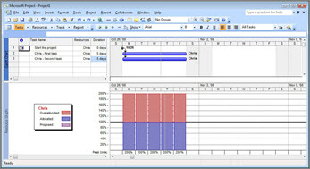
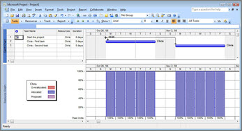
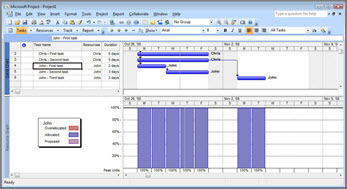

# Resource management: white paper

This white paper is part of our "From the trenches" collection. It describes challenges in different aspects of resource management and provides suggestions on creating a resource management system.
  
To see more white papers, see ["From the Trenches" white papers](https://support.office.com/article/faec6b1a-c217-4c79-b8c4-0514f402106b).
  
## Resource Management

Resource management is the most popular reason organizations will switch from individual project management to enterprise project management with systems like Microsoft Office Project Server.
  
You'd think that would mean we'd have an extensive playbook on how to get the very best resource management out of such systems. 
  
If only.
  
### Defining Resource Management

The first problem, like so many aspects of enterprise systems, is defining exactly what people mean by "resource management". Depending on your perspective, resource management could be a number of different things. 
  
#### Resource Leveling

Let's start with the purist view. This comes from those of us in the industry for more than 15 years or so. When project management software was first made available as a commercial product, it was a critical path methodology (CPM) scheduling tool. There was no consideration of resources at all in those early systems. It was exciting enough to get a schedule out of the system and then, when roll-feed plotters came out (mostly to support the technical drawing industry), to use them to get bar chart or logic (network) diagram displays of our projects. 
  
When resources were factored into these systems, they were to enhance the original calculations with the addition of resources. The algorithms varied, but the intent was to ensure that any delays from insufficient numbers of certain trades were identified long enough in advance to hire those people and get them on the job. We'll come back to resource leveling a little later.
  
#### Critical Chain Planning

It's actually been around a long time, although I know for some people the concept of Critical Chain seems new and is very exciting. For those who are schedule-centric, Critical Chain applies the resource constraints right into the schedule and looks for the resource(s) that will have the most profound effect on the schedule's delivery. It is, perhaps, what CPM should have been from the beginning, and when it's applied in the right situation, it can be very revealing. 
  
#### Resource Capacity Planning

If we expand our thinking a bit, we can include those first two definitions in a broader concept of managing the capacity of our resources. This is, by far, the most popular concept that we are asked to deliver on in an enterprise project management deployment. Resource Capacity Planning seeks to answer several questions for an organization's decision makers: 
  
- Can I meet the commitments I've already made with the personnel I have?
    
- If not, what changes in personnel would be required to meet my commitments?
    
- If so, what excess capacity do I have to take on additional commitments?
    
- If I'm given an additional project, can I accomplish it with my existing personnel?
    
- If I cannot change my personnel, what will be the impact of new work I'm required to accomplish?
    
Resource Capacity Planning includes several concepts that must be implemented as part of your project management processes. These include:
  
- Resource Loading
    
    To start the Resource Capacity Planning challenge, we can start with how much work needs to be done. (If there's no work to be done, there's no need to manage the resources.) Having an accurate picture of how much work each task will take and who needs to accomplish it is critical to an accurate analysis.
    
- Skill Scheduling
    
    In modern project management tools like Microsoft Project, we can manage the resource requirement now just as a department or an individual but also as skills. Skill scheduling includes managing the resource requirement but also managing the skills availability as an inventory, which seems to be more effective overall than just managing the number of people available in each department. After all, you might have a database management department but if the skills of your personnel are lacking in SQL Server 2008 and that is the skill needed for the next project, then you're still lacking when it comes to getting the project done.
    
- Resource Allocation
    
    Who puts what resources onto the assignments? There is a process to be created to determine how resource requirements are defined and then resolved. Should you start by requesting a category or competency of resource? Should you make requests of individual resources in 'Proposed' mode and then have someone in authority make them 'Committed'? Should you have different projects with proposed resources which are kept separate? Should a project manager be able to commit resources from different departments or should department heads have that privilege? 
    
- Resource Availability
    
    You have the needs of the projects for resources but what resources are available? Who decides how much time each resource will make available for project vs. non-project work? Who decides when vacations can be taken? How will you determine how many hours of overtime can be worked a day? How will you deal with unpaid overtime? Will it become banked time?
    
- Resource Leveling
    
    Once you have both the availability and the needs of the resources for your projects, comparing the two should let you know where you're over-allocated and present the challenge of dealing with the over-allocation. Should projects be prioritized so that some get the resources and some don't? Should some tasks be prioritized so that some get the resources and some don't? Should you use automated resource leveling? How about manual movement of tasks? Who will deal with reconciling a conflict where some parts of the company are waiting for work from other parts?
    
#### Resource Contracts

This term is typically found in a matrix organization where we have department heads who manage groups of resources and project managers who manage work that must be accomplished by those resources. The term "Resource Contracts" refers to the negotiation between the project managers and those department heads to commit resources to certain work. This might start as a request from the project manager for a certain person to be available at a certain date for a certain time. The department head might reply with a counter-offer with an option of a different person with similar skills or the person requested on a different date. The project manager then replies with an acceptance or a counter-counter-offer and so on until the resource requirement is fulfilled.
  
#### Resource Tracking

For some organizations, the most important aspect of resource management is not the planning, it's determining what has actually happened. "If you could just tell me what my people are actually doing with their time we'd be much more efficient," a senior executive might say. For these organizations, the timesheet aspect of an enterprise project management system becomes the most significant. Even without the integration back to the project plan, the by-activity accounting still gives an enormous richness of data to management of what each task costs in terms of effort. And it paints an interesting picture of how much time is available for project work and, more interestingly, what time is being spent on aside from project work. When we can tie the timesheet collection back to the project plan, then resource management can extend to budget vs. actual analysis. We can see what time was required for each planned task, the progress on that task so far and the impact of the progress on the projected finish of that task and any other tasks which may be affected by it. 
  
#### Resource Communications

In a mega-project construction world, we used to not worry so much about resource communications. Foremen would pick up the latest news from the project office in the morning and tell their crews what they needed to know as they got started. In white-collar high-tech types of project environments, that's not the case at all. A project team may now be made up of all kinds of people. Aside from the project schedulers and the resources who will do work, you might have executive sponsors, the users, the client, sub-contractors, out-sourced developers and more. It's not at all uncommon to now have a project team which exceeds not just the walls of your office but also the boundaries of your organization. Communications in such an environment become much more significant. Resource Management in this context might be just being able to effectively collaborate with all the resources implicated in our project management process.
  
#### Resource Commitments

When we talk about project management systems, we tend to talk about a very algorithmic environment, but managing the commitments of resources within a project is also an important aspect of getting things done. Project team leaders need to manage the commitments they've requested and the commitments they've made. A resource might say "I'll finish that by Friday." That's a commitment; a promise. It might be a perfect match for the expected finish date in our schedule, and it might not. It's a commitment and that's distinct from when the scheduling algorithm says the work should be done. Resource commitments might be managed in Outlook or Office SharePoint Server or on a white board or in some other commitment tool, but they must be managed somehow. 
  
#### Resource Sub-Contracting

For some organizations, just managing the resources that are contracted from other companies is resource management enough. When sub-contracts are involved, managing the promises that the sub-contractor makes and ensuring that the contract provides the right incentive and is honored by the sub-contractor can make or break a project. 
  
It sounds pretty straightforward. After all, there are tools within the Microsoft EPM Solution for all these aspects of resource management. Resource leveling, resource allocation, resource loading, skill scheduling are all referred to in the basic functionality of Project Server or even just with Project Standard or Professional. Multi-project resource allocation can be done with the Resource Substitution Wizard or the Team Builder in Project Server. Resource tracking can be done with the timesheet in Project Server. Resource Contracts don't have much of an interface by default but the whole idea of Proposed vs. Committed Resources is in that area so a more robust interface for dealing with resource requests could be done with a web-based form with Office SharePoint Server and tie into the functionality directly. Even Resource Sub-Contracting could be addressed with functionality from Office SharePoint Server.
  
### The Challenge

You may note that I've not talked about Resource Capacity Planning, and it's not because it's not possible. This is typically the most requested aspect of an EPM deployment, but it's one of the hardest to actually deliver.
  
There's a fundamental challenge when we try to apply a resource leveling algorithm to a highly skilled group of resources. In order to understand it, it's worthwhile to go back to what original designers were thinking when resource leveling algorithms were created. I promised to come back to resource leveling and even critical chain analysis and this is why.
  
When we think of the original resource leveling engines, they were designed for an engineering context. The first project scheduling tools were written for heavy engineering and construction projects where calculations would be done on one project at a time. Indeed, the entire organization might have been created to deliver a single project. Original commercial tools targeted the Defense and Oil and Gas industries, which could take advantage of the heavy volume of data these tools could manage. But, when we look at resources on such projects, we always think of generic resources. 
  
Resource scheduling on such a project is inevitably done by skill. A project scheduler thinks of how many Mechanical Engineers, Electricians and Pipefitters they might need. Resource Leveling algorithms are perfect for this question. We have a number of resources, we level the tasks, and the numbers of full-time staff can vary upwards or downwards as need be. When we think of this for a significant number of the same type of interchangeable resource, the algorithm works rather well.
  
Modern project management has extended the concepts originally created for mega projects with large numbers of interchangeable resources and applied them all the way down to the individual level. The algorithm still seems to work, at least in theory, and it sure works just fine in a demonstration because we only ever show one resource at a time. 
  
Let's take this example:
  

  
I've got a simple project here in Project Professional 2007. I've started the project with a milestone and added two tasks which are to start right after the milestone is complete. As soon as I assign Chris to both tasks, I've got a resource leveling problem. As you can see by the split screen, Chris is allocated to twice his availability which makes perfect sense.
  
Now let's level the project using Project's Resource Leveling algorithm: 
  

  
Again, things are perfect. Chris's tasks have been spread over a two week period instead of one, showing how one of the tasks has to be delayed to a second week in order to get it all accomplished. Also, Chris is shown to be working continuously from week one to week two.
  
All's well it seems until we add another resource to the calculation. Let's go back to our first situation and add a couple of additional tasks to the project but assign them to someone else:
  

  
Now I've got two people working at once. Chris is back to his over-allocated situation (you can see both of his tasks in week one and we've added three tasks for John who will start at the same time. John's tasks, though, are already resource leveled because there is some sequence to them. If we're looking just at John's situation, it looks fine. John is working continuously from week one into week two, but what happens when we apply the resource leveling algorithm now?
  

  
Project levels Chris's time just the way it did the first time and Chris's work is continuous from week one to week two. John, however, is going to have a full week's gap in his work as he waits for Chris to complete his second task. It's unlikely that we'll want to have John reading the newspaper and staying idle in his cubicle for an entire week, so it will now be up to John and Chris's supervisor(s) to manually manage how they should schedule their time. 
  
We're only looking at the simplest example of two resources. The challenge becomes that much worse when we have a full team to talk about, more than one project that's affected or more than one person put on each task.
  
This isn't a fault of Project. This is just how resource leveling works with virtually every scheduling tool on the market that does resource leveling. First it calculates the critical path, and then it applies the resource constraints to the schedule based on the options you've chosen. Different systems will have different options but when we apply a resource leveling algorithm to individuals, this is where we always end up. Modern project schedulers have learned not to apply classic resource leveling when scheduling must be done to the individual level. 
  
This is also one of the fundamental reasons why we don't have analytical tools like Project push information into a Resource Commitment system like Outlook. Outlook at its core could be considered a personal commitment system. You make commitments in Outlook every day. You promise someone you'll be at an appointment next week at 2pm. (That someone might be yourself.) You promise someone you'll complete a task by this Tuesday. We look at Outlook today to see what tasks and appointments we need to fulfill and then use the communications functionality of the system to respond to others about the commitments we're making or requesting. 
  
Imagine that we would now integrate that with Project, which is, at its core, an analytical system. Moving activities from Project or Project Server into Outlook and retrieving the progress on them is one thing. What if all of someone's Outlook tasks were integrated back into the schedule? I might make an appointment next week to be at the dentist for the morning. Should I now let the impact of this four-hour gap in my availability ripple through every task I have scheduled in the future? Should all tasks be pushed four hours later? What about all the schedules of all the people I interact with or whose tasks are affected by my four hour delay? Should the entire company now start receiving emails saying their schedule has been pushed four hours later? But wait, I'm only one person. What happens when everyone's Outlook commitments are affecting every task from every person in the company? In short order, we'd have chaos.
  
If we are to integrate a resource commitment or resource communication tool like Outlook with a resource capacity planning tool like Project or Project Server, we need to reconcile the philosophical differences between the two paradigms. When the link from Project Server to Outlook was designed, this made up part of the thinking. Outlook would be enabled to receive tasks from Project and to integrate those tasks into the Outlook calendar or task list. "Pushing" tasks from Outlook to Project Server was not permitted.
  
### Creating a Resource Management System

If you've made it this far, then you may be hoping I've got some advice on how to create resource management, and I do have a few suggestions. 
  
First of all, it's worthwhile to talk about what aspects of resource management apply to your organization and which you can take advantage of quickly. It's quite common to find that some aspects of resource management will be a bigger challenge to implement than others. I'm always keen to grab the low-hanging fruit first. You might be most interested in Resource Capacity Planning, for example, but find that creating such a process and gathering all the data to create a consistent process is a daunting challenge. Yet, you might find that implementing Resource Tracking with a timesheet system gives you less cultural hurdles to overcome. So, start with broadening your perspective of what Resource Management is to consider some other aspects.
  
If you're looking at Resource Capacity Planning, then you have to appreciate that any resource leveling algorithm is going to have difficulties with resource definitions at the individual level. If that's so, then you can think about doing resource leveling to the skill or generic level and leaving individual assignments to team leaders. This is often an area of an EPM deployment that is upsetting to senior executives. For anyone who hasn't considered all the implications, it isn't uncommon to imagine a system where analysis is done somewhere centrally and it not only magically reconciles every individual's day-to-day calendar with their personal and corporate commitments, but also ensures that they are working a full workday every day. 
  
If Resource Capacity Planning is your concern, I've got an idea for you that's not suggested very often. In any high-tech organization, skill scheduling to the individual level is very common because many people have a unique collection of skills and knowledge that makes them particularly appropriate for certain kinds of work. If that is your situation, then consider creating a 'Key Resource Project'. In my experience, the key resources in an organization represent less than five percent of the total number of resources. These key resources are the people that are essential to every project. They have that combination of skills and knowledge that is not found elsewhere, and successful project managers know to make sure to get one of those key resources onto their projects if they want to succeed. 
  
A Key Resource Project would be a list of all of the tasks assigned only to those people. You would resource level their work and let all the other resources around them be scheduled however they are by team leaders. This can be implemented almost instantly and takes a relatively small amount of effort. Organizations who have tried this find it often resolves much of the heartache of resource leveling without the cultural challenge and process improvement challenges of a process that must include everyone.
  
It's also worthwhile to think of your solution as being more extensive than just Project Server, just like the Project team does at Microsoft. The "Microsoft EPM Solution" after all is a stack of technology. When you consider all the different aspects of Resource Management, then Windows SharePoint Services, Windows Workflow, Office SharePoint Server (for forms), SQL Server all become vectors that are essential to creating an environment that is tailored to what you need for your organization. 
  
## About the Author

Chris Vandersluis is the president and founder of Montreal, Canada-based HMS Software, a Microsoft Certified Partner. He has an economics degree from McGill University and over 30 years experience in the automation of project control systems. He is a long-standing member of the Project Management Institute (PMI) and helped found the Montreal, Toronto, and Quebec chapters of the Microsoft Project Users Group (MPUG). Publications for which Chris has written include Fortune, Heavy Construction News, Computing Canada magazine, and PMI's PMNetwork, and he is a regular columnist for Project Times. He teaches Advanced Project Management at McGill University and often speaks at project management association functions across North America and around the world. HMS Software is the publisher of the TimeControl project-oriented timekeeping system and has been a Microsoft Project Solution Partner since 1995. 
  
Chris Vandersluis can be contacted by e-mail at: chris.vandersluis@hms.ca
  
If you would like to read more EPM-related articles by Chris Vandersluis, see HMS's EPM Guidance site (http://www.epmguidance.com/?page_id=39).
  

