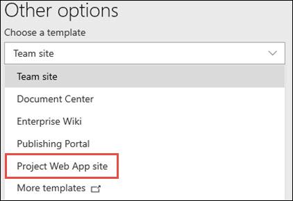

# Set up another Project Online site

  
You may decide that you want to set up an additional Project Online site, to manage projects in a separate environment from your first Project Online site. You can do this by creating another site collection with Project Web App.
  
 **To set up another Project Online site:**
  
1. [Where to sign in to Office 365 for business](https://support.office.com/article/e9eb7d51-5430-4929-91ab-6157c5a050b4) with your work or school account. 
    
2. Select the app launcher icon  in the upper-left and choose **Admin**.
    
    
  
    > [!TIP]
    > The **Admin** tile appears only to Office 365 administrators. 
  
3. In the lower-left navigation, select **Show all**, expand **Admin Centers** and open the **SharePoint** admin center. 

4. In the SharePoint admin center, select **Active sites**.

5. On the **Active sites** page, select **Create**, and on the **Create a site** page, select **Other options**.
6. On the **Other options** page, from the **Choose a template** menu, select **Project Web App site**. 

     

7. Give the site a name, type the name or email address of the site's Primary administrator, select a time zone, and select a language.
8. Select **Finish**.
    

  

  
  
    

    
> [!NOTE]
>  After setting up the site, wait 15 minutes before using it, so that Project Online can finish installing.
  

