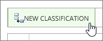
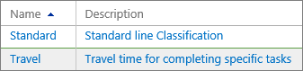
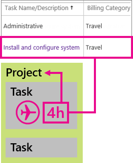
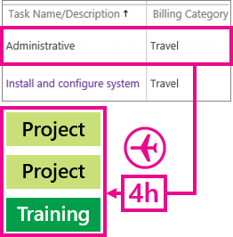
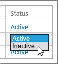

# Set up categories for timesheet rows

  
The rows on a team member's timesheet are used to capture hours spent on specific project tasks, or on other, non-project activities, like training or vacation. Sometimes, it can be helpful to categorize the task-related hours in other ways too. [Need an example?](set-up-categories-for-timesheet-rows.md#BKMK_Example)
  
To set things up to capture different categories of task-related work, you can create line classifications in Project Web App. 
  
## Create a line classification to categorize task work

1. In Project Web App, choose **Settings** \> **PWA Settings**.
    
2. Under **Time and Task Management**, choose **Line Classifications**.
    
    
  
3. Choose **New Classification**.
    
    
  
4. In the new blank row, type a **Name** for the category of work, and provide a **Description** that team members will understand. 
    
    
  
5. Choose **Save**.
    
    
  
## Need an example?

Sara is a consultant who travels a lot to work directly with customers. Her company has just landed a contract with Contoso, to upgrade their payroll system. As part of the "Contoso Payroll System Upgrade" project, Sara is assigned to the "Install and configure system" task, where she will travel to Contoso's headquarters and help them roll things out.
  
Sara spends part of her time traveling to and from Contoso's offices, and part of her time doing the actual installation.
  
On her timesheet, Sara can include the "Install and configure system" task on two separate rows: one row to capture her travel time ("Travel"), and one row to capture the installation work ("Standard"). This helps Sara's project manager keep an eye on how much time Sara and other team members are spending on travel for this particular customer contract.
  

  
## But wait, what about administrative time?

 **Aren't we supposed to use administrative time to capture things like travel and training?**Project Web App also lets you create administrative time categories, for things like travel, training, vacation, or sick leave. What makes administrative time different is that the hours recorded in those timesheet rows are not part of any particular project or task. It's perfectly okay to have some overlap between line classifications and administrative time. 
  
For example, you may need a line classification for travel, for times when people are traveling to work on a particular task, like Sara going to Contoso for their installation. 
  

  
You may also need an administrative time category for travel, to capture time spent traveling between different branch offices to get things done on multiple projects, or to attend training sessions that aren't directly related to any one project. 
  

  
 **[Want to set up administrative time categories?](set-up-vacation-sick-leave-and-other-non-project-work-categories.md)**
  
## What if I don't want a category anymore?

If you no longer want team members to be able to use a category in their timesheets, you can make it inactive.
  
> [!NOTE]
> **But I want to delete it!** You can delete line classification categories too, but only if they haven't been used on any timesheets. Choose the row you want to delete, and then choose **Delete Classification**. > Inactive categories are not available for team members to choose, but they can still be used in reports that include previous timesheet data. 
  
 **To make a line classification category inactive**
  
1. Choose **Inactive** in the **Status** column. 
    
    
  
2. Choose **Save**.
    
    
  

